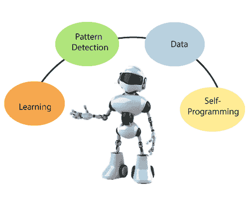
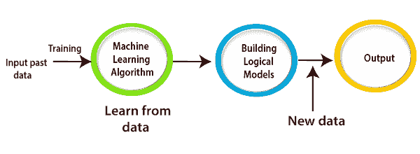

# 机器学习教程

> 原文：<https://www.tutorialandexample.com/machine-learning-tutorial/>

### 什么是机器学习？

因为我们所有人都非常清楚人类的学习概念，他们从他们过去的经验中学习。但是，我们能指望计算机或任何机器从给定的原始数据和过去的经验中进行自我学习吗？由此机器学习的概念应运而生。

机器学习是[人工智能](https://www.tutorialandexample.com/artificial-intelligence-tutorial/)的一个子集，它通过原始数据和过去的经验进行学习，而无需实际显式编程，以与人类完全相同的方式赋予数据某种意义。换句话说，我们可以说，最大似然是计算机科学的一个领域，它致力于从一些最大似然算法处理的数据中提取一些有意义的数据。**机器学习**于 1959 年由*亚瑟[塞缪尔](https://en.wikipedia.org/wiki/Arthur_Samuel)T7】推出。*

> “机器学习对数据使用统计工具来输出预测值。它是人工智能的一种应用，为系统提供了从经验中学习和改进的能力，而无需明确地自动编程”。

### 机器学习的需求是什么？

如今，人类变得更加先进，工作也相当智能，尤其是处理难题和解决问题的方式。而另一方面，人工智能还未成熟，还没有打败人类的智慧。因此，在大规模的情况下，基于一些原始数据以有效的方式进行决策需要机器学习。

截至目前，开发人员更多地致力于开发人工智能、深度学习和*机器学习*等技术，从给定的数据中提取一些信息，并执行不同的算法来解决一些实际的现实世界问题，特别是在大规模上为组织提供帮助。它也可以被称为数据驱动的决策。决策制定不需要任何编程逻辑，而是可以使用驱动数据本身。为此，它确实需要人类的智慧。此外，人类本身不足以解决大规模的现实问题。所以这就是需要**机器学习**的时候。数据越多，模型就越好，精确度就越高。

### 机器学习的运作

在传统编程中，我们用来提供数据和程序，而计算机用来生成输出。

然而，在机器学习的情况下，我们过去常常向机器提供数据和预测输出，它从数据中学习，找到隐藏的见解，并创建模型。它获取输出数据，并相应地重复其训练和增长，以便模型随着时间的推移在用新数据或输出数据进行训练时变得更好。

### 机器学习的应用

机器学习发展如此之快，以至于在人工智能的黄金时代，人工智能融入了我们的日常生活，我们甚至没有意识到这一点；Alexa，谷歌地图，谷歌助手和谷歌地图。下面列出了一些其他真实世界的应用程序

1.  情感分析
2.  图像识别
3.  语音识别
4.  股票市场交易
5.  欺诈检测及其防范
6.  在线购物应用的产品建议
7.  天气预报
8.  交通预测
9.  社交媒体应用上的好友建议
10.  医疗问题的诊断

## 机器学习主题

*   [什么是机器学习？](/machine-learning-tutorial/)
*   机器学习应用
*   [机器学习生命周期](/machine-learning-life-cycle/)
*   [Python Anaconda 设置](/python-anaconda-setup-for-machine-learning/)
*   [ML/AI/深度学习的区别](/difference-between-artificial-intelligence-machine-learning-deep-learning/)
*   [了解不同类型的机器学习](/understanding-different-types-of-machine-learning/)
*   [数据预处理](/data-preprocessing-in-machine-learning/)
*   [监督机器学习](/supervised-machine-learning/)
*   无监督机器学习
*   监督与非监督学习

## ML 回归算法

*   [线性回归](/linear-regression-tutorial/)
*   多项式回归

## ML 分类算法

*   [ML 分类算法介绍](/ml-classification-algorithm/)
*   [逻辑回归](/logistic-regression/)
*   K-NN 算法
*   [支持向量机](/support-vector-machines/)
*   [决策树](/decision-trees/)
*   [朴素贝叶斯](/naive-bayes-algorithm-in-machine-learning/)
*   [随机森林](/random-forest-algorithm/)

## ML 聚类算法

*   [ML 聚类算法简介](/ml-clustering-algorithm/)
*   [K-均值聚类](/k-means-clustering-algorithm/)
*   [层次聚类](/hierarchical-clustering-algorithm/)

## ML 关联规则学习算法

*   [关联规则学习算法介绍](/association-rule-learning-algorithm/)

## 多方面的

*   分类与回归
*   线性回归与逻辑回归
*   [面向机器学习的 5 大编程语言及其库](/top-5-programming-languages-and-their-libraries-for-machine-learning)
*   [ML 中线性代数的基础向量](/basics-vectors-in-linear-algebra-in-ml)
*   [机器学习中的决策树算法](/decision-tree-algorithm-in-machine-learning)
*   [机器学习中的偏差和方差](/bias-and-variances-in-machine-learning)
*   [最后一年学生的机器学习项目](/machine-learning-projects-for-the-final-year-students)
*   [顶级机器学习工作](/top-machine-learning-jobs)
*   [不同组织的机器学习工程师薪资](/machine-learning-engineer-salary-in-different-organisation)
*   [机器学习的最佳 Python 库](/best-python-libraries-for-machine-learning)
*   [机器学习中的正则化](/regularization-in-machine-learning)
*   [机器学习中的一些创新项目思路](/some-innovative-project-ideas-in-machine-learning)
*   [什么是交叉编译器](/what-is-cross-compiler)