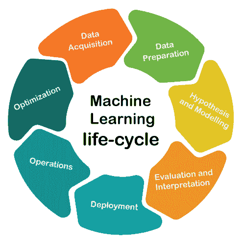

# 机器学习生命周期

> 原文：<https://www.tutorialandexample.com/machine-learning-life-cycle/>

### 机器学习的生命周期

以下是*机器学习生命周期*中涉及的主要步骤:

*   数据采集
*   数据准备
*   假设和建模
*   评估和解释
*   部署
*   操作
*   最佳化

### 数据采集

数据是机器学习的**生命周期中必不可少的组成部分之一，但是我们必须获取适当的数据来解决一个特定的问题。它不需要任何数据科学家来收集数据。任何人，只要事先了解几个可免费获得的数据集之间的实际差异，并且知道如何对任何组织的投资策略做出重大决策，就最适合担任数据科学家的角色。**

### 数据准备

这可能是这个周期中最乏味和最耗时的任务，涉及到识别各种数据质量问题。通常，无论何时获得数据，都不能对其进行分析，因为它可能包含放错地方的条目、不规则性和语义错误。因此，为了使用这种类型的数据，数据科学家通过在电子表格中编辑或简单地编写代码来手动重新格式化和清理数据。数据准备步骤的另一个名称是数据清理或数据争论阶段。

### 假设和建模

这是任何数据科学项目的基本步骤，它经历了编写、运行和提炼程序的过程，以便从数据中分析和获得有意义的业务洞察力。这些程序可以用像 Python、R、T2、MATLAB 或 Perl 这样的语言编写。在这一步中，我们使用我们的数据来训练各种[机器学习](https://www.tutorialandexample.com/machine-learning-tutorial/)算法，并选择产生最佳性能的算法。

### 评估和解释

在对数据进行模型训练后，我们评估最终结果，以了解它在现实生活中的表现或可靠性。每个绩效指标都有不同的评估指标。例如，如果您希望您的机器学习模型预测每日股票，那么强烈建议考虑 RMSE(均方根误差)进行评估。此外，我们考虑性能指标，如平均准确率，AUC 和日志丢失顺序分类垃圾邮件。

### 部署

术语“部署”可以定义为通过新数据进行预测的模型的应用。建立模型一般不是项目的结束。尽管模型的目的是强化数据的知识，但获得的知识必须以客户可以轻松使用的方式组织和呈现。值得注意的是，部署阶段可以像创建报告一样简单，也可以像根据需要采用可复制的数据科学流程一样复杂。

### 操作

在这一步中，将制定一个长期监督和支持数据科学项目的计划。基本上，在这个阶段，它从升级和降级方面监控模型的性能。数据科学家从个人数据科学项目中获得帮助，以实现共享学习，并在未来推动类似数据科学项目的实施。

### 最佳化

优化是任何数据科学项目的最后一个阶段。当新的数据源到来时，它会在生产中重建机器学习模型，或者采取必要的步骤来升级机器学习模型的性能。