# Python Anaconda 设置

> 原文：<https://www.tutorialandexample.com/python-anaconda-setup-for-machine-learning/>

[Python 编程语言](https://www.tutorialandexample.com/python-tutorial)在本教程中用于获得动手机器学习。在使用 Python 进行机器学习之前，需要在计算机系统上安装兼容的 IDE(集成开发环境)。现在我们将看到如何在 Anaconda 发行版的帮助下安装 Python 和 IDE。

Anaconda 发行版是一个开源平台，用于部署 Python 和 [R programming](https://www.tutorialandexample.com/r-tutorial/) 等编程语言。它用于机器学习、数据科学、预测分析等应用。主要目的是建立简化的数据包管理和部署。它支持许多操作系统，如 Windows、Mac OS 和 Linux。它提供了大约 1500 个适用于 Windows、Mac OS 和 Linux 的流行数据科学包。全球有 15 亿用户在使用。

例如，Anaconda 发行版提供了几个用于安装 Python 的 IDEJupyter 笔记本，Spyder，Anaconda 提示等。它非常适合，因为它包含一个软件包解决方案，使得在您的桌面上安装 Python 变得更加容易。它会自动为 Python 安装一些 IDE 和库，比如 [NumPy](https://www.tutorialandexample.com/numpy-tutorial/) ，Pandas 等等。

下面给出了以下步骤:

**第一步:** -下载 Anaconda Python

要下载 Anaconda，你需要打开你选择的浏览器，在搜索引擎中输入 **Anaconda Python** 。单击您在窗口上看到的第一个链接，或者您可以直接从下面给出的链接下载；https://www.anaconda.com/distribution/

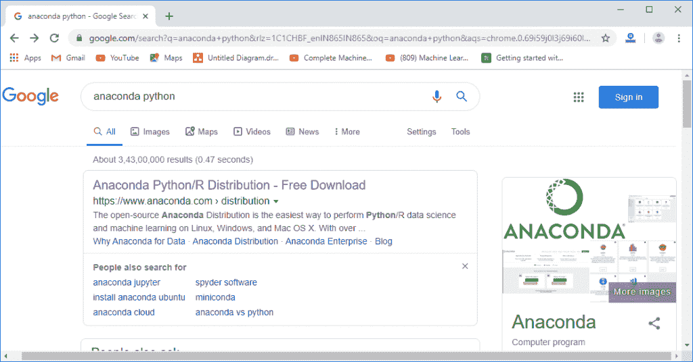

点击第一个链接，你将进入 Anaconda 的下载页面。

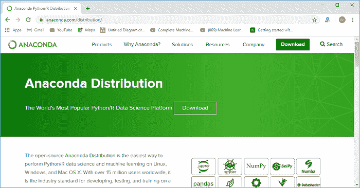

因为 Anaconda 可用于 Windows、Mac OS 和 Linux。我们在这里为 Windows 下载，你可以根据自己的选择下载。选择操作系统后，您会得到两个 Python 版本。选择最新版本的 **Python 3.7 版本**，点击**下载**，开始下载。

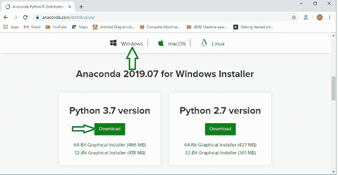

**步骤 2:** -安装 Anaconda Python 版本

下载完成后，进入下载，双击**Anaconda 3-2019.03-Windows-x86 _ 64 . exe**会出现一个安装 anaconda 的设置窗口。点击**下一个**，它将带你到协议窗口。

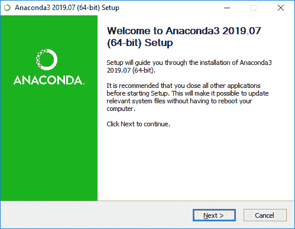

点击许可协议窗口上的**我同意**并继续。

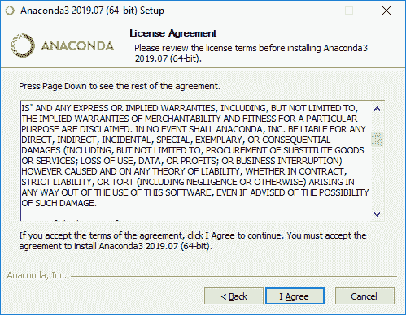

从下面给出的选项中选择**仅我**，然后点击**下一步**。

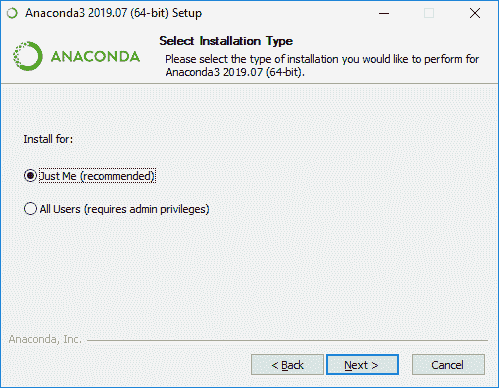

将会打开一个窗口，询问它的安装位置。如果您不想做任何事情，您可以不做任何事情，只需通过点击下一个的**来保持默认设置。**

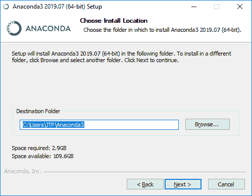

选择第二个选项，点击**安装**。

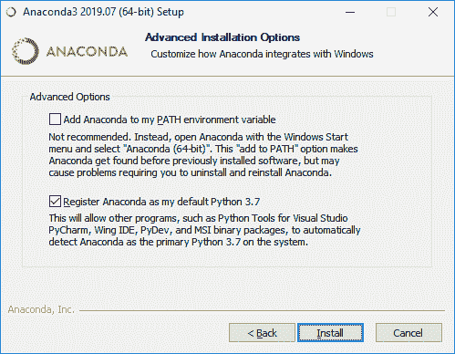

安装完成后，点击**下一个**。

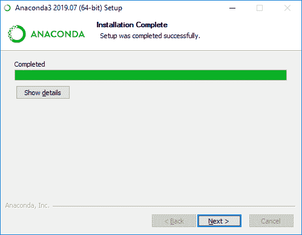

安装完成后，点击**完成**。


第三步: -打开 Anaconda Navigator

安装完成后，打开 Anaconda Navigator 来启动 Python IDE 可能是 Spyder 也可能是 Jupyter。为此，你需要点击**窗口键**并在搜索栏中输入 **Anaconda Navigator** 。

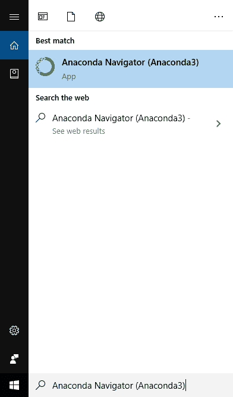

打开 Anaconda Navigator 后，点击 **Spyder** 下方的 **Launch** 按钮，启动 Spyder IDE。Spyder IDE 将被安装。

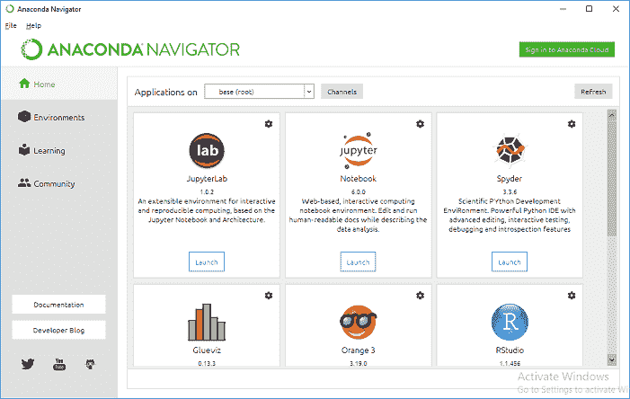

一旦 Spyder IDE 启动，打开的窗口将如下图所示；

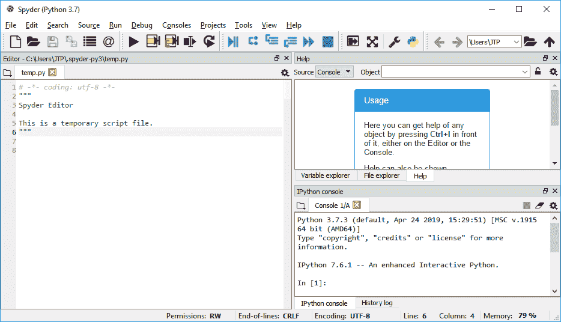

### Python 中的第一个程序

1.  写一个程序，用扩展名保存。任何文件夹中的 py。

```
print(“hello world!”)
```

*   点击三角形**运行**按钮运行程序。
*   输出显示在右下方的**控制台面板**上。

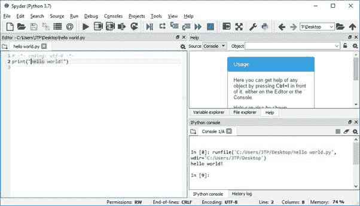