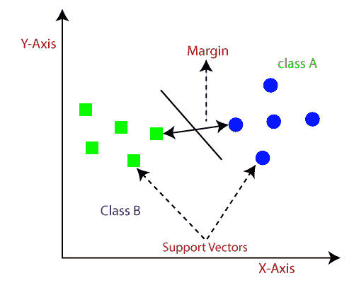
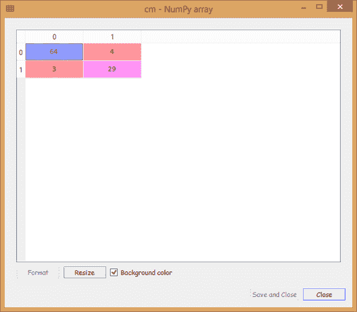
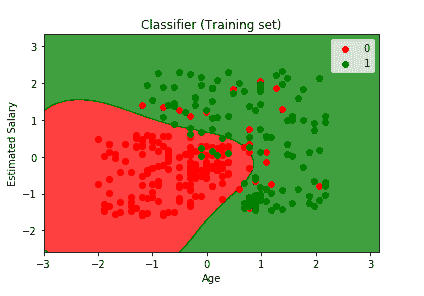
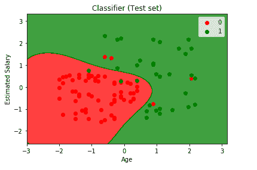

# 支持向量机

> 原文：<https://www.tutorialandexample.com/support-vector-machines/>

**SVM 简介**

支持向量机是具有相关学习算法的监督学习模型的一部分。它是用于分类、回归和异常值检测的最强大和最灵活的算法。它用于高维空间的情况，其中每个数据项被绘制为 n 维空间中的一个点，使得每个特征值对应于特定坐标值。

分类是在尽可能宽的超平面/线的基础上进行的，这更清楚地区分了两个类别。基本上，支持向量是每个个体的观察点，而支持向量机是区分一个类和另一个类的边界。



SVM 的一些重要术语如下

*   **支持向量:**这些是位于超平面附近的数据点或特征向量。这些有助于定义分隔线。
*   **超平面:**它是一个比决策平面的维数小一的子空间。它用于将不同的对象分成不同的类别。最佳超平面是两个类之间具有最大分离距离的超平面。
*   **边距:**定义为数据点到决策边界的距离(垂直)。有两种类型的边距:好边距和边距。**利润率好的**是利润率高的**和利润率低的**。

SVM 的主要目标是找到最大边缘超平面，从而将数据集分成不同的类。它经历以下步骤:

*   首先，SVM 将重复产生超平面，这将以最合适的方式分离出类。
*   然后，我们将寻找有助于纠正隔离的最佳选择。

### SVM 的优势

*   有效处理大量的特征向量。
*   非线性数据可以被处理，结合了 SVM 的核的概念，因为核是 SVM 的强项。
*   稳健的模型，因为它最大限度地提高了利润。
*   过度拟合的低风险因素。
*   与安相比，SVM 的成绩更好。

### SVM 的缺点

*   选择合适的内核，因为不正确的内核可能会导致结果错误。
*   样本越大，性能越差。
*   在测试阶段非常慢。
*   由于二次规划的实现，SVM 的复杂度增加，需要更多的内存。

### SVM 的应用

*   面部表情分类，因为它结合了形状和 SVM 的统计模型。
*   语音识别，因为 SVM 接受关键字，拒绝非关键字。
*   手写字符识别。
*   超文本和文本分类。

### SVM 的内核概念

在内核技巧的帮助下，SVM 可以将输入数据空间转换成期望的输出空间。它从根本上是用来把一个低维空间变成一个高维空间，或者我们可以说它只是通过改变它的维度，把一个不可分的问题变成一个可分的问题。它更强大、更灵活，因此可以提供更准确的结果。

### 内核的类型:

下面给出了三种类型的内核:

1.  线性核
2.  多项式核
3.  径向基函数核

线性核:它是两个观察值(X，Y)的点积，可选地加上一个常数。这是内核最简单的方法之一。数学上可以写成:

K(X，Y) = X <sup>T</sup> Y + C

多项式核:它是非平稳核。当训练数据是标准化形式时，它是最适合的。数学上可以写成:

K(X，Y) =(？X <sup>T</sup> Y+C) <sup>D</sup>

在哪里？是可调参数，称为斜率，C 是常数，D 是多项式的次数。

径向基函数核:也称为高斯核。它是最常用的 SVM 内核。它将输入空间映射到一个无限维空间。数学上它被给出为:

K(X，Y) = exp (-gamma*sum(X-Y^2))

我们现在将看到 SVM 分类器如何将两个不同的类分成两个不同的类别，我们还将比较其结果与逻辑回归模型的结果。为此，我们将采用上一章逻辑回归模型中使用的相同数据集 Social_Network_Ads。

它将经历与我们之前一样的预处理步骤:

```
# Importing the libraries
 import numpy as np
 import matplotlib.pyplot as plt
 import pandas as pd

 # Importing the dataset
 dataset = pd.read_csv('Social_Network_Ads.csv')
 X = dataset.iloc[:, [2, 3]].values
 y = dataset.iloc[:, 4].values

 # Split the dataset into the Training set and Test set 
 from sklearn.model_selection import train_test_split
 X_train, X_test, y_train, y_test = train_test_split(X, y, test_size = 0.25, random_state = 0)

 # Feature Scaling
 from sklearn.preprocessing import StandardScaler
 sc = StandardScaler()
 X_train = sc.fit_transform(X_train)
 X_test = sc.transform(X_test) 
```

完成特征缩放后，我们现在将使分类器适合训练集。为此，我们首先需要创建一个 SVM 分类器。因此，我们将从 scikit learn 导入 SVC 库。我们将创建一个名为 classifier 的变量，它是 SVC 的一个对象。我们将使用“rbf”核，也称为高斯核。

这是一个非常复杂的内核。它将帮助我们将数据提升到一个新的维度。所以，我们的数据可以被一个新维度的超平面线性分离，然后我们将我们的数据投影到 2 维得到 SVM 分离器。由于核 SVM 算法是基于随机因素的，所以这里把 random_state 变量取为 0，得到同样的结果。这样就建立了核分类器。然后，我们将分类器拟合到 X_train 和 y_train，以便分类器可以学习 X _ train 和 y_train 之间的相关性。

```
# Fitting classifier to the Training set
sklearn.svm import SVC
classifier=SVC(kernel='rbf',random_state=0)
classifier.fit(X_train,y_train) 
```

在分类器学习了相关性之后，我们现在将预测观察值。因此，我们将创建一个变量 **y_pred** ，它是包含 test_set 结果预测的预测向量。

```
y_pred = classifier.predict(X_test)
```

现在我们将创建一个混淆矩阵，我们将从 sklearn.metrics 的库中导入**混淆矩阵**函数。它将包含正确和不正确的预测。这里我们关心的是计算错误预测的数量。

```
from sklearn.metrics import confusion_matrix
cm = confusion_matrix(y_test, y_pred) 
```

**输出:**



从上面给出的输出图像中，我们可以看到我们在**测试集**上有七个不正确的预测，这比逻辑回归模型好得多，因为它在计算 **11** 不正确的预测。所以，这被证明是一个改进的模型。

接下来，我们将以与之前在**逻辑回归模型**中相同的方式可视化训练集结果和测试集结果。我们将绘制一个图表，区分我们的模型预测用户将购买 SUV 的区域和用户不会购买 SUV 的预测区域。

### 可视化训练集结果:

现在，我们将有一个训练集结果的图形可视化。为此，我们将绘制一张图表，其中我们的 SVM 模型将预测会购买 SUV 的用户会选择**是**，不会购买 SUV 的用户会选择**否**，这将按照我们在之前模型中所做的相同方式进行。

```
# Visualising the Training set results
 from matplotlib.colors import ListedColormap
 X_set, y_set = X_train, y_train
 X1, X2 = np.meshgrid(np.arange(start = X_set[:, 0].min() - 1, stop = X_set[:, 0].max() + 1, step = 0.01),
                      np.arange(start = X_set[:, 1].min() - 1, stop = X_set[:, 1].max() + 1, step = 0.01))
 plt.contourf(X1, X2, classifier.predict(np.array([X1.ravel(), X2.ravel()]).T).reshape(X1.shape), 
              alpha = 0.75, cmap = ListedColormap(('red', 'green')))
 plt.xlim(X1.min(), X1.max())
 plt.ylim(X2.min(), X2.max())
 for i, j in enumerate(np.unique(y_set)):
     plt.scatter(X_set[y_set == j, 0], X_set[y_set == j, 1], 
                 c = ListedColormap(('red', 'green'))(i), label = j)
 plt.title('Classifier (Training set)')
 plt.xlabel('Age')
 plt.ylabel('Estimated Salary')
 plt.legend()
 plt.show() 
```

**输出:**



从上面给出的输出图可以看出，这里所有点都是一个训练集中的观测点，或者我们可以简单的说一个训练集的用户。**红色**点是**没有**购买 SUV 的用户，而**绿色**点是**购买**SUV 的用户。此外，我们在这里有预测区域，例如红色区域表示不会购买 SUV 的用户的区域，绿色区域表示将购买 SUV 的用户。

分隔预测区域的分隔符称为**预测边界**。因为我们建立了非线性分类器，所以边界不是直线而是曲线。分类器将具有低估计工资的老年用户和具有高估计工资的年轻用户分别分类到正确的区域中。也有一些不正确的预测，因为我们的分类器不是一个**过拟合分类器**，而是一个**敏感分类器**。曲线实际上很好地分离了数据。

### 可视化测试集结果:

现在，我们将可视化测试集结果，与逻辑回归模型中的方式完全相同。

```
# Visualising the Test set results
 from matplotlib.colors import ListedColormap
 X_set, y_set = X_test, y_test
 X1, X2 = np.meshgrid(np.arange(start = X_set[:, 0].min() - 1, stop = X_set[:, 0].max() + 1, step = 0.01),
                      np.arange(start = X_set[:, 1].min() - 1, stop = X_set[:, 1].max() + 1, step = 0.01))
 plt.contourf(X1, X2, classifier.predict(np.array([X1.ravel(), X2.ravel()]).T).reshape(X1.shape),
              alpha = 0.75, cmap = ListedColormap(('red', 'green'))) 
 plt.xlim(X1.min(), X1.max())
 plt.ylim(X2.min(), X2.max())
 for i, j in enumerate(np.unique(y_set)):
     plt.scatter(X_set[y_set == j, 0], X_set[y_set == j, 1],
                 c = ListedColormap(('red', 'green'))(i), label = j)
 plt.title('Classifier (Test set)')
 plt.xlabel('Age')
 plt.ylabel('Estimated Salary') 
 plt.legend()
 plt.show() 
```

**输出:**



从上面给出的输出中，我们可以看到几乎所有的新观察结果都被归入了正确的类别。内核 SVM 做了大量的预测，预测红色区域的用户不会购买 SUV，绿色区域的用户会购买 SUV。当我们在混淆矩阵中计算出 7 个错误预测时，同样我们可以从输出图像中看到并计算它们。因为它分类得很好，所以我们可以确认它是一个好的分类器。