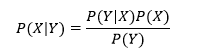
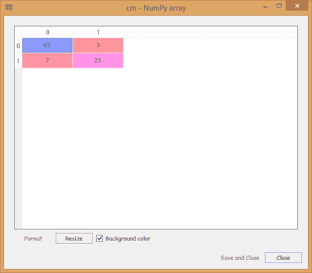
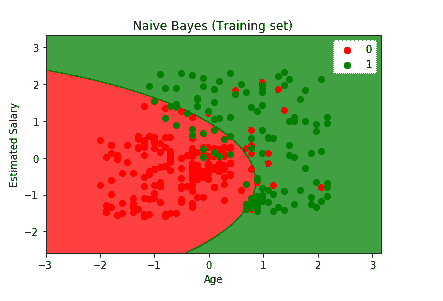
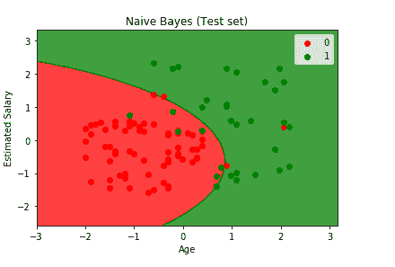

# 机器学习中的朴素贝叶斯算法

> 原文：<https://www.tutorialandexample.com/naive-bayes-algorithm-in-machine-learning/>

**机器学习中的朴素贝叶斯算法介绍**

朴素贝叶斯算法是一种基于贝叶斯定理的分类算法，它假设所有预测值都是相互独立的。基本上，它是一种基于概率的机器学习分类算法，往往非常复杂。它非常容易构建，可用于大型数据集。

**贝叶斯定理:**

贝叶斯定理定义了一个事件发生的可能性，该可能性是基于与该事件相关的一些先前条件。或者简单的说，可以说是从似然、类先验概率、预测器先验概率计算后验概率的一种方式。

数学上；



其中，是后验概率，是可能性，是类别先验概率，是上述等式中的预测值先验概率。

由于贝叶斯定理是朴素贝叶斯机器学习算法的基础，它需要一些独立性假设。因此，朴素贝叶斯机器学习算法常常依赖于不正确的假设。由于我们使用的数据集与之前模型中使用的数据集相同，因此在贝叶斯定理中，要求年龄和工资是独立变量，这是贝叶斯定理的一个基本假设。

但在我们的案例中，我们可以清楚地看到，从根本上来说，事实并非如此。他们之间有某种关联。随着年龄的增长，经验会越来越多，同时薪水也会增加。可见他们并不是绝对独立的。这两个变量之间有某种关系。

鉴于它们不是独立的，贝叶斯定理不能应用于机器学习算法。这就是我们将朴素贝叶斯应用于机器学习算法的原因。它通常应用于特征和变量不是相互独立的时候。它仍然被应用并给出最好的结果。

### 朴素贝叶斯模型的类型

为了构建一个朴素贝叶斯模型，使用了 scikit 学习库。scikit learn python 库中有三种类型的朴素贝叶斯模型，如下所示:

*   高斯朴素贝叶斯
*   多项式朴素贝叶斯
*   伯努利朴素贝叶斯

**高斯朴素贝叶斯模型:**

在这种情况下，假设数据值来自高斯分布，则考虑连续特征值。

**多项式朴素贝叶斯模型:**

它主要用于对文档问题进行分类。假设这些属性来自简单的多项式分布。该模型最适合表示离散计数的属性。

**伯努利朴素贝叶斯模型:**

多用于文本分类问题。它假设特征是二进制形式(即 0 或 1)。仅采用一个值来预测类别。

我们将从导入 python 库开始。

```
# Importing the libraries
import numpy as np
import matplotlib.pyplot as plt
import pandas as pd 
```

导入库之后，我们将导入数据集，并以与在早期模型中相同的方式进行预处理阶段。

```
# Importing the dataset
dataset = pd.read_csv('Social_Network_Ads.csv')
X = dataset.iloc[:, [2, 3]].values
y = dataset.iloc[:, 4].values 
```

```
# Splitting the dataset into the Training set and Test set
from sklearn.model_selection import train_test_split
X_train, X_test, y_train, y_test = train_test_split(X, y, test_size = 0.25, random_state = 0) 
```

```
# Feature Scaling
from sklearn.preprocessing import StandardScaler
sc = StandardScaler()
X_train = sc.fit_transform(X_train)
X_test = sc.transform(X_test)                                                                           
```

在预处理数据之后，我们将使朴素贝叶斯分类器适合训练集。为此，我们将首先从 scikit learn nave Bayes 库中导入 **GaussianNB** 类，然后我们将创建它的对象，将其命名为**分类器**。这里我们不需要输入任何参数，我们只需要调用类。然后，我们将使我们的分类器适合训练集。

```
# Fitting Naive Bayes to the Training set
from sklearn.naive_bayes import GaussianNB
classifier = GaussianNB()
classifier.fit(X_train, y_train) 
```

由于我们在上面几行中没有传递任何参数，所以我们在输出中有如下所示的 **GaussianNB** :

**输出:**

```
GaussianNB(priors=None, var_smoothing=1e-09)
```

现在，我们已经完成了分类器与训练集的拟合，我们现在将以与之前模型中相同的方式预测测试集结果。基本上， **y_pred** 就是包含所有测试集结果的向量预测。正如我们所知，这不是看待不正确预测的正确方式，因此我们将构建一个混淆矩阵。

```
# Predicting the Test set results
y_pred = classifier.predict(X_test)
# Making the Confusion Matrix
from sklearn.metrics import confusion_matrix
cm = confusion_matrix(y_test, y_pred) 
```

**输出:**



从上面显示的输出图像可以看出，我们有 10 个不正确的预测。

现在我们将进入可视化部分。在这一步中，我们将可视化训练集结果和测试集结果，通过绘制一个图来区分预测将购买 SUV 的用户的区域和预测除 SUV 之外不会购买 SUV 的用户的区域。它将与我们在早期模型中所做的一样进行。

```
# Visualising the Training set results
 from matplotlib.colors import ListedColormap
 X_set, y_set = X_train, y_train
 X1, X2 = np.meshgrid(np.arange(start = X_set[:, 0].min() - 1, stop = X_set[:, 0].max() + 1, step = 0.01),
  np.arange(start = X_set[:, 1].min() - 1, stop = X_set[:, 1].max() + 1, step = 0.01))
 plt.contourf(X1, X2, classifier.predict(np.array([X1.ravel(), X2.ravel()]).T).reshape(X1.shape),
  alpha = 0.75, cmap = ListedColormap(('red', 'green')))
 plt.xlim(X1.min(), X1.max()) 
 plt.ylim(X2.min(), X2.max())
 for i, j in enumerate(np.unique(y_set)):
  plt.scatter(X_set[y_set == j, 0], X_set[y_set == j, 1],
  c = ListedColormap(('red', 'green'))(i), label = j)
 plt.title('Naive Bayes (Training set)')
 plt.xlabel('Age') 
 plt.ylabel('Estimated Salary')
 plt.legend()
 plt.show() 
```



从上面给出的输出图像，可以清楚地看到，我们有一个非常美丽的光滑曲线，没有不规则。朴素贝叶斯模型成功地聚集了在正确地区购买 SUV 的估计工资较低的老年用户，但由于线性关系，logistic 回归和 SVM 模型未能正确分类。但在这种情况下，分隔符是一条曲线，它很好地捕捉到了其中一些。

```
# Visualising the Test set results
 from matplotlib.colors import ListedColormap
 X_set, y_set = X_test, y_test
 X1, X2 = np.meshgrid(np.arange(start = X_set[:, 0].min() - 1, stop = X_set[:, 0].max() + 1, step = 0.01),
  np.arange(start = X_set[:, 1].min() - 1, stop = X_set[:, 1].max() + 1, step = 0.01))
 plt.contourf(X1, X2, classifier.predict(np.array([X1.ravel(), X2.ravel()]).T).reshape(X1.shape),
  alpha = 0.75, cmap = ListedColormap(('red', 'green')))
 plt.xlim(X1.min(), X1.max()) 
 plt.ylim(X2.min(), X2.max())
 for i, j in enumerate(np.unique(y_set)):
  plt.scatter(X_set[y_set == j, 0], X_set[y_set == j, 1],
  c = ListedColormap(('red', 'green'))(i), label = j)
 plt.title('Naive Bayes (Test set)')
 plt.xlabel('Age')
 plt.ylabel('Estimated Salary') 
 plt.legend()
 plt.show() 
```



从上图中，我们可以清楚地看到测试集的结果。朴素贝叶斯分类器成功地预测了红色区域中的大多数红色用户(购买了 SUV)以及绿色区域中的绿色用户(购买了 SUV)。我们确实有一些不正确的预测，即绿色区域中的红色用户，反之亦然，对它们进行计数后，结果为 10，这与我们在上一步的混淆矩阵中计算的不正确预测完全相同。由于结果是相同的，并且最终分类正确，所以我们可以说它实际上是一个很好的分类器。我们将在下一个模型中获得更多的轮廓形状(预测区域)。

### 朴素贝叶斯算法的优势

1.  这是最快的算法，并且非常容易实现。
2.  它比逻辑回归模型执行更好的分类，因为训练需要非常少的数据。
3.  当输入数据的类型是分类数据时，它工作得很好，但是对于数值数据，它假定正态分布。
4.  离散数据和连续数据都可以通过朴素贝叶斯算法来处理。
5.  它可以用于分类问题，如二进制和多类问题。

### 朴素贝叶斯算法的缺点

1.  **特征独立性:**这是算法最大的缺点之一，因为几乎不可能有独立的特征集。
2.  **零频率:**假设一个分类变量有一个在训练集中没有出现的特定类别，那么，在这种情况下，它将被赋予零可能性，从而限制它进行预测。

### 朴素贝叶斯算法的应用

1.  它可以用于实时预测。
2.  它可用于预测多类变量的后验概率。
3.  它用于文本分类、过滤垃圾邮件和情感分析等问题。