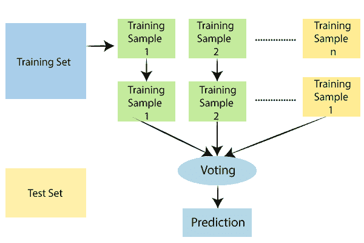
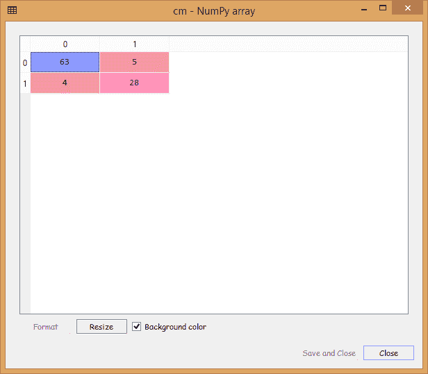
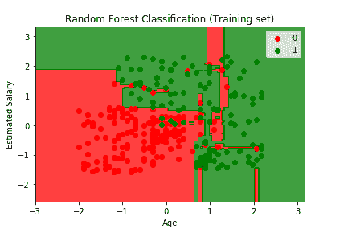

# 机器学习的随机森林算法

> 原文：<https://www.tutorialandexample.com/random-forest-algorithm/>

### 随机森林简介

随机森林是一种基于集成的监督学习模型。随机森林的概念既用于分类，也用于回归问题。基本上，在基于集成的学习中，多种算法被组合以构建鲁棒的预测模型，使得这些算法可以是相似的或者甚至是不相似的。

类似地，随机森林加入多个决策树，构造一个将作为整体的森林。每棵树都有助于输出一个类别的预测，得票最多的树将成为模型的预测。

### 随机森林的工作方式:

1.  我们首先从从数据集中选择一个随机样本开始。
2.  然后，我们将为每个记录/样本单独创建决策树，以便从每个决策树中获得输出。
3.  接下来，我们将对每个预测结果进行投票。
4.  最后，投票最多的预测结果将被选为最终结果。



### 随机森林的优势:

1.  由于每个决策树都是在给定的数据集上训练的，所以预测依赖于人群的力量，这使得它成为一个无偏的模型。
2.  这是最稳定的算法之一，意味着它不会受到向数据集添加任何新数据点的影响。它可能会阻碍其中一个决策树，但不会对林中的其余决策树产生影响。
3.  它对分类数据和数值数据都有很好的表现。
4.  它也适用于缩放值。

### 随机森林的缺点:

1.  由于随机森林中存在一组决策树，对资源的需求也随之增加，进一步增加了算法的复杂度。
2.  与其他算法相比，训练该模型需要花费大量时间。

### 随机森林的实现:

我们现在将了解随机森林是如何工作的。因此，我们将从导入库和数据集开始。然后，我们将像在早期模型中一样预处理数据集。

```
# Importing the libraries
 import numpy as np
 import matplotlib.pyplot as plt
 import pandas as pd

# Importing the dataset
 dataset = pd.read_csv('Social_Network_Ads.csv')
 X = dataset.iloc[:, [2, 3]].values
 y = dataset.iloc[:, 4].values 

#Data Pre-Processing
 # Splitting the dataset into the Training set and Test set
 from sklearn.model_selection import train_test_split
 X_train, X_test, y_train, y_test = train_test_split(X, y, test_size = 0.25, random_state = 0)

# Feature Scaling
 from sklearn.preprocessing import StandardScaler 
 sc = StandardScaler()
 X_train = sc.fit_transform(X_train)
 X_test = sc.transform(X_test) 
```

既然我们已经完成了数据预处理，我们将开始使随机森林分类适合训练集，为此，我们将创建一个分类器。我们将首先从 **sklearn.ensemble** 库中导入 **RandomForestClassifier** 类。然后我们将创建一个变量“**分类器**，它是 **RandomForestClassifier 的一个对象。为此，我们将传递以下参数；**

1.  第一个参数是 **n_estimators** ，即森林中的树木数量，它将预测用户是否会购买 SUV，默认设置为 **10** 棵树。
2.  第二个参数是**标准**等于**熵**，我们也在决策树模型中使用它来评估拆分的质量。用户群越同质，熵减少得越多。
3.  而最后一个是 **random_state** ，设置为 0，得到同样的结果。

然后，我们将使用**拟合**方法将分类器拟合到训练集，以使分类器学习 X_train 和 y_train 之间的相关性。

```
# Fitting Random Forest Classification to the Training set
from sklearn.ensemble import RandomForestClassifier
classifier = RandomForestClassifier(n_estimators = 10, criterion = 'entropy', random_state = 0)
classifier.fit(X_train, y_train) 
```

我们现在将在分类器学习相关性之后预测观察值。我们将创建一个名为 **y_pred** 的变量，它是包含 test_set 结果预测的预测向量，然后像我们在前面的模型中所做的那样创建混淆度量。

```
# Predicting the Test set results
y_pred = classifier.predict(X_test)
# Making the Confusion Matrix
from sklearn.metrics import confusion_matrix
cm = confusion_matrix(y_test, y_pred) 
```

**输出:**



从上面给出的图像中，我们可以看到我们只有九个不正确的预测，这是相当不错的。

最后，我们将可视化训练集和测试集结果，就像我们在前面的模型中所做的那样。我们将绘制一个区分区域的图表，该图表预测将购买 SUV 的用户和不会购买 SUV 的用户。

**可视化训练集结果:**

在这里，我们将可视化训练集结果。在这方面，我们将有一个图形可视化，以与之前类似的方式，为将购买 SUV 的用户预测**是**，为将不购买 SUV 的用户预测**否**。

```
# Visualising the Training set results
 from matplotlib.colors import ListedColormap
 X_set, y_set = X_train, y_train
 X1, X2 = np.meshgrid(np.arange(start = X_set[:, 0].min() - 1, stop = X_set[:, 0].max() + 1, step = 0.01),
                      np.arange(start = X_set[:, 1].min() - 1, stop = X_set[:, 1].max() + 1, step = 0.01))
 plt.contourf(X1, X2, classifier.predict(np.array([X1.ravel(), X2.ravel()]).T).reshape(X1.shape),
              alpha = 0.75, cmap = ListedColormap(('red', 'green'))) 
 plt.xlim(X1.min(), X1.max())
 plt.ylim(X2.min(), X2.max())
 for i, j in enumerate(np.unique(y_set)):
     plt.scatter(X_set[y_set == j, 0], X_set[y_set == j, 1],
                 c = ListedColormap(('red', 'green'))(i), label = j)
 plt.title('Random Forest Classification (Training set)')
 plt.xlabel('Age')
 plt.ylabel('Estimated Salary')
 plt.legend()
 plt.show() 
```



**输出:**

根据上面给出的输出图像，这里的点是真实结果，每个点对应于**social _ Network**的每个用户(数据集中的用户)，这里的区域是预测，即红色区域包含分类器预测用户不会购买 SUV 的所有用户，绿色区域包含分类器预测用户将购买 SUV 的所有用户。

预测边界是红色和绿色区域之间的区域界限。我们可以清楚地看到，我们有一个不同的预测边界，然后以前的分类器。

对于每个用户，我们的森林中有十棵树，它们预测用户是否购买 SUV，或者用户是否不购买 SUV。在以前的决策树模型中，我们只有一棵树进行预测，但是在现有的模型中，我们有十棵树。在这十棵树做出预测后，它们会进行多数投票。因此，随机森林根据大多数投票做出是或否的预测。

我们可以看到，大多数红色和绿色用户分别被很好地划分为红色区域和绿色区域。由于这是一个训练集，我们很少有不正确的预测。在下一步中，我们将会看到这个过度拟合的问题是否会损害测试集的结果。

**可视化测试集结果:**

现在我们将为测试集设想同样的情况。

```
# Visualising the Test set results
 from matplotlib.colors import ListedColormap
 X_set, y_set = X_test, y_test
 X1, X2 = np.meshgrid(np.arange(start = X_set[:, 0].min() - 1, stop = X_set[:, 0].max() + 1, step = 0.01),
                      np.arange(start = X_set[:, 1].min() - 1, stop = X_set[:, 1].max() + 1, step = 0.01))
 plt.contourf(X1, X2, classifier.predict(np.array([X1.ravel(), X2.ravel()]).T).reshape(X1.shape),
              alpha = 0.75, cmap = ListedColormap(('red', 'green')))
 plt.xlim(X1.min(), X1.max())
 plt.ylim(X2.min(), X2.max())
 for i, j in enumerate(np.unique(y_set)):
     plt.scatter(X_set[y_set == j, 0], X_set[y_set == j, 1],
                 c = ListedColormap(('red', 'green'))(i), label = j)
 plt.title('Random Forest Classification (Test set)')
 plt.xlabel('Age')
 plt.ylabel('Estimated Salary') 
 plt.legend()
 plt.show() 
```


从上面的输出图像中，我们可以看到这是一个过度拟合的情况，因为红色区域是为了抓住没有购买 SUV 的红色用户，而绿色区域是为了购买 SUV 的绿色用户。但不幸的是，红色区域包含了一些购买了 SUV 的用户，绿色区域包含了没有购买 SUV 的用户。

该模型学会了如何对训练集进行分类，但它无法对新的观察结果进行分类。因此，由此可以得出结论，在我们迄今为止研究的所有分类器中，核 SVM 分类器和朴素贝叶斯分类器给出了最有希望的结果，因为它们具有平滑弯曲的预测边界，可以在正确的区域捕捉正确的用户。此外，在测试集中预测新用户时，不存在当前模型中出现的过度拟合问题。

**结论:**

在选择基于最高精确度(具有最大数量的正确预测)的正确模型和防止过度拟合时，总是有一场战斗。很明显，我们希望防止过度拟合，而且在这种情况下，核 SVM 是所有分类器中最好的，因为它具有很好的准确性，几乎没有错误的预测。

它实际上抓住了红色区域中的红色用户和绿色区域中的绿色用户，而没有新观测的过度拟合问题。内核 SVM 分类器优于逻辑回归分类器和 SVM 分类器，因为它包括红色区域中的红色用户，而不包括红色区域中的绿色用户，反之亦然。