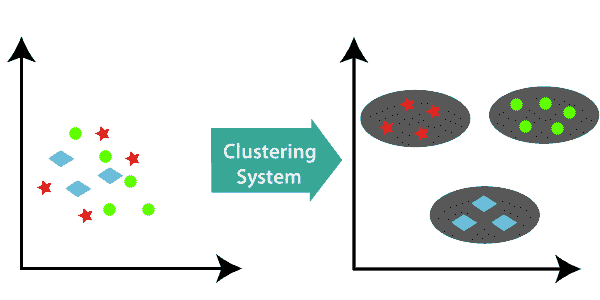

# 机器学习聚类算法

> 原文：<https://www.tutorialandexample.com/ml-clustering-algorithm/>

**ML 聚类算法简介**

聚类属于无监督学习方法。在这种情况下，机器被提供一组未标记的数据，并且机器被要求在没有任何外部监督的情况下从其自身的数据中提取结构。

它在数据集中搜索相似的模式，然后通过相似的分组属性形成这种样本的聚类。换句话说，聚类是对相关数据样本进行分组的过程，使得一个组中的数据点具有相同的种类，但是与另一个组中的数据点不同。进行假设，并基于该假设构成数据点的相似性。

下面给出一个集群系统的例子，以便更清楚地了解集群的概念；

### 不同的集群形成方法

下面给出了形成集群的几种方法；

**1。基于密度的**

在基于密度的方法中，聚类被构建为具有关系的密集区域。它们导致极好的准确性，并有助于合并两个集群。它的例子有 DBSCAN(带噪声的应用的基于密度的空间聚类)、OPTICS(对点进行排序以识别聚类结构)等。

**2。** **等级基础**

在这些方法中，聚类被构造为树状结构。有两种方法，如自下而上的方法(聚合)和自上而下的方法(分裂)。例如，使用代表的聚类(CURE)，使用层次的平衡迭代减少聚类(BIRCH)等。

**3。分区**

在这些方法中，通过将样本分成 K 个聚类来构成聚类，使得分裂的数量等于聚类的数量。例如:K-means 聚类和 CLARANS(基于随机搜索对大型应用程序进行聚类)

**4。网格**

在这些方法中，群集被塑造成网格。在网格上执行的聚类功能更快，并且独立于数据点。例如统计信息网格(STING)、Quest 中的聚类(CLIQUE)。

### 聚类的应用

1.  **用于减少和压缩数据:**聚类的概念广泛用于图像处理领域以及矢量量化中，用于数据减少、压缩和汇总。
2.  **数据挖掘步骤的中间步骤:**由于聚类在总结用于分类、假设生成和测试的数据方面表现良好，因此它也被证明是数据挖掘任务的中间步骤。
3.  **生物学:**它在植物和动物等生物解剖结构的分类中工作得很好。
4.  **保险:**用于在识别欺诈的同时跟踪客户及其保单。
5.  **地震研究:**有助于对地震影响区域进行分组，确定危险区域。
6.  **社交网络分析:**基于聚类的概念，它有助于生成一系列图像、视频和音频。