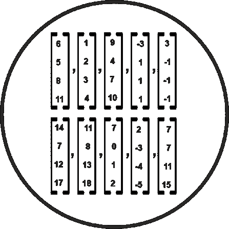
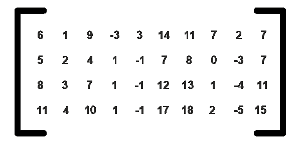

# ML 线性代数中的基本向量

> 原文：<https://www.tutorialandexample.com/basics-vectors-in-linear-algebra-in-ml>

第一，要真心学习机器学习，必须了解线性代数中的向量。线性代数的原理在这里非常重要。线性代数是对直线、空间和平面的研究，也是对一些线性变换技术的研究。基是从线性代数生成所有向量空间的向量集。

当我们查看矩阵图像的基础时，我们从矩阵中移除所有冗余向量。因此，基就是所有线性独立方程向量的组合。每个非零向量空间都有一个基。

### 基向量的思想是什么？

基本向量背后的思想如下:

让我们取一个集合 K，其中 K 包含所有的二维矩阵。我们必须在那个集合上取所有的二维矩阵。所以二维矩阵会有很多向量。向量的所有方程在这些空间中都有效。

所以，如果有两个向量，设向量(v1 和 v2)，然后它们在这个空间形成基和向量。这两个向量写在一个线性代数方程中。现在，我们注意到这些线性代数方程实际上是数字的形式。

举个例子:如果你想要 vector (5，6)，那么这就写成了线性代数方程组(1，0)和(0，1)的形式，分别与 5 和 6 的标量相乘。所以最关键的一点是，如果我们有很多个向量空间，那么这些向量空间分别用两个简单的线性代数方程(1，0)和(0，1)乘以标量来表示。

### 基向量的定义

如果你想写出给定空间中每个向量的线性组合，这些独立的向量就叫做共享空间的基向量。

**属性**

**1。它必须是线性独立的**

如果我们想通过乘以一个标量来导出向量 v2 的值，这是不可能的。并且还证明了这两个向量应该是线性的，相互独立。这是生成唯一向量的基本信息。

**2。必须跨越整个空间**

这里的跨度指的是空间中的任何向量。我们可以把两个向量都写在那个特定的空间上。

**3。这些基本向量不是唯一的**

我们可以找到许多组基向量。但是在选择基向量之前，我们只需要知道两个条件。这些规则就是它们应该是相互独立的，本质上应该是垃圾邮件。

### 要记住的要点

有趣的是，我们可以有两个向量，如果它们有一组不同的数字。我们用一个例子来讨论一下。让我们看看我们是否有两个向量，v1(1，0)和 v2(0，1)，类似地举另一个例子，v1(1，1)和 v2(1，-1)。首先，我们必须检查包含两个向量的数是否相等。所以，如果向量空间是相同的，那么集合中向量的数量应该是相同的。

让我们以一个有四个部分的空间为例。

然后将向量排列成矩阵形式。

然后我们要确定矩阵的秩；之后，我们知道了矩阵的行数和列数。然后从上面的矩阵中，我们可以选择两个独立的列作为基向量。这意味着向量空间的数量取决于秩。如果我们的秩是 1，那么我们只有一个向量。我们需要表示这个向量空间中的每个矩阵。所以我们必须选择两个向量矩阵，它们是线性的，并且彼此独立，这可能是垃圾邮件。

来自数据科学的视点向量概念对于机器学习是必不可少的。例如，如果我们有十个包含四个数字的样本，那么我们只有 40 个数字。

让我们再举一个例子。

我们取两个基本向量，得到- 4x2= 8 个数。

然后从剩下的八个样本中，我们将两个数存储为常数。

因此，我们可以存储 24 个数字，并且可以在 24 个约束中存储全部数据。理解数据科学的基本概念至关重要。通过这个过程，我们可以更创新地存储数据。