# 机器学习的最佳 Python 库

> 原文：<https://www.tutorialandexample.com/best-python-libraries-for-machine-learning>

机器学习是现代的一项重要技术。它帮助我们做以前不可能做的事情。如果你对机器学习感兴趣，那么你必须知道我们必须为此使用不同的算法。但这是一个非常耗时的过程。试想一个必须手动实现的算法。所以，你必须手动编写所有的代码。这是非常耗时和无聊的。为了摆脱这一点，我们可以使用库，模块。要知道 Python 是一门非常强大的机器学习语言。它有许多库来实现机器学习算法。正因如此，它已经成为实现机器学习算法的最强语言之一。在本文中，我们将详细讨论机器学习算法。本文将对所有对机器学习感兴趣的人有所帮助。如果你是机器学习的初学者，那么它将对你非常有用。

让我们看看实现机器学习算法的不同 Python 库。

## 不同的 Python 库

1.  Keras
2.  Matplotlib
3.  Numpy
4.  熊猫
5.  PyTorch
6.  Scikit-learn
7.  我的天啊
8.  TensorFlow
9.  提亚诺

### 1\. Keras

它是最著名和最受欢迎的 Python 库之一。对机器学习初学者帮助很大。在 CPU 和 GPU 上都能流畅运行。它被认为是高级神经网络 API。它可以运行在 TensorFlow、CNTK 或 Theano 之上。keras 的主要优势之一是它可以用于快速和简单的原型制作。

**举例:**

```
import numpy as nup  
from tensorflow import keras as ks  
from tensorflow.keras import layers as ls  
number_classes = 10  
input_shapes = (28, 28, 1)  
 (x_1_train, y_1_train), (x_2_test, y_2_test) = ks.datasets.mnist.load_data()  

x_1_train = x_1_train.astype("float32") / 255  
x_2_test = x_2_test.astype("float32") / 255  
x_1_train = nup.expand_dims(x_1_train, -1)  
x_2_test = nup.expand_dims(x_2_test, -1)  
print ("x_train shape:", x_1_train.shape)  
print (x_1_train.shape[0], "Training samples")  
print (x_2_test.shape[0], "Testing samples")  
y_1_train = ks.utils.to_categorical(y_1_train, number_classes)  
y_2_test = ks.utils.to_categorical(y_2_test, number_classes)  
model_1 = ks.Sequential(  
    [  
        ks.Input(shape = input_shapes),  
        ls.Conv2D(32, kernel_size = (3, 3), activation = "relu"),  
        ls.MaxPooling2D(pool_size = (2, 2)),  
        ls.Conv2D(64, kernel_size = (3, 3), activation = "relu"),  
        ls.MaxPooling2D(pool_size = (2, 2)),  
        ls.Flatten(),  
        ls.Dropout(0.5),  
        ls.Dense(number_classes, activation = "softmax"),  
    ]  
)  
model_1.summary() 
```

**输出:**

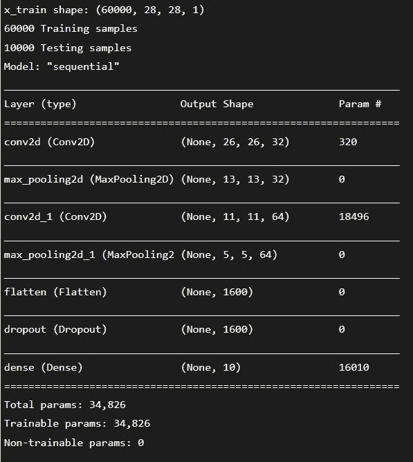

### 2\. Matplotlib

这个库主要用于数据的可视化。数据科学家用这个来检查数据的模式。它主要显示 2D 图形和图表。有一个名为 Pyplot 的模块，通过它我们可以控制图形或图表的不同属性，如轴、颜色和其他东西。它与机器学习没有直接关系，但它有助于开发人员可视化数据的模式。它以数据可视化而闻名。它可以用来制作交互式图形。我们可以缩放、平移或更新这些数字。通过使用这个，我们可以自定义视觉风格和布局。我们可以导出几种文件格式。

**例 1:**

```
import matplotlib.pyplot as plot     
K_1 = [8, 4, 6, 3, 5, 10,   
      13, 16, 12, 21]  
R_1 = [11, 6, 13, 15, 17, 5,   
      3, 2, 8, 19]  

K_2 = [6, 9, 18, 14, 16, 15,  
      11, 16, 12, 20]  
R_2 = [16, 4, 10, 13, 18,   
      20, 6, 2, 17, 15]  
plot.scatter(K_1, R_1, c = "Black",   
            linewidths = 2,   
            marker = "s",   
            edgecolor = "Brown",   
            s = 50)   
plot.scatter(K_2, R_2, c = "Purple",  
            linewidths = 2,  
            marker = "^",   
            edgecolor = "Grey",   
            s = 200)  
plt.xlabel ("X-axis")  
plt.ylabel ("Y-axis")  
print ("Scatter Plot")  
plt.show() 
```

**输出:**

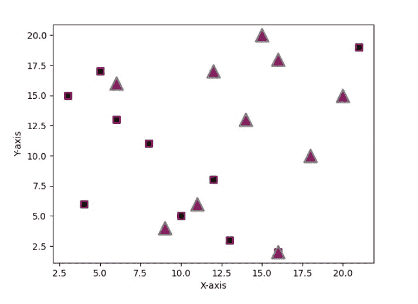

**例 2:**

```
import matplotlib.pyplot as plot  
import numpy as nup  
K = nup.linspace(2, 4, 8)  
R = nup.linspace(5, 7, 9)  
Q = nup.linspace(0, 1, 3)  
plot.plot(K, K, label = 'K')  
plot.plot(R, R, label = 'R')  
plot.plot(Q, Q, label = 'Q')  
plot.legend()  
plot.show() 
```

**输出:**

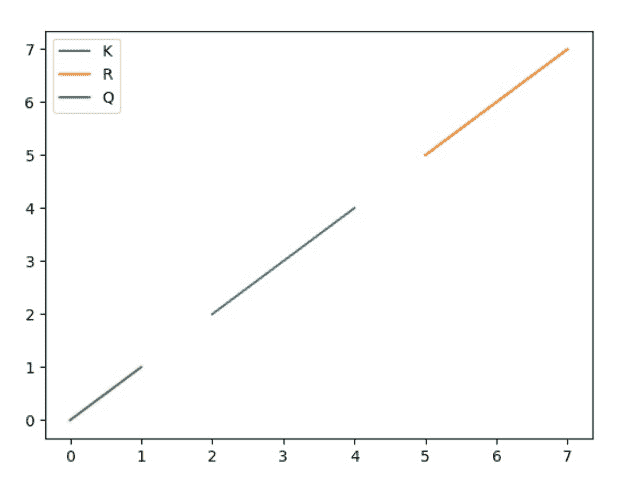

### 3.Numpy

它是最著名的用于机器学习开发的 Python 库之一。我们可以用这个库进行计算。这个库可以通过数学函数和公式形成多维数据来帮助我们。这个库用于线性代数。

**例 1:**

```
import numpy as nup  
K = nup.array([[2, 4], [6, 8]])  
R = nup.array([[1, 3], [5, 7]])  
P = nup.array([10, 12])  
S = nup.array([9, 11])  

print ("Inner product of vectors: ", nup.dot(P, S), "\n")  

print ("Matrix and Vector product: ", nup.dot(K, P), "\n")  

print ("Matrix and matrix product: ", nup.dot(K, R)) 
```

**输出:**

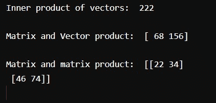

**例 2:**

```
import numpy as np
x = np.array([[1, 2], [3, 4]])
y = np.array([[5, 6], [7, 8]])
v = np.array([9, 10])
w = np.array([11, 12])
print(np.dot(v, w), "\n")
print(np.dot(x, v), "\n")
print(np.dot(x, y))
```

**输出:**

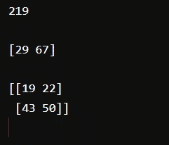

### 4\. Pytorch

它是最著名的用于机器学习开发的 Python 库之一。通过使用这个库，你可以完成计算任务。这个库中有许多可用的工具。它是一个开源的 Python 机器学习库。它是用 C 语言实现的。

**例 1:**

```
import torch as tch  
d_type = tch.float  
device_1 = tch.device("cpu")  
N_1 = 62  
D_in_1 = 1000  
H_1 = 110  
D_out_1 = 11  

K = tch.randn(N_1, D_in_1, device = device_1, dtype = d_type)  
R = tch.randn(N_1, D_out_1, device = device_1, dtype = d_type)  

K_1 = tch.randn(D_in_1, H_1, device = device_1, dtype = d_type)  
K_2 = tch.randn(H_1, D_out_1, device = device_1, dtype = d_type)  

learning_rate_1 = 1e-6  
for Q in range(500):  
    h_1 = K.mm(K_1)  
    h_relu_1 = h_1.clamp(min = 0)  
    y_pred_1 = h_relu_1.mm(K_2)  

    loss = (y_pred_1 - R).pow(2).sum().item()  
    print (Q, loss)  

    grad_y_pred = 2.0 * (y_pred_1 - R)  
    grad_K_2 = h_relu_1.t().mm(grad_y_pred)  
    grad_h_relu = grad_y_pred.mm(K_2.t())  
    grad_h = grad_h_relu.clone()  
    grad_h[h_1 < 0] = 0  
    grad_K_1 = K.t().mm(grad_h)  

    K_1 -= learning_rate_1 * grad_K_1  
    K_2 -= learning_rate_1 * grad_K_2 
```

**输出:**

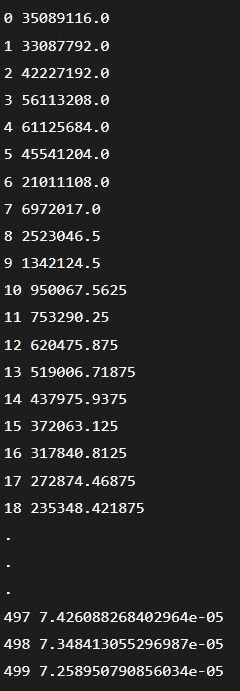

**例 2:**

```
import torch
import math
dtype = torch.float
device = torch.device("cpu") 
x = torch.linspace(-math.pi, math.pi, 2000, device=device, dtype=dtype)
y = torch.sin(x)
a = torch.randn((), device=device, dtype=dtype)
b = torch.randn((), device=device, dtype=dtype)
c = torch.randn((), device=device, dtype=dtype)
d = torch.randn((), device=device, dtype=dtype)
learning_rate = 1e-6
for t in range(2000):
y_pred = a + b * x + c * x ** 2 + d * x ** 3
loss = (y_pred - y).pow(2).sum().item()
if t % 100 == 99:
print(t, loss)
grad_y_pred = 2.0 * (y_pred - y)
grad_a = grad_y_pred.sum()
grad_b = (grad_y_pred * x).sum()
grad_c = (grad_y_pred * x ** 2).sum()
grad_d = (grad_y_pred * x ** 3).sum()
a -= learning_rate * grad_a
b -= learning_rate * grad_b
c -= learning_rate * grad_c
d -= learning_rate * grad_d
print(f'Result: y = {a.item()} + {b.item()} x + {c.item()} x^2 + {d.item()} x^3') 
```

### 5.熊猫

它是最著名的用于机器学习开发的 Python 库之一。这个库用于数据分析。您可以使用这里提供的不同工具来分析您的数据。它是专门为数据分析而构建。所以，可以给开发者很大的帮助。

**例 1:**

```
import pandas as pad  
   data_2 = { "Countries": ["Bhutan", "Cape Verde", "Chad", "Estonia", "Guinea", "Kenya", "Libya", "Mexico"],  
      "capital": ["Thimphu", "Praia", "N'Djamena", "Tallinn", "Conakry", "Nairobi", "Tripoli", "Mexico City"],  
       "Currency": ["Ngultrum", "Cape Verdean escudo", "CFA Franc", "Estonia Kroon; Euro", "Guinean franc", "Kenya shilling", "Libyan dinar", "Mexican peso"],  
       "population": [20.4, 143.5, 12.52, 135.7, 52.98, 76.21, 34.28, 54.32]
}  

data_2_table = pad.DataFrame(data_2)  
print(data_2_table) 
```

**输出:**

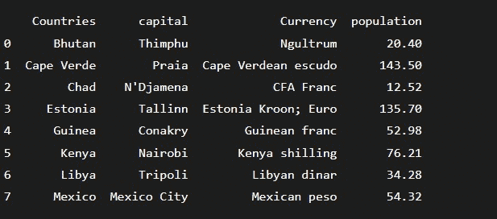

**例 2:**

```
import pandas as pd  
data = {'Name':['Jai', 'Prince', 'Gaura', 'Anu','Ji', 'Prini', 'Gaurav', 'Anuj','Jvi', 'Prici', 'Gauv', 'Aaj'],
 ‘Graduation yr’:[ 2020, 2021, 2017, 2015, 2010, 2018, 2020, 2021, 2017, 2015, 2010, 2018 ],
		'Age':[ 27, 24, 22, 32, 27, 24, 22, 32,27, 24, 22, 32 ],
		'Address':[ “Kanpur”,  'Allahabad', 'Kannauj', 'Delhi',  'Kanpur', 'Allahabad',  'Kannauj', 'Delhi',  'Kanpur',  'Allahabad',  'Kannauj', 'Delhi',  'Kanpur', 'Allahabad',  'Kannauj'],
		'Qualification':['Msc',  'MA',  'MCA' , 'Phd', 'Msc', 'MA', 'MCA', 'Phd','Msc', 'MA', 'MCA', 'Phd']}   
dat = pd.DataFrame(data)  
print (dat [['Name', 'Qualification']])
```

### 6\. Scikit-learn

这个 Python 库在开发者中非常有名。在这个库中，我们可以实现监督和非监督算法。这个库是从 Python 的两个主要库 Numpy 和 Scipy 构建的。这个库可以帮助我们进行数据分析和数据挖掘。我们可以使用这个库来实现机器学习算法。

**例 1:**

```
from sklearn import datasets as ds  
from sklearn import metrics as mt  
from sklearn.tree import DecisionTreeClassifier as dtc  
dataset_1 = ds.load_iris()  

model_1 = dtc()  
model_1.fit(dataset_1.data, dataset_1.target)  
print(model)  

expected_1 = dataset_1.target  
predicted_1 = model_1.predict(dataset_1.data)  

print (mt.classification_report(expected_1, predicted_1))  
print(mt.confusion_matrix(expected_1, predicted_1)) 
```

**输出:**

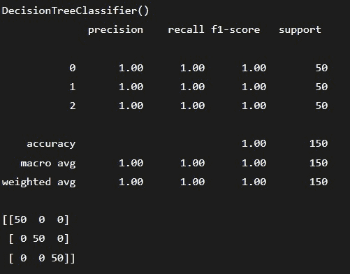

**例 2:**

```
from sklearn import datasets
from sklearn import metrics
from sklearn.tree import DecisionTreeClassifier
dataset = datasets.load_iris()
model = DecisionTreeClassifier()
model.fit(dataset.data, dataset.target)
print(model)
expected = dataset.target
predicted = model.predict(dataset.data)
print(metrics.classification_report(expected, predicted))
print(metrics.confusion_matrix(expected, predicted))
```

**输出:**

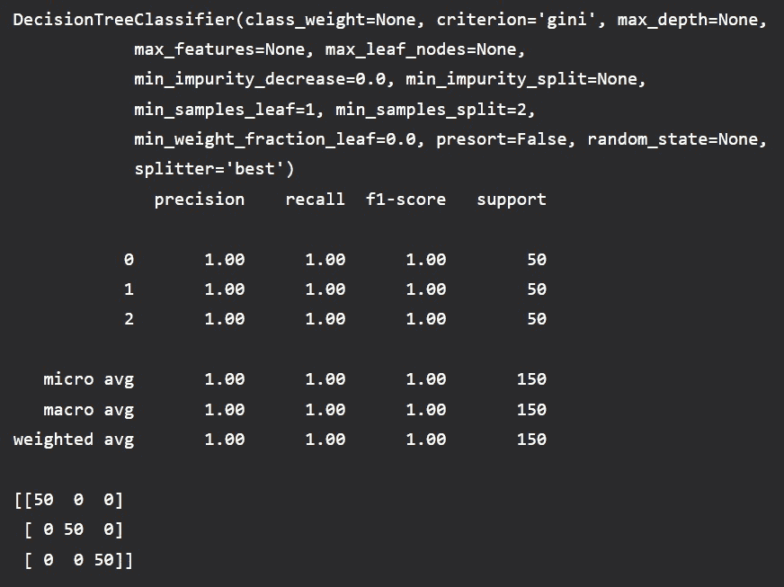

### 7.我的天啊

机器学习开发人员使用这个库来完成涉及图像处理的任务。这是一个非常著名的机器学习库，因为有很多东西可以用来执行几项任务，如线性代数、统计和其他。

**例 1:**

```
import numpy as np
from scipy.spatial import ConvexHull
import matplotlib.pyplot as plt

points = np.array([
[2, 5],
  [3, 4],
  [3, 1],
  [2, 2],
  [4, 1],
  [1, 4],
  [5, 0],
  [3, 1],
  [1, 2],
  [0, 7]
])

hull = ConvexHull(points)
hull_points = hull.simplices

plt.scatter(points[:,0], points[:,1])
for simplex in hull_points:
  plt.plot(points[simplex,0], points[simplex,1], 'k-')

plt.show() 
```

**输出:**

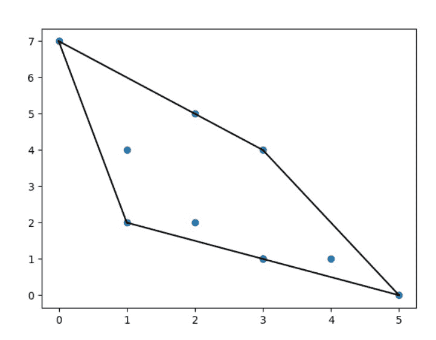

**例 2:**

```
import numpy as np
from scipy.sparse.csgraph import floyd_warshall
from scipy.sparse import csr_matrix
arr = np.array([
  [0, 1, 2],
  [1, 0, 0],
  [2, 0, 0]
])
newarr = csr_matrix(arr)
print(floyd_warshall(newarr, return_predecessors=True)) 
```

**输出:**

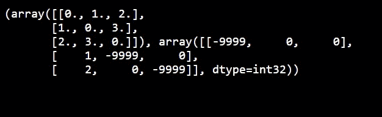

**例 3:**

```
from scipy.spatial import KDTree

points = [(1, -1), (2, 3), (-2, 3), (2, -3)]

kdtree = KDTree(points)

res = kdtree.query((1, 1))

print(res) 
```

**输出:**


### 8\. Tensorflow

这个机器学习库是由谷歌大脑团队开发的。它是 Python 中非常著名的用于机器学习开发的库。它是一个开源库。如果你想开发一些人工智能应用，那么你需要 Tensorflow。它可用于开发深度神经网络。为了定义和执行计算任务，你应该使用这个库。

**例 1:**

```
import tensorflow as tsf  

K_1 = tsf.constant([2, 4, 6, 8])  
K_2 = tsf.constant([1, 3, 5, 7])  
result = tsf.multiply(K_1, K_2)  

sess_1 = tsf.Session()  
print (sess_1.run(result))  

sess_1.close() 
```

**输出:**


**例 2:**

```
import tensorflow as tf
# Initialize two constants
x1 = tf.constant([1, 2, 3, 4])
x2 = tf.constant([5, 6, 7, 8])
result = tf.multiply(x1, x2)
sess = tf.Session()
print(sess.run(result))
sess.close()
```

**输出:**


### 9.提亚诺

这是一个非常有用和强大的机器学习库。对于计算任务，你可以使用这个库。它通常用于需要大量计算数据的长期项目。这个图书馆工作效率很高。它优化了 CPU 和 GPU 的使用。它用于自检和检测错误。如果你需要做数学和统计，那么这个图书馆可以帮助你很多。

**例 1:**

```
import theano
import theano.tensor as T
x = T.dmatrix('x')
s = 1 / (1 + T.exp(-x))
logistic = theano.function([x], s)
logistic([[0, 1], [-1, -2]])
```

**输出:**

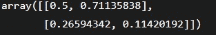

**例 2:**

```
import numpy
import theano.tensor as T
from theano import function
x = T.dmatrix('x')
y = T.dmatrix('y')
z = x + y
f = function([x, y], z)
f([[30, 50], [2, 3]], [[60, 70], [3, 4]])
```

**输出:**


**例 3:**

```
import numpy
import theano.tensor as T
from theano import function
x = T.dscalar('x')
y = T.dscalar('y')
z = x + y
f = function([x, y], z)
f(5, 7)
```

**输出:**

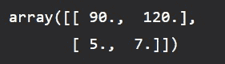

### 10.OpenCV

这是一个非常著名的 Python 库。我们可以用这个进行图像处理。它的计算效率很高。它用于实时计算机。

**例 1:**

```
import cv2
import os
image_path = r'C:\Users\Rish\Desktop\G\gs.png'
directory = r'C:\Users\Rish\Desktop\G'
img = cv2.imread(image_path)
os.chdir(directory)
print("Before saving image:")
print(os.listdir(directory))
filename = 'savedImage.jpg'
cv2.imwrite(filename, img)
print("After saving image:")
print(os.listdir(directory))
print('Successfully saved')
```

**输出:**

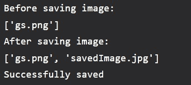