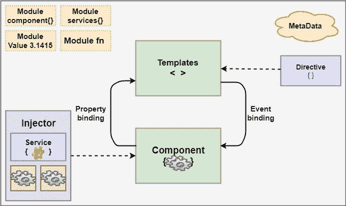
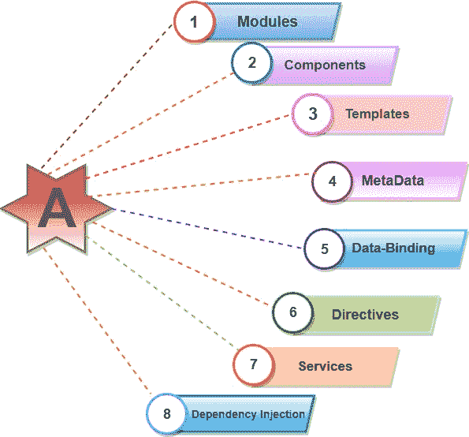
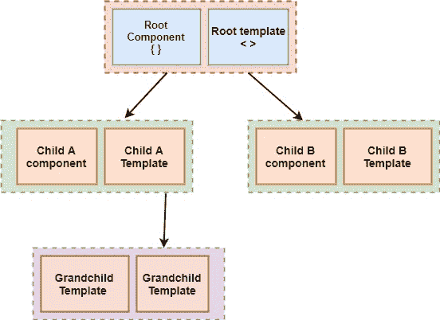
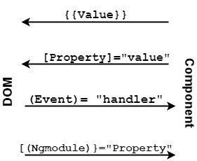
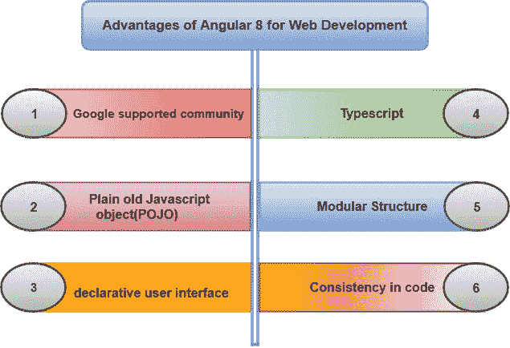

# 角 8 建筑

> 原文：<https://www.tutorialandexample.com/angular-8-architecture/>

**建筑的棱角 8**

Angular 8 是一个平台和框架，用于创建 HTML 和 Typescript 格式的客户端应用程序。*角度 8 写在打字稿里*。 [Typescript](https://www.tutorialandexample.com/typescript-tutorial/) 是 JavaScript 的超集。

Angular 8 将核心和可选功能实现为一组类型脚本库，我们可以将它们导入到我们的应用程序中。

**NgModules** 是 Angular 8 应用的*基本构建模块。它们为组件提供了编译上下文。*

各种单元组合*构建一个角度应用*，如下。



Angular 8 总是至少有一个根模块支持引导。

组件定义视图，视图是根据 Angular 8 中的程序逻辑和数据修改的一组屏幕元素。

这些是基本模块，如下所示:



**1。模块:**

angular 8g 模块不同于其他 JavaScript 模块。每个 Angular 8 应用程序都提供了启动应用程序的[引导](https://www.tutorialandexample.com/bootstrap-tutorial/)机制。

一般来说，每个角 8 模包含许多功能模块。

Angular 8 模块的一些交互**特性:**

*   NgModules 从另一个 NgModules 导入功能，就像其他 JavaScript 模块一样。
*   [NgModules](https://angular.io/guide/ngmodules) 允许其他模块导入和使用它们的功能，例如，如果我们想在应用程序中使用 route service，我们可以导入 Routing Ng 模块。

**2。组件:**

每个 angular 项目至少有一个组件，即根组件，根组件将组件与页面文档对象模块(DOM)连接起来。每个组件定义一个包含数据、应用程序、逻辑的类，并且它与 HTML 模板绑定。

```
 @Component({
 selector: ‘app-root’,
 TemplateUrl: .’ /app.component.html’,
 StyleUrls: [‘. /app.component.css’]
 }) 
```

**3。模板:**

角度模板将 HTML 与角度标记集成在一起，可以在 HTML 元素显示之前对其进行修改。它提供程序逻辑，绑定标记连接到应用程序数据和 DOM。

```

# {{2| power: 5}}

```

在上面的 HTML 文件中，我们一直使用模板。我们已经使用模板中的管道将值转换成所需的输出。



**4。元数据**

 **装饰者是 Angular 中的元数据。它用于增强类，以便可以配置类的预期行为。开发人员是 Angular 开发时的核心概念。用户可以使用类中的元数据来告诉 Angular app，app 组件是一个组件。元数据可以通过装饰器附加到 Typescript。

```
@Component ({
 selector: ‘app-root’,
 templateUrl: ‘./app.component.html’,
 styleUrls: [‘./app.component.css’]
 }]
```

**5。数据绑定:**

Angular 允许组件和 DOM 之间的通信。使得定义交互式应用程序变得非常容易，而不需要推拉数据。

有两种类型的数据绑定。

**事件绑定:**我们的应用程序通过更新应用程序数据来响应目标环境中的用户输入。

**属性绑定:**将从应用程序数据中计算出的值插入到 HTML 中。

插值:{{value}}:插值将属性的值加到组件上。

```
 Name: {{student.name}} 
学院:{ {学生。大学}}
```

### 属性绑定:[属性]= "值"

一个值已经从一个组件传递到一个特殊的属性，属性绑定可以是一个简单的 html 属性。



**6。指令:**

用于扩展 HTML 元素功能的指令。Angular 中的三种类型的指令是结构指令、属性指令和组件指令。我们可以内置角度指令，比如:ngClass，这是一个去掉角度属性指令的更好的例子。

```
Angular8 指令示例

```

7 .**。服务:**

用于重用代码的服务。该服务为该代码创建多个组件的标准代码。装饰器提供元数据，允许我们的服务作为依赖项注入到客户机组件中。Angular 将元素与服务区分开来，以增加模块性和可重用性。通过将组件功能与其他类型的处理分离开来，我们可以使我们的组件更加精简和高效。

**8。依赖注入:**

这是一种效率和模块化的设计模式。DI 被连接到 Angular 中，成为一个 Angular 框架，并在任何地方使用，为新的组件提供新的服务。依赖注入不从服务器获取数据、验证用户输入或直接记录到控制台；相反，他们将这些任务委托给服务。

**管道:**

带有@Pipe decorator 的类定义了一个函数，该函数将输入值转换为输出值，以便按数量显示。

Angular 定义了各种管道，如数据管道和货币管道；获取完整列表，我们还可以定义新管道。要在 HTML 模板中指定值转换，请使用**管道运算符(|)。**

```
{{interpolated_value | pipe_name}}
```

管道还可以控制它如何执行转换，以便我们可以在管道中传递所需的输出。

```
今天是{ {今天|日期}}

日期是{ {今天|日期:'完整日期' }}

时间是{ {今天|日期:'短时间' }} 
```

### 角度性能&从角度 7 到角度 8 的升级

Angular 8 的新功能很棒，但我们许多人升级到 Angular 8 新版本的主要原因是为了获得性能提升。如果我们使用以前的 angular 版本，那么将应用程序从 Angular 7 升级到 Angular 8 是很简单的。

命令将 Angular 7 的版本更新为 Angular 8。

```
Ng update @angular/cli @angular/core
```

### Angular 8 在 Web 开发中的优势

Angular 8 有很多好处，可以让用户使用它作为 web 开发的框架。



1.  **谷歌支持的社区:** Angular 附带谷歌的长期支持(LTS)。谷歌团队对 Angular 的稳定性非常有信心；此外，谷歌应用程序使用了一个有角度的框架。
2.  普通旧 JavaScript 对象(POJO ):它不需要任何 getter 和 setter 函数。它把每个对象都当作日常的旧 JavaScript 对象。它提供了 JavaScript 功能来实现对对象的操作，例如添加属性或从目的中删除属性。
3.  **声明式用户界面:** Angular 使用 HTML 来定义应用的视图部分，这是一种复杂的语言。Html 也是一种声明性语言。我们不担心程序的流程，当它根据应用程序的需求定义我们想要的东西时，angular 会处理其余的事情。
4.  **Typescript:** 用 Typescript 写的，是 JavaScript 的超集。它提高了安全性。如果我们在构建期间创建了适当的映射文件，那么您就可以在编辑器或浏览器中轻松地调试 typescript 代码。
5.  **模块化结构:** Angular 将代码组织成模块，无论是组件、指令、管道还是服务。通过分离代码，它使功能的组织变得简单而直接。它还提供延迟加载。
6.  **代码的一致性:**最大化代码的可读性。对于任何新的开发人员来说，由于其代码一致性特性，完成项目是一件容易的事情。

#### 相关帖子:

*   [角度 8 变化和新功能](https://www.tutorialandexample.com/angular-8-changes-and-new-features/)
*   [八角万向](https://www.tutorialandexample.com/angular-8-universal/)
*   [角度 8 中的动态分量](https://www.tutorialandexample.com/dynamic-components-in-angular-8/)
*   [依赖注入角度 8](https://www.tutorialandexample.com/dependency-injection-in-angular-8/)
*   [Angular 8 中的可扩展性和验证表单](https://www.tutorialandexample.com/scalability-and-validation-forms-in-angular-8/)
*   [在角度 8 中创建表单](https://www.tutorialandexample.com/creating-form-in-angular-8/)
*   [角度 8 中的字符串插补](https://www.tutorialandexample.com/string-interpolation-in-angular-8/)
*   [角度 8 中的数据绑定](https://www.tutorialandexample.com/data-binding-in-angular-8/)
*   [属性绑定在角度 8](https://www.tutorialandexample.com/property-binding-in-angular-8/)
*   [角度 CLI 命令](https://www.tutorialandexample.com/angular-cli-commands/)
*   [角度 8 分量](https://www.tutorialandexample.com/angular-8-components/)**