# 角度 8 的安装

> 原文：<https://www.tutorialandexample.com/installation-of-angular-8/>

**逐步安装导轨至角度 8**

Angular 结合了声明性模板、依赖注入和端到端工具来解决开发挑战。Angular 使开发人员能够构建一个适用于移动、web 和桌面的应用程序。Angular 目前的版本是 7.2.13，我们要讲解的是在 Windows 10 操作系统中安装的步骤。

**要安装 Angular 8，我们需要以下东西:**

*   Windows 10
*   Node.js (12.6.0)
*   NPM
*   Angular CLI(命令行界面)
*   用于编写我们的代码(VS 代码)的 IDE
*   饭桶

**在我们的系统中安装了这些之后，我们必须知道这些东西是什么:**

**Node.js:** Node.js 是一个开源、跨平台的 JavaScript 运行时环境，在浏览器之外执行 JavaScript 代码。它是由**瑞安·达尔**用 C、C++和 JavaScript 开发的。它可以在各种平台(Windows、Linux、UNIX、Mac 等)上免费使用和运行。它可以生成动态页面内容，并可以添加、删除和修改数据库中的数据。Node.js 文件有扩展名**。js”。**

**NPM** : NPM 是 node.js 包中的一个包管理者。【www.npmjs.com】[](https://www.npmjs.com)**主机数百万免费套装下载使用。当我们安装 node.js 时，NPM 程序就安装在我们的计算机中了。node.js 中的一个包包含了我们需要一个模块的整个包。下载一个包很兼容。打开命令行界面，说 NPM 下载我们想要的软件包。如果我们想下载一个名为**"大写":**的包**

 **```
C:\Users\e>npm install upper-case
```

Angular CLI:Angular CLI 被称为 Angular 命令行界面。Angular CLI 用于创建项目。它可以用来创建内容、服务、管道、指令等等；此外，它还有助于构建、服务、测试等。它使得 Angular 开发工作流更加容易和快速。


**IDE (Visual Studio):** 微软 Visual Studio 是由**微软**开发的集成开发环境，用 C++和 C#编写。它用于创建计算机程序，以及网站、网络应用程序和移动应用程序。visual studio 使用 Microsoft 软件开发平台，如 Windows API、Windows 窗体、Windows Presentation Foundation、Windows 应用商店和 Microsoft Silver light。它产生了本机代码和托管代码。

VS 代码很轻，很容易设置。它可以免费使用，并提供大量的扩展来提高您的工作效率。

我们可以从这里下载 VS 代码:[](https://code.visualstudio.com/)**。**

 ****Git:** Git 是一个分布式版本控制系统，用于在软件开发过程中跟踪源代码的变化。它是为程序员之间分配工作而设计的。但它用于跟踪文件中的任何一组更改。 **Linus Torvalds** 在 2005 年为开发 Linux 内核创建了它。Git 是 GNU(通用公共许可证)第 2 版条款下的自由开源软件分发系统。

**1。安装 Node.js:** 首先，我们需要在我们的系统中安装 Node.js，然后 NPM 将与 node.js 连接。因此，最新版本的 node.js 可以从官方网站下载并安装。目前，12.4.0 是 node.js 的趋势版本。URL 如下所示:

https://nodejs.org

打开链接后，出现了这个页面。对于最新版本的 node 和 npm，我们可以选择第二种。

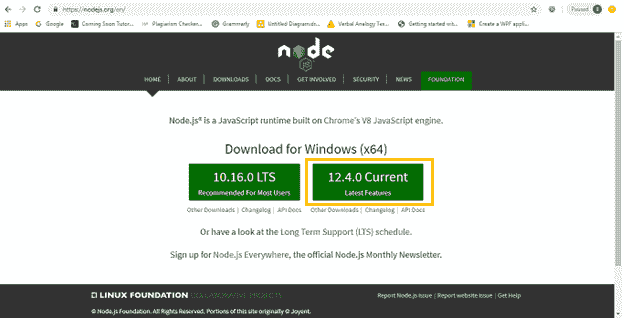

下载后，我们必须在我们的系统中安装 node.js。步骤如下:

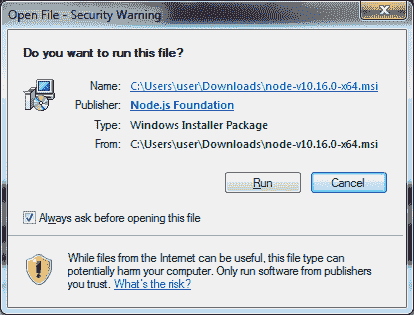

点击**运行**

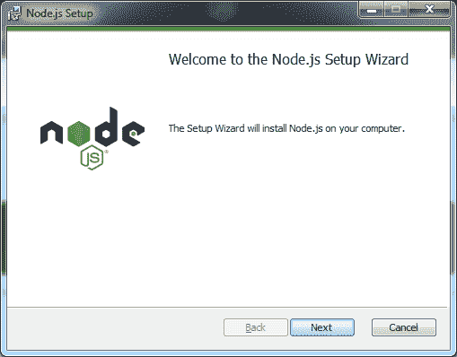

**点击“下一步”**

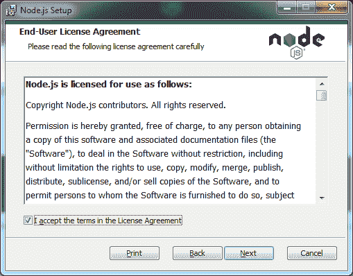

点击**“下一步”**

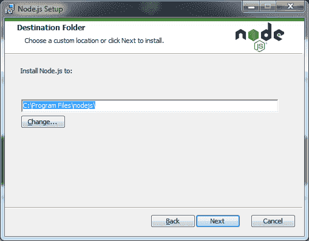

再次点击“下一步”

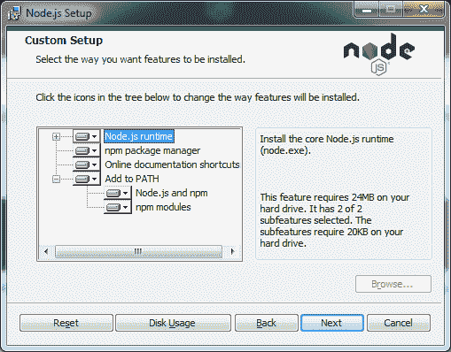

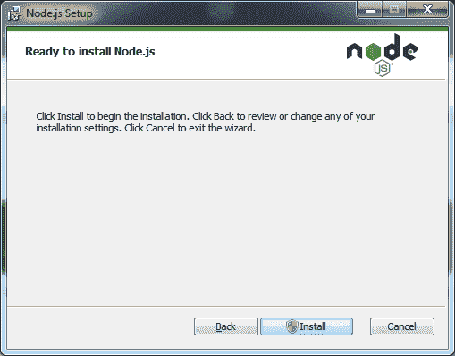

点击**“安装”**

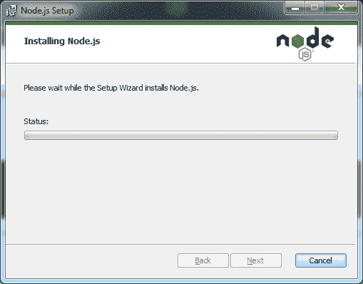


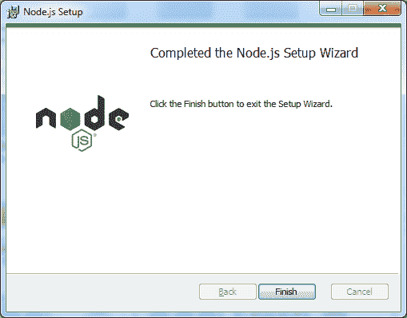

node.js 已成功安装在我们的系统中。

**安装 Git**

首先，我们必须打开 Git 的官方网站:

https://gitforwindows.org

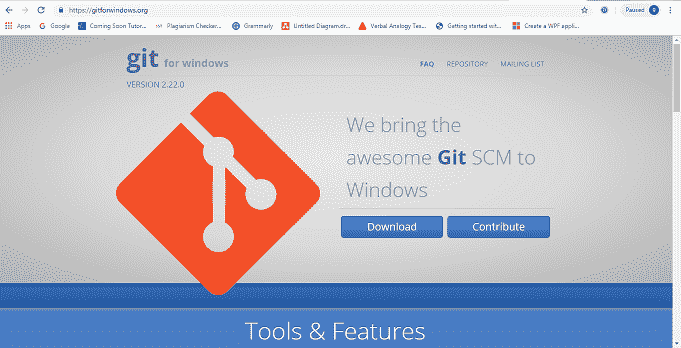

点击**运行**

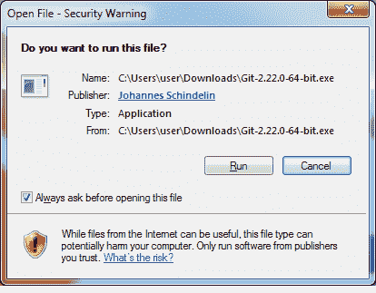

点击**下一个**

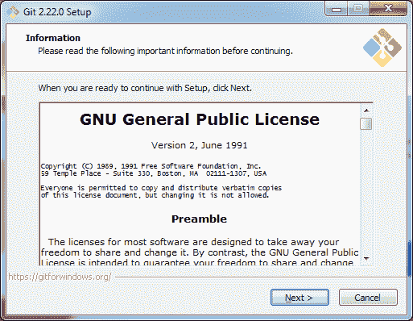

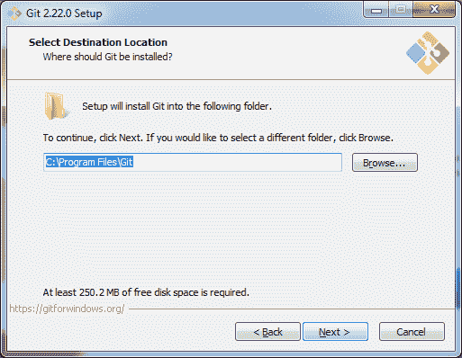

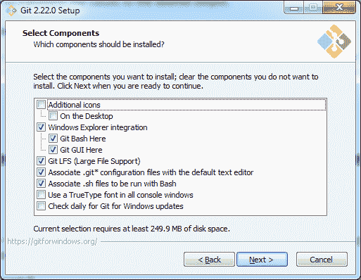

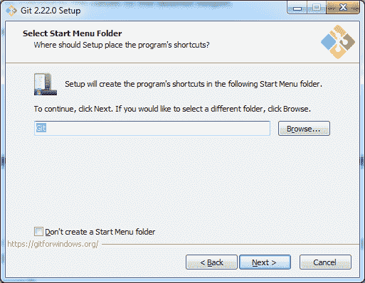

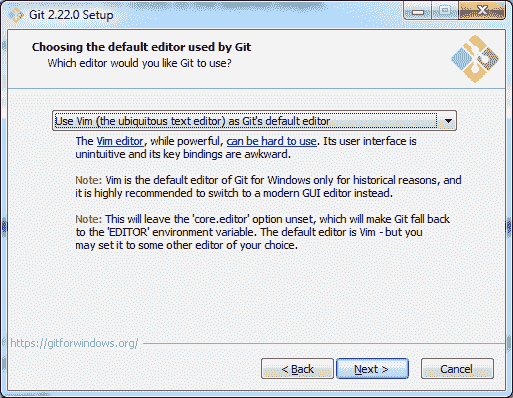

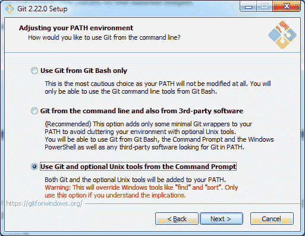

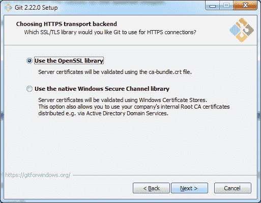

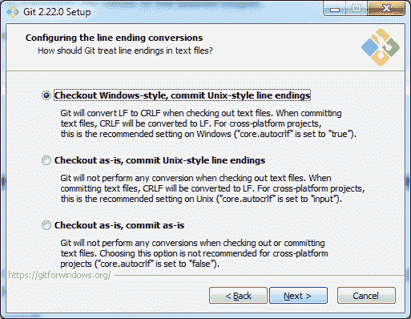

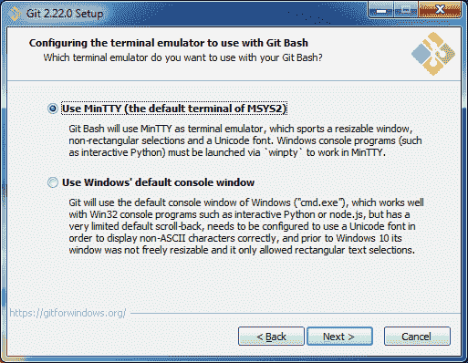

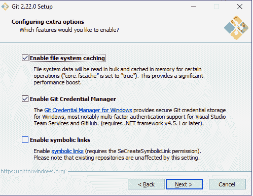

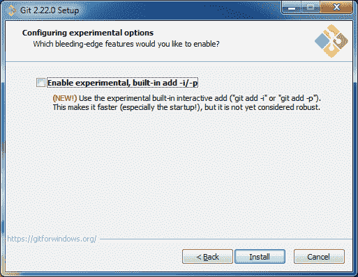

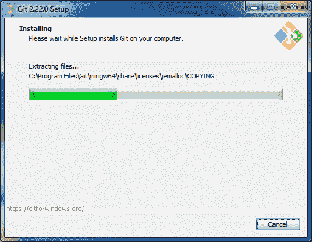

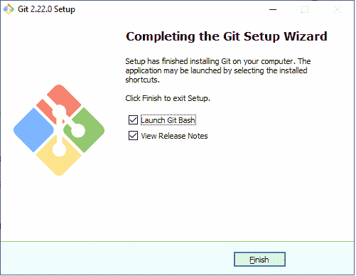

在上面的截图中， **Git** 已经成功安装在我们的系统中。

之后，我们必须在我们的系统中安装 AngularCLI，以便我们打开 angular form 的官方网站，网址为:

https://cli.angular.io

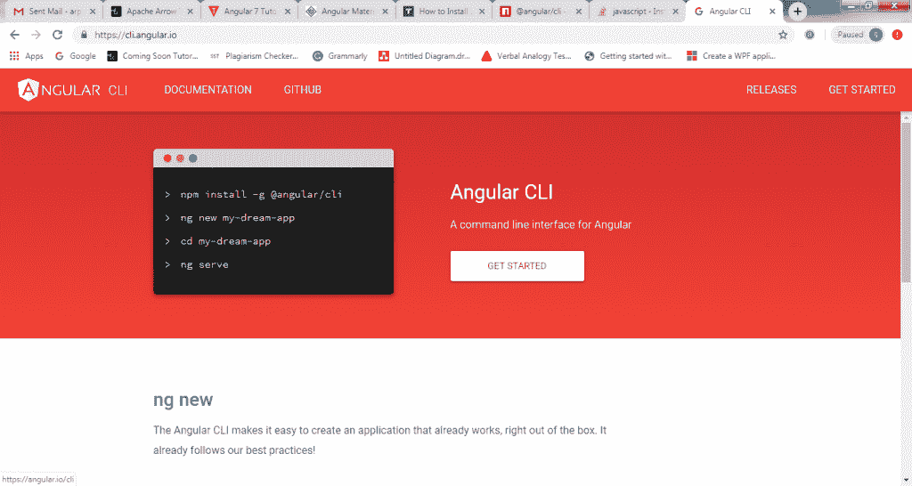

我们可以通过以下命令检查节点和节点程序包管理器(Npm)的当前版本。

```
Node –v
Npm -v 
```

右击桌面，点击“Git Bash Here ”,一个命令行界面将在桌面打开。

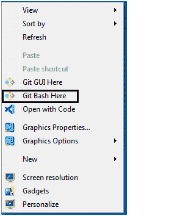

这里，“GIT BASH”在我们的系统中打开，然后编写命令。

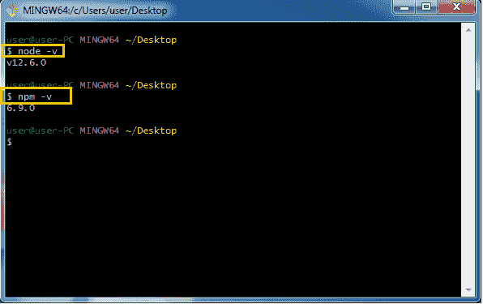

然后我们必须在 **Git 的命令行帮助下下载 Angular CLI。**在 Git Bash 中编写这个命令。

```
npm install  –g @angular/cli
 or
 npmi –g @angular/cli 
```

要安装 Angular CLI，我们必须在 Git 中编写以下命令。

```
npm install –g @angular/cli
```

根据下面的屏幕截图，它将成功地安装在我们的系统中。

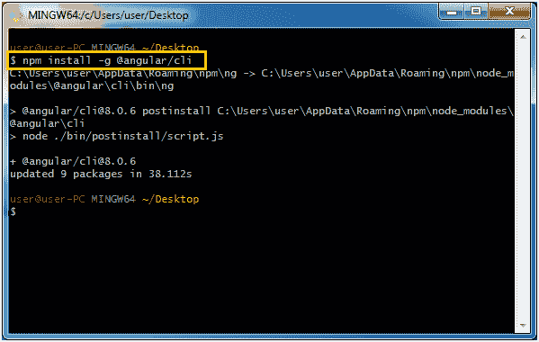

我们的 Angular 8 设置现在已经完成。

在接下来的教程中，我们将了解如何在 VS 代码的帮助下创建我们的第一个应用。****