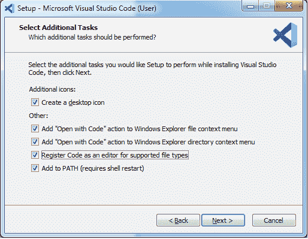
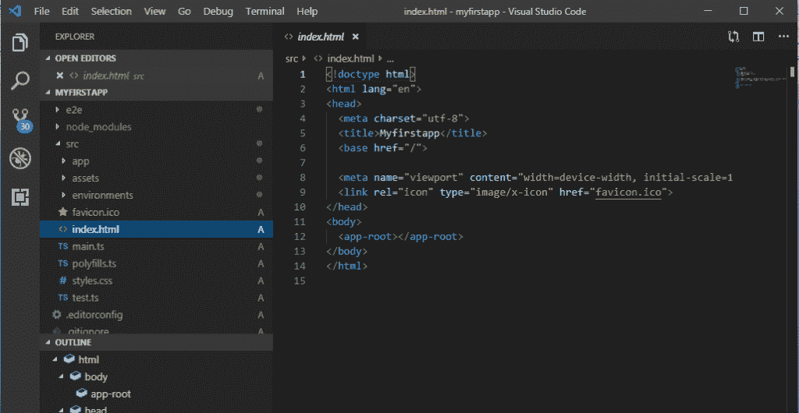
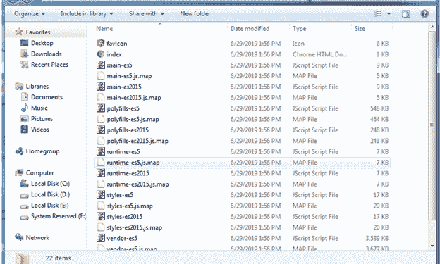

# 在 Angular 8 中创建第一个应用

> 原文：<https://www.tutorialandexample.com/creating-first-app-in-angular-8/>

首先，我们必须打开 Git Bash，然后我们必须在其中编写以下命令。

```
ng new my -app
```


项目现在已经创建好了，所以现在我们必须进入这个文件夹来编写这个命令:

```
cd project name
```

然后，我们必须在服务器上运行这个项目，并通过这个命令启动。

```
ng serve --open
```


之后，defaultlocal 主机已经自动创建，并从本地主机 4200 在我们的系统中打开。


创建项目后，我们希望 IDE 打开并编辑执行项目的代码，这样我们就可以通过其网站在我们的系统中下载**VS 代码**。


下载后，我们必须安装 VS 代码。

这些是以下步骤:


点击**“下一步”。**


再次点击**“下一步”。**


点击**“下一步”。**




在我们的系统中下载并安装了 VS 代码后，我们可以在其中打开我们的项目。


之后，我们将在 VS 代码中打开我们的项目。




在这里，我们可以在 VS Code 中添加和编辑我们的代码来完成我们的项目，我们所有的库和文件都在系统中。

我们的项目现在已经生成。

如果我们的项目完成了，然后，我们必须建立这个项目上传到服务器上的整个文件。为了创建计划，我们必须在 GIT 中使用这个命令，如下所示:

```
ng build
```


根据上面的截图，它将成功构建。

我们也可以直接通过档案查。

只需点击项目文件，然后转到“**dist”**文件夹，然后打开项目，点击名称后，我们将看到数据。如果我们想上传，那么我们必须根据下面给出的**截图**上传文件夹中的所有文件。


这些是构建的文件。



我们还可以看到构建项目后 VS 代码的变化，如下所示:


要验证安装的 Angular CLI 版本:

```
ng -v 
```