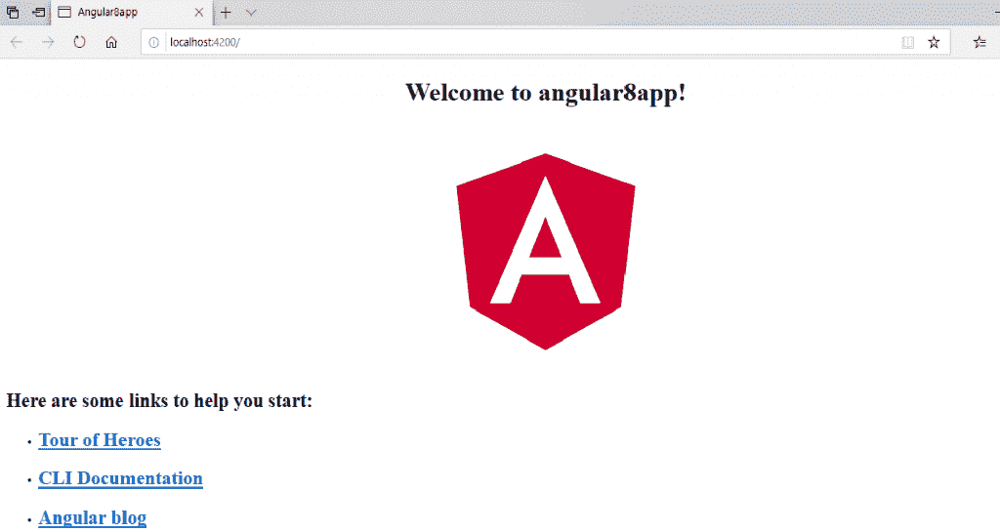
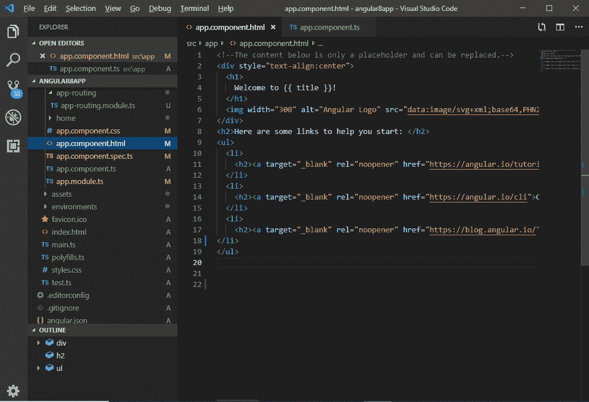
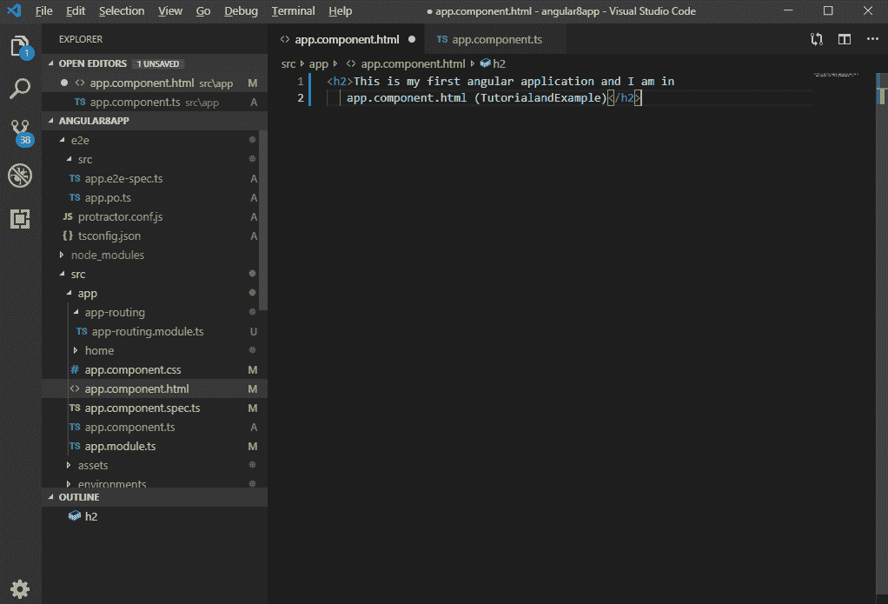
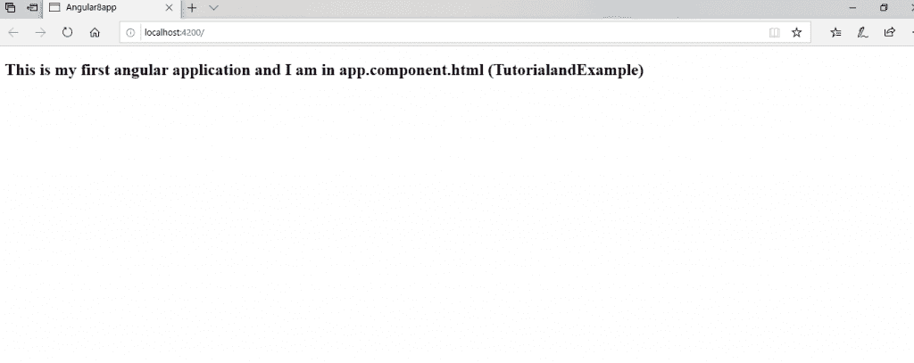
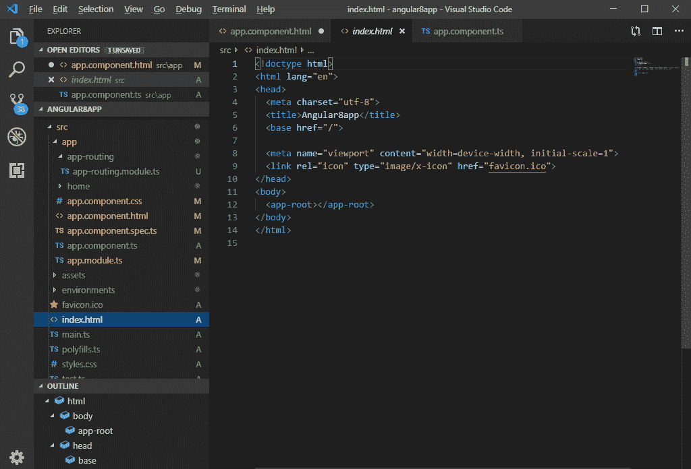
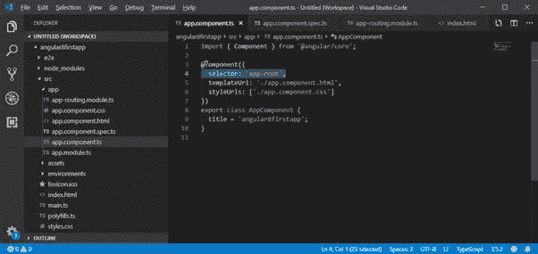
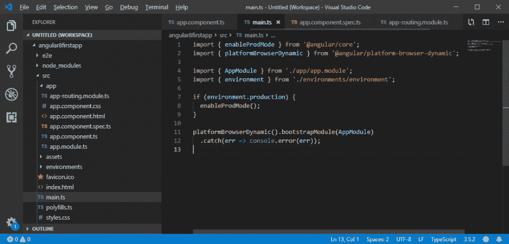
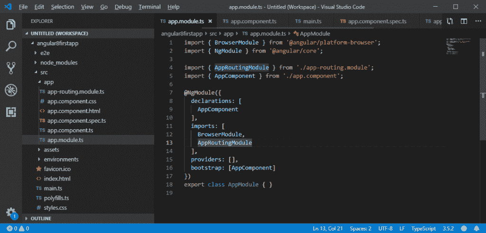

# 角度 8 App 加载

> 原文：<https://www.tutorialandexample.com/angular-8-app-loading/>

**Angular 8 app 如何加载启动**

当我们创建一个 Angular 应用程序并使用 **ng serve** 命令运行它时，它看起来像下面的截图。



这是一个简单的 Angular 应用程序，使用 **ng new app-name** 命令创建，不需要在应用程序中进行编辑。这款应用的名字叫做 **angular8app** 。

现在，我们将看到如何加载和启动 Angular 的应用程序。

从**app.component.html**文件中删除所有代码，写一些必要的 HTML 代码。

**例如:**

```
<h5>This is my first angular application, and I
am in app.component.html (TutorialandExample)</h5>
```

这是**app.component.html**文件中的默认代码。

当...的时候



当我们用给定的代码更新它时:



我们可以在浏览器上看到。



这里，文件不是由服务器提供的。服务器提供了一个**index.html**文件。



Angular 是一个允许创建**“单页应用程序】、**的框架，这里的**index.html**是由服务器生产线产生的单页。

**Index.html:**

```
<!doctype html>
 <html lang="en">
 <head>
   <meta charset="utf-8">
   <title>Angular8firstapp</title>
   <base href="/"> 
   <meta name="viewport" content="width=device-width, initial-scale=1">
   <link rel="icon" type="image/x-icon" href="favicon.ico">
 </head>
 <body>
   <app-root></app-root>
 </body>
 </html> 
```

上面的代码看起来像一个普通的 HTML 代码，这里的<title>标签在浏览器中显示了与应用程序标题相同的标题。但是</title>代码不同于普通的 HTML 代码。

我们可以看到 CLI 提供的 **" < app-root > "** 标签。我们可以说，每当我们从 CLI 创建项目时，默认情况下，都会创建一个组件，即“app 组件”。

参见“ **app.component.ts** ”文件。这是一个打字稿文件。在这里，我们看到了**【选择器】**属性。

```
import { Component } from '@angular/core';
 @Component({
   selector: 'app-root',
   templateUrl: './app.component.html',
   styleUrls: ['./app.component.css']
 }) 
 export class AppComponent {
   title = 'angular8firstapp';
 } 
```



我们可以看到，选择器属性包含字符串作为 index.html 文件。该信息是将该零件放入带有组件模板的**index.html**文件所需的角度。

组件的模板是**”。/app.component.html** ，所以，Angular 把这部分包含到了 index.html 文件**中。**

现在，我们看到一个“应用程序根”是如何包含在 index.html 文件中的。

### 角度触发器是如何工作的？

当 ng-serve 构建应用程序时，它会创建“**包**”，并在运行时自动将这些包添加到 index.html 文件中。因此，从这些包中，第一个代码必须从“main.ts”中执行，也就是说，“ **main.ts** 文件是 angular 应用程序开始执行的主文件。

**main.ts 文件:**

```
import { enableProdMode } from '@angular/core';
import { platformBrowserDynamic } from '@angular/platform-browser-dynamic';
import { AppModule } from './app/app.module';
import { environment } from './environments/environment';
if (environment.production) {
  enableProdMode(); 
} 
platformBrowserDynamic().bootstrapModule(AppModule) 
  .catch(err => console.error(err)); 
```



这里，自举方法启动角度应用。它指的是在应用文件夹中查找的 **AppModule，**。我们可以在“ **app.module** ”文件中看到，基本上是所有组件列表的引导阵列分析 index.html 文件。

**app.module.ts** 文件:

```
import { BrowserModule } from '@angular/platform-browser';
import { NgModule } from '@angular/core';
import { AppRoutingModule } from './app-routing.module';
import { AppComponent } from './app.component'; 
@NgModule({
  declarations: [
    AppComponent
  ], 
  imports: [
    BrowserModule,
    AppRoutingModule
  ], 
  providers: [],
  bootstrap: [AppComponent]
})
export class AppModule { } 
```



现在，我们可以看到 angular 应用程序被加载为:

```
main.ts  >>   app.Module.ts  >> app.component.ts  >>  index.html >>  app.component.html
```