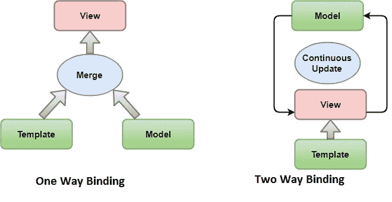
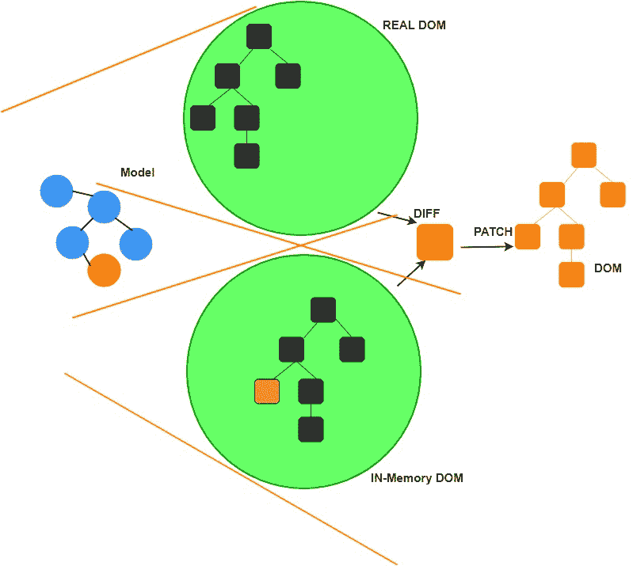

# 优点|角度 8 的缺点

> 原文：<https://www.tutorialandexample.com/advantages-disadvantages-of-angular-8/>

**棱角分明的优点 8**

下面给出了 angular 8 的一些优点:

 ***   它提供干净的代码开发
*   更高的性能
*   angular 框架可以负责路由，这意味着在 Angular 中从一个视图移动到另一个视图很容易。
*   使用 Angular CLI(命令行界面)进行无缝更新。
*   它允许检索定位服务状态的能力。
*   我们可以在 angular 8 中调试模板。
*   它支持一个域中的多个应用程序。

## 角度的缺点

**以下也是 Angular 的一些缺点:**

*   棱角分明的特征可能会让新人感到困惑。
*   没有精确的手册和广泛的、包罗万象的文档。
*   陡峭的学习曲线
*   作用域很难调试有限的路由。
*   当页面嵌入交互元素时，时间会变得很慢。
*   第三方集成很复杂。
*   从旧版本切换到新版本时，我们可能会面临几个问题。

**