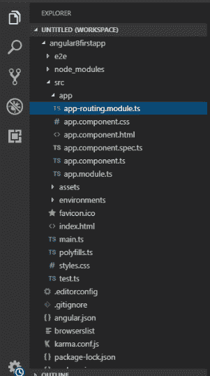
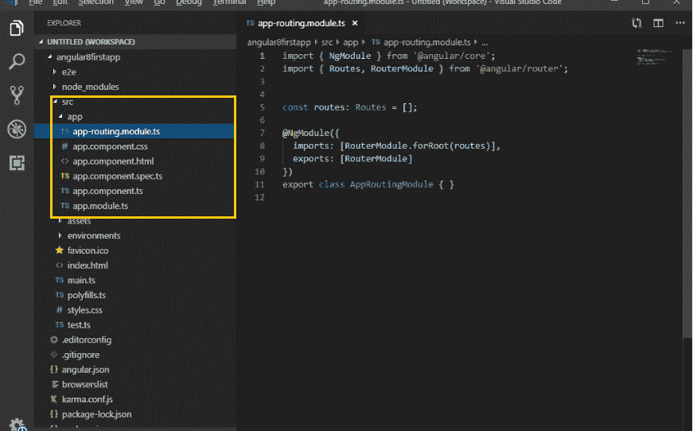
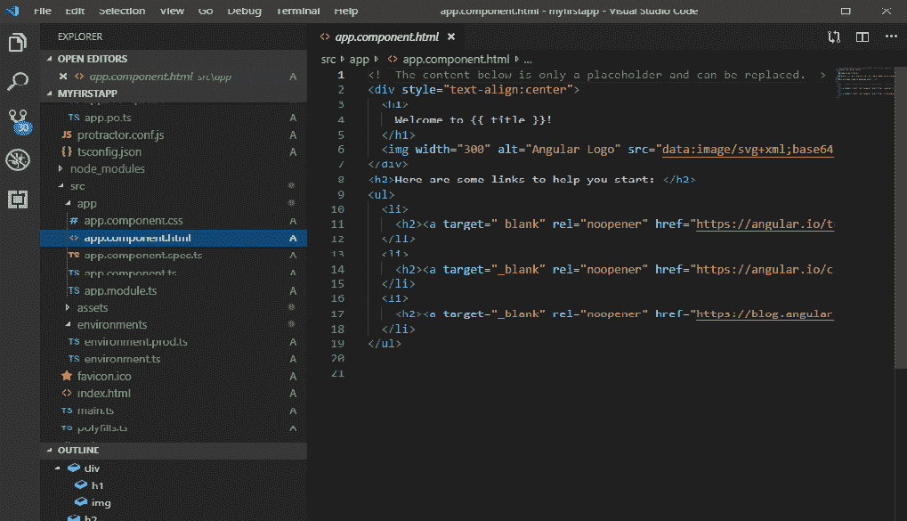
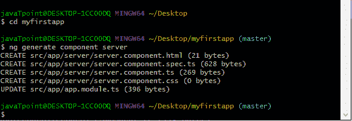
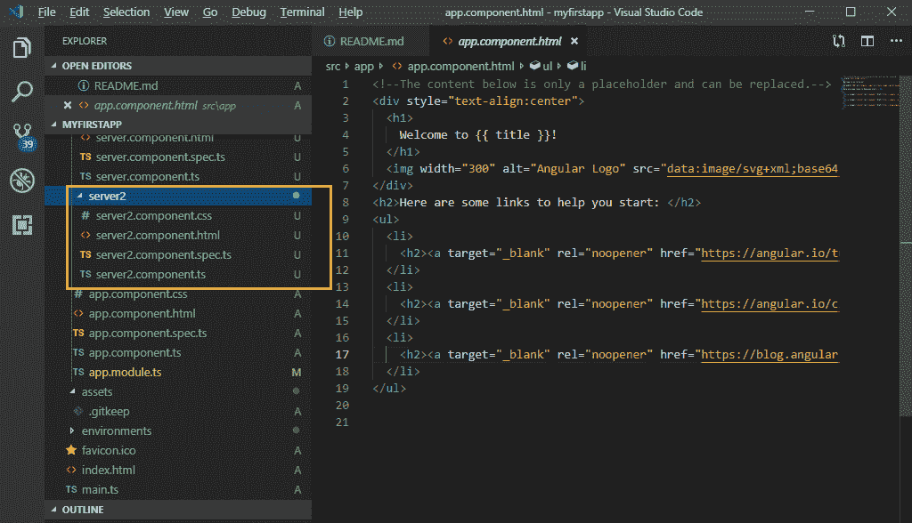
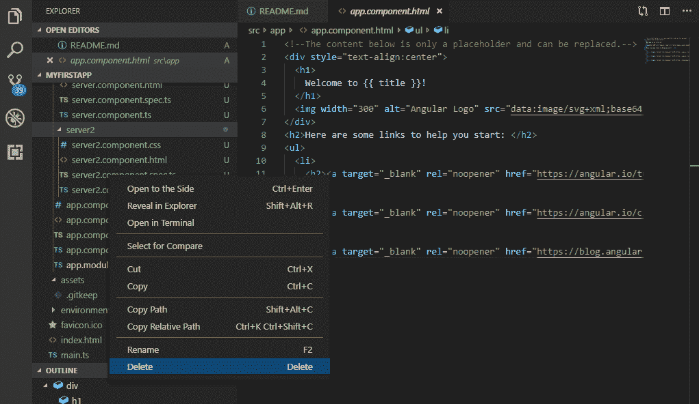
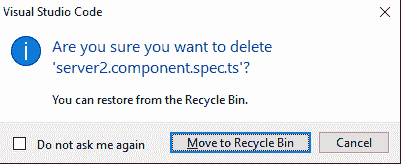

# 角度 8 分量

> 原文：<https://www.tutorialandexample.com/angular-8-components/>

Angular 用于*构建移动和桌面网络应用*。组件是角形的**基本积木。它有一个选择器、模板、样式和其他属性，并指定处理组件所需的元数据。**

使用一个 **@component** 装饰器和一个角度组件树来定义组件。它使我们复杂的应用程序成为可重用的部分，我们可以很容易地重用。

组件是 Angular 和带有根组件的组件树中最关键的概念。根组件是包含在 **app.module.ts** 文件中定义的主 **ngModule** 模块的引导数组中的组件。

组件的一个重要方面是可重用性。组件可以在整个应用程序中重用，甚至可以在其他应用程序中重用。执行特定任务的标准且可重复的代码可以封装到一个可重用的组件中。


### 什么是基于组件的架构？

Angular 应用程序由一些组件构建而成，这些组件形成一个包含父组件和子组件的树结构。

组件是大系统中的一个独立模块，它使用输入和输出与系统的其他构件进行通信。它有关联的视图、数据和行为，并且有父组件和子组件。

该组件允许最大程度的重用、安全测试、维护和问题分离。转到我们的 Angular 项目文件夹，打开 src/app 文件夹，我们会看到下面的文件。

**App 文件夹:**App 文件夹包含我们为 App 组件创建的数据。

*   **app.component.css** :组件 css 文件。
*   app.component.html:这个组件用于 HTML 视图。
*   **app.component.spec.ts** :组件的 HTML 视图
*   **app.component.ts** :组件编码(数据和行为)
*   **app.module.ts** :主应用模块。



进一步打开 **src/app/app.component.ts** 文件，让我们了解应用程序根组件背后的代码。

**默认编码:**

```
Import { Component } from ‘@angular/core’;
 @Component ({
 Selector: ‘app-root’,
 templateUrl: ‘./app.component.html’ ,
 styleUrls: [‘./app.component.css’]
 })
 export class AppComponent {
 title = ‘myfirstapp’;
 } 
```



首先，我们从 **@angular/core** 导入组件装饰器，然后我们用它来保存 Typescript AppComponent 类。然而，组件装饰器接受一个带有多个参数的对象:

*   **选择器:**它指定了可以用来在 HTML 模板中调用这个组件的标签，就像标准的 HTML 标签一样
*   **templateUrl:** 表示用于显示该组件的 HTML 模板的路径。
*   **styleUrls:** 它为组件中的 CSS 样式表指定一个 URL 数组。

导出键盘用于导出组件，它已经从其他组件和模块中导入了应用程序文件。

title 变量是一个成员变量，它包含字符串“app”，它不是任何角度分量的合法定义的一部分。

让我们看看该组件的相应模板。如果我们打开 **src/app.component.html**

**默认编码:**

```

# 欢迎来到！

 

 以下是一些帮助您开始的链接:

```

*   ## >英雄之旅

*   [T0】 CLI document
*   ## [angular blog](https://blog.angular.io)



模板是一个 HTML 文件在 HTML 模板中使用，除了以下标签

## 如何创建一个新组件？

这是 Angular 的基本构造块。

打开 **VS 代码**，然后进入你的项目源文件夹，然后展开 app 目录，创建一个名为“**服务器**的新列表

现在，在服务器目录中创建一个组件。右键单击服务器目录并创建一个名为“server.component.ts”的新文件。这是最近创建的组件。

组件用于在 Angular 的所有版本中构建网页，但是它们需要模块来将它们捆绑在一起。现在，我们必须在模块中注册我们的新组件。

### 使用 CLI 创建组件

**语法:**

```
 ng generate component component_name
 Or
 ng g c Component-name 
```

让我们看看如何在命令行中创建一个元素。

打开命令提示符，并停止正在浏览器上运行的 **ng serve** 命令。键入**ng generate component server(**其中 server 是我们正在创建的组件的名称，以创建一个名为 server2 的新组件)。我们也可以使用快捷命令 **ng g c server** 来完成同样的任务。首先，我们必须用 **cd myfirstapp** 打开我们的项目，然后创建组件 **server2。**





在上面的截图中，我们看到一个名为“server2”的新组件被创建。它包含我们在生成第一个应用程序时看到的相同的其他组件。

```
 server2.component.css
 server2.component.html
 server2.component.spec.ts
 server2.component.ts 
```

**server 2 . component . spec . ts**通常用于测试目的。我们可以通过点击右键来删除它。



