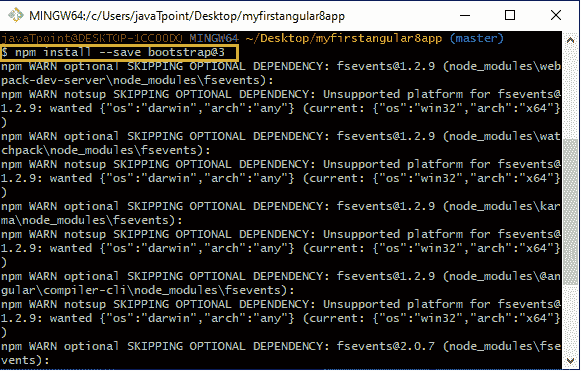
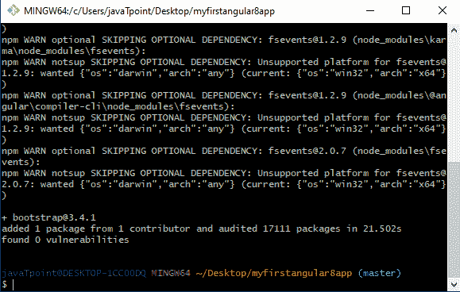
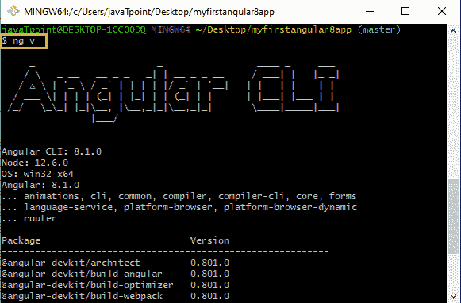
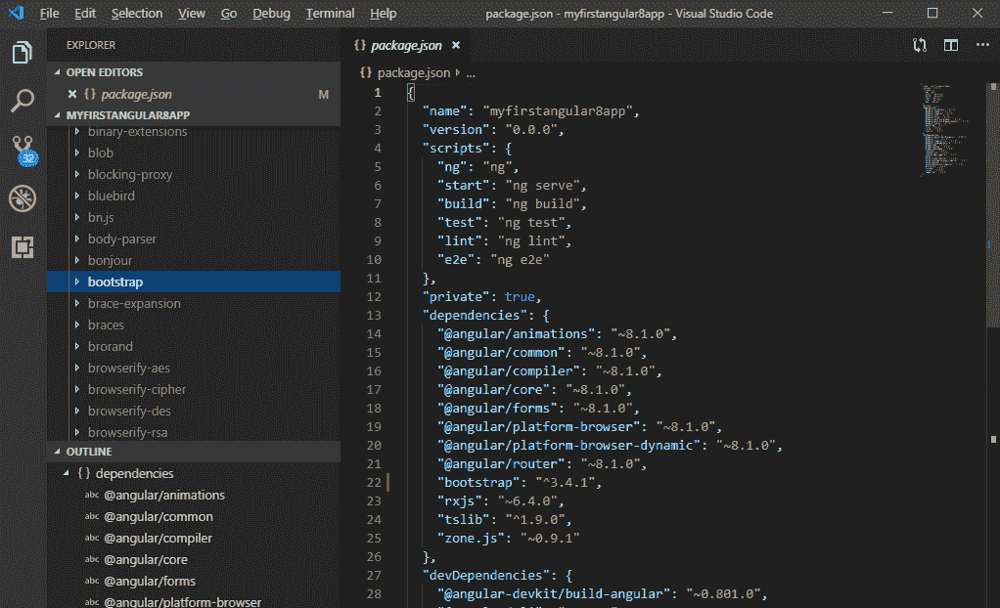
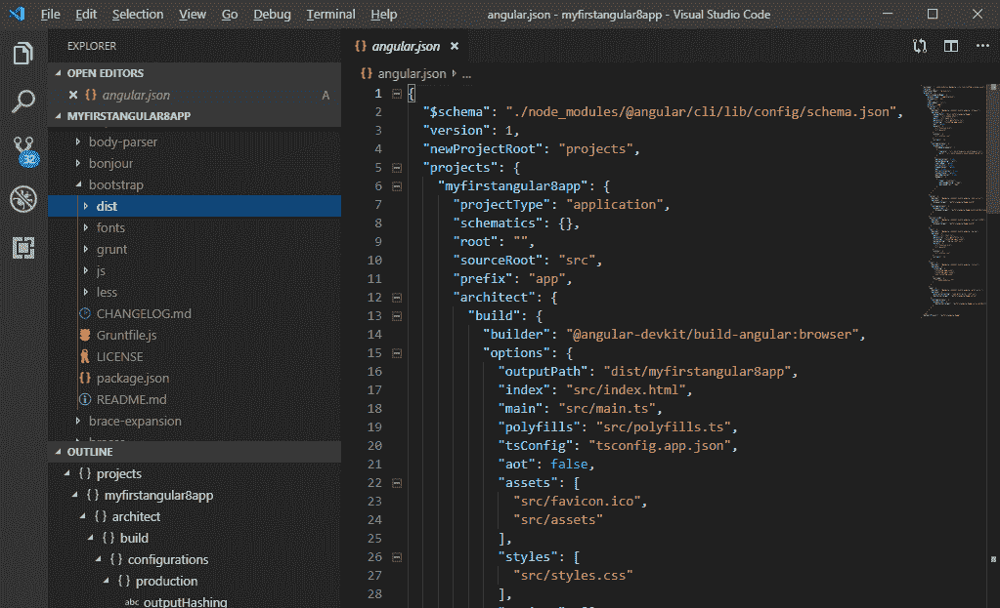
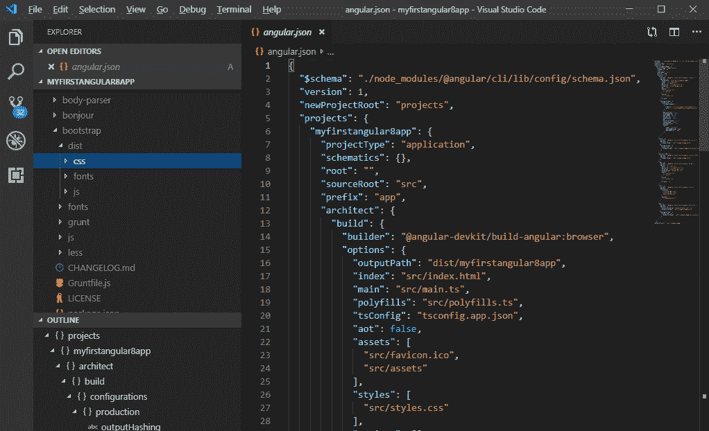

# 带自举的角度 8

> 原文：<https://www.tutorialandexample.com/angular-8-with-bootstrap/>

### Angular 怎么安装 Bootstrap？

在命令提示符下运行以下命令。

```
npm install–save
[email protected]= > The @3 is essential!
```





之后，当我们使用用 [Angular CLI 6+](https://www.tutorialandexample.com/angular-cli-commands/) 创建的项目时，我们会有一个 angular.json 文件，而不是一个**。angular-cli.json** 文件。在那个文件中，我们需要将 Bootstrap 添加到**样式[]** 数组中，但是路径应该是**node _ modules/Bootstrap/dist/CSS/Bootstrap . min . CSS**，**不是../node _ modules/bootstrap/dist/CSS/bootstrap . min . CSS .**领先../不能包含在内。



这里，我们使用的是 Angular 8.1.0 版本。

**在项目中添加 bootstrap.css 文件的过程**

展开节点模块(库根文件夹)



转到 bootstrap 文件夹并展开它。



转到 dist 文件夹并展开它。



展开 CSS，我们会发现“ **bootstrap.css** ”展开 bootstrap.css，我们会看到 **bootstrap.min.css**


在样式部分打开 angular.js 文件和 bootstrap.min.css。

```
"styles" : [
"node_modules/bootstrap/dist/css/bootstrap.min.css",
"src/styles.css " 
 ], 
```

已经为 Angular 8 项目安装了引导程序。我们现在可以用它了。