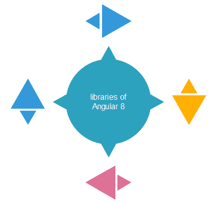

# Angular 8 库

> 原文：<https://www.tutorialandexample.com/angular-8-libraries/>

Angular 库解决了一些常见的问题，比如提供统一的用户界面、提供数据以及允许数据输入。开发人员可以为特定领域创建标准解决方案，这些解决方案可以在不同的应用程序中重用。这些解决方案已经构建为*角度库*，并且这些库可以作为 npm 包发布和共享。

angular 库是一个 angular 项目，但它不同于 Angular 应用程序，它不能独立运行。它是进口的，也用于我们的应用程序。



## 角度库使用

*   Angular 库扩展了 Angular 的基本功能。例如，如果我们想要将反应式表单添加到一个应用程序中，并使用 ng add @angular/forms 库包，那么我们可以从@angular/forms 库中导入反应式表单模块我们的应用程序代码。
*   Angular Material 是一个广泛的通用库的例子，它提供了复杂的、可重用的和适应性强的 UI 组件。

## 在 Angular 8 中安装库

库作为 npm 包发布，并与 Angular CLI(命令行界面)统一。为了将可重用的库代码整合到应用程序中，我们必须安装软件包，并在使用它的地方导入所提供的功能。

**语法**

```
ng add
```

ng add 命令使用 npm 包管理器来安装 library 包，一个包含在包中的实例给其他项目内的代码，例如，添加 import 语句、字体、主题等。

**库打字**

库包包括输入 d.ts 文件。如果我们库的包不涉及类型，IDE 显示错误，我们必须安装库的相关@ types/包。

例如，我们有一个名为 d1 的库:

```
npm install d1–save
npm install @types/d1--save-dev 
```

安装在工作区中的库的@types/package 中定义的类型添加到使用该库的项目的 typescript 配置中，这些类型在 node_modules/@types 文件夹中查找类型，因此我们不必单独添加每个类型包。

如果一个库不包含@types/上的类型，我们仍然可以通过手动添加类型来使用它。您可以通过以下方式实现:

在我们的 src/文件夹中创建一个 typing ings . d . ts 文件。该文件作为全局类型定义自动包含在内。

在 src/typing.d.ts 中添加以下代码。

```
 declare module 'host.' 
 {
 export interface Host
 {
 protocol?: string;
 hostname?: string;
 pathname?: string;
 }
 export function parse(URL: string, queryString?: string): Host;
 } 
```

将给定代码添加到使用该库的组件或文件中:

```
import * as host from 'host';
constparsedUrl =host. Parse('https://angular.io');
console.log(parsedUrl.hostname); 
```

## 在 Angular 8 中更新库

我们可以使用 ng update 命令来更新库。它更新单个库版本。Angular CLI 已经检查了库的最新发布版本，如果它发现最新版本比我们安装的版本更新，请下载它并更新 package.json 以匹配最新版本。

**语法**

```
ngupdate 
```

### 将库添加到全局运行时范围

我们必须在构建时使用 CLI 配置文件 angular.json 中构建目标的“脚本”和“样式”来配置 CLI。

例如，要使用 Bootstrap 4 库，首先使用 npm 软件包管理器安装该库及其依赖项。

npm 安装引导程序-保存

将引导 CSS 文件添加到“样式”数组:

```
 “styles”:
 [
 “node_modules/bootstrap/dist/css/bootstrap.css”,
 “src/styles.css”
 ], 
```

## 如何在 Angular 中创建新库？

我们可以创建并发布新的库来扩展 Angular 功能。它一般用在我们需要在一个 app 中解决同一个问题的时候，我们有一个库的候选。

我们可以创建一个按钮，将用户发送到我们公司的网站，应该包括在我们公司建立的所有应用程序中。

打开 Angular CLI 并编写以下语法来创建新库。

**语法**

```
ng generate library my-library
```

它将在我们的工作区中创建一个 projects/my-lib 文件夹，其中包含一个 NgModule 中的一个组件和一个服务。工作空间配置文件 angular.json 用“library”类型的项目更新。

```
 "projects": {
...
"my-lib": {
"root": "projects/my-lib",
"sourceRoot": "projects/my-lib/src",
"projectType": "library",
"prefix": "lib",
"architect": {
"build": {
"builder": "@angular-devkit/build-ng-packagr:build",
... 
```

现在，我们可以使用以下命令来构建、测试和 lint 我们的项目:

```
 ng build my-lib
 ng test my-lib
 ng lint my-lib 
```