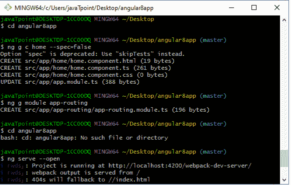
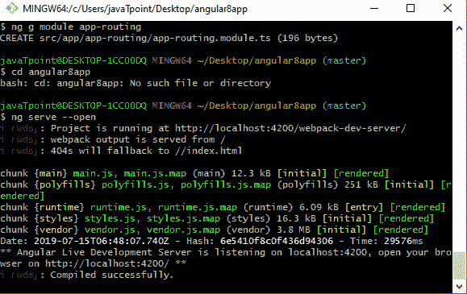
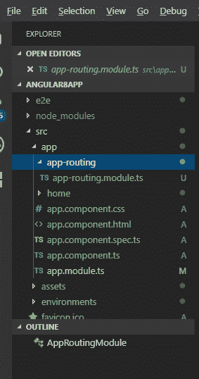
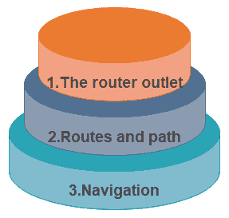
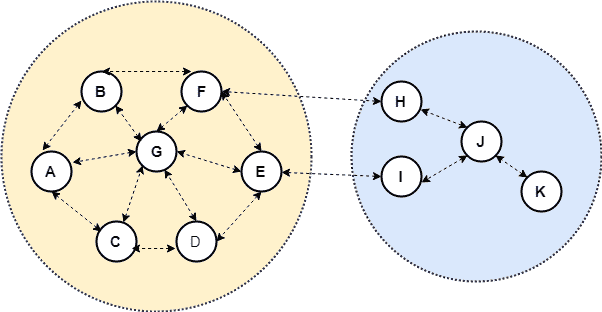

# 以角度 8 布线

> 原文：<https://www.tutorialandexample.com/routing-in-angular-8/>

**路由**

Angular Router 是一个强大的 JavaScript 路由器，由 Angular 核心团队构建和维护，可以从**包@angular/router** 安装。路由提供了一个完整的路由库，可以有多个路由器出口和不同的路径策略。

角度路由器是角度平台的主要组成部分。它允许开发人员构建具有多个视图的单页应用程序，并允许在视图之间导航。

Angular 使用布线模块 ngRoute 支持 SPA。路由模块根据 URL 进行操作。它可以作为浏览器的导航条，在页面间导航。

*   在地址栏输入 URL，浏览器就会导航到相应的页面。
*   单击该页面的链接，浏览器将导航到新页面。
*   点击浏览器的后退或前进，浏览器会根据历史页面向后或向前导航。

### 路由器的工作:

每当用户操作时，例如点击在浏览器中加载新页面的链接，路由器拦截浏览器行为，并显示和隐藏视图层次结构。

如果路由器找到了当前的应用程序，它需要特定的功能，并且它可以不按需加载模块。

当用户点击一个按钮，或者从一个下拉框中选择，或者响应来自任何来源的一些其他刺激时，我们可以导航到新的视图。路由器在浏览器历史中登录，因此后退和前进按钮工作正常。

为了定义导航规则，我们将导航路径与组件相关联。路径使用类似 URL 的语法，以与模板语法相同的方式集成我们的程序数据。我们可以应用程序逻辑来选择显示或隐藏视图，以响应用户输入和我们的访问规则。

### 如何在 Angular 8 中设置路由？

路由可以很容易地添加到项目中。如果我们收到消息，“**您想要添加角度路由吗？”(Y/N)** ，如果我们用 Y **来回答。**角度路由器是在我们的项目中设置的，没有手动添加。

否则，如果我们没有这样的选项，那么我们必须在我们的项目中手工导入它。

*   首先打开我们的项目，我们必须导入或添加路由模块。
*   之后，为了创建模块，我们必须编写命令**ng g c home–spec = false。**
*   在同一个目录下，我们必须编写命令 **ng g 模块 app-routing**

**根据以下截图。**







Angular 为 Angular 生态系统带来了许多改进的模块，包括一个名为 component router 的新路由器。组件路由器是高度可配置的，并且具有打包路由器的特性。包括的功能有标准视图布线、嵌套子布线、命名布线和布线参数。与路由器相关的概念有:



**路由器出口**

Router-outlet 是一个可从路由器库中访问的指令，路由器在该库中插入组件并根据当前浏览器的 URL 进行匹配。我们可以在 angular 应用程序中添加多个出口，这使我们能够实现高级路由场景。

**路线和路径**

路线是由路径和组件属性组成的定义。路径指的是 URL 中确定可以显示的唯一视图的部分，以及需要与路径相关联的角度分量。

在组件中，每个路由映射一个 URL 路径。

该路径可以采用通配符字符串(**)。如果调用的 URL 与解释的路由不匹配，路由器会选择此路由。它可用于显示一个**“Not Found”**视图，或者在没有匹配时重定向到一个特定视图。

**举例:**

```
{path:’contacts’, component: ContactListComponent}
```

如果路由定义被提供给路由器配置，当网络应用 **/contacts 的浏览器 URL 时，路由器将呈现 **ContactListComponent** 。**

**路线参数**

使用参数创建路径是 web 应用程序中的一个常见功能。角度路由器允许我们以不同的方式访问参数。

我们可以使用冒号语法创建一个路由器参数。

```
{path:‘contacts/:id’, component: contactDetailcomponent}
```

**路线守卫**

路由保护是 Angular 路由器的特性，如果路由器被请求，它允许开发者运行逻辑，并且它是基于逻辑的。它允许和拒绝用户访问路由。我们可以通过实现从 **@angular/router** 包中获得的 CanActivate 接口来添加一个路由保护。它**可以激活()**方法，该方法包含允许和拒绝访问路由的逻辑。

**举例:**

```
Class MyGuard implements CanActivate {
can activate () {
return true;
}
} 
```

**导航指令**

Angular 路由器提供路由器链接指令来创建导航链接。该指令生成与要导航的组件相关联的路径。

**例如:**

```
. 
```



**Router Path**

