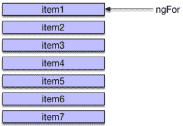
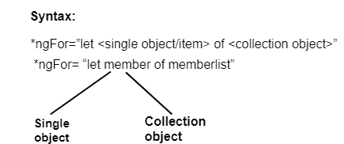

# 角度 8 *ngFor 方向

> 原文：<https://www.tutorialandexample.com/angular-8-ngfor-directive/>

**角度 8 ngFor 指令**

*ngFor 指令用于对可迭代列表(集合)中的每个项目重复一次 HTML 模板的一部分。ngFor 是一个角度结构方向，类似于 AngularJS 中的 ngRepeat。一些局部变量如 Index、First、Last、odd 和 even 由*ngFor 指令导出。

**ngFor 的语法**

```
….



如何使用 ngFor 指令？

要使用 ngFor 指令，我们必须创建一个 HTML 元素块，它可以显示 items 集合中的单个项目。之后，我们可以使用 ngFor 指令告诉 angular 为列表中的每一项重复该 HTML 元素块。

ngFor 指令的语法与我们见过的其他指令不同。如果我们熟悉 ngFor 语句，我们会注意到它们是相同的。



**指令**的*ngFor 示例

首先，我们必须创建角度应用程序。之后，打开 app.component.ts，添加以下代码。

以下代码包含一个 movies 数组中前 3 部电影的列表。让我们构建一个模板，以表格形式显示这些电影。

```
import { Component } from '@angular/core';
@Component({
selector: 'movie-app',
templateUrl:'./app/app.component.html', 
styleUrls:['./app/app.component.css'] 
}) 
export class AppComponent  
{  
title: string ="Top 10 Movies" ; 
movies: Movie[] =[ 
{title: 'Winter Is Coming',director: 'Tim Van Patten',cast:'Idris Elba, 
Ginnifer Goodwin, Jason Bateman',releaseDate:'March 4, 2016'}, 
{title:'Batman v Superman: Dawn of Justice',director:'Zack Snyder',cast:
'Ben Affleck, Henry Cavill, Amy Adams',releaseDate:'March 25, 2016'}, 
{title:'Captain America: Civil War',director:'Anthony Russo, Joe Russo',cast:'
Scarlett Johansson, Elizabeth Olsen, Chris Evans',releaseDate:'
May 6, 2016'}, 
{title:'X-Men: Apocalypse',director:'Bryan Singer',cast:'Jennifer Lawrence,
 Olivia Munn, Oscar Isaac',releaseDate:'May 27, 2016'}, 
] 
}  
class Movie { 
title : string; 
director : string; 
cast : string; 
releaseDate : string; 
} 
```

现在，打开 app.component.html 并添加以下代码:

```

 {{title}}

```

```