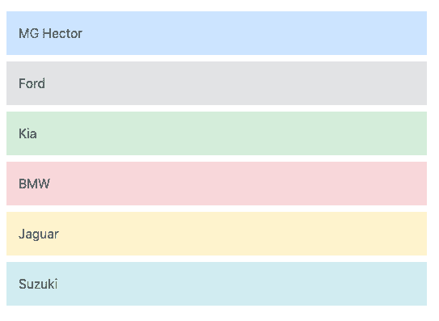

# Angular 8 ngClass 指令

> 原文：<https://www.tutorialandexample.com/angular-8-ngclass-directive/>

**角度 8 ngClass 指令**

ngClass 指令是一种属性指令。Angular 提供了内置指令，它有助于在 HTML 元素上添加或删除 CSS 类。ngClass 指令允许我们基于表达式求值动态地应用 CSS 类。

选择器使用了 ngClass 指令，NgClass 提供了三种简单的方法来更新 DOM 中的 CSS 类。

**语法:**

**创建一个接口类和数组**

在这一步，我们必须创建一个接口类来定义 cars 数组的属性类型。

运行命令创建接口类:

```
ng generate class Cars
```

我们的 cars 集合具有属性名称和颜色，请转到 src>app>cars.ts 并添加以下代码:

```
export interface Cars {
name: string;
color: string;
} 
```

然后，我们将在 **app.component.ts** 文件中生成 cars 数组，如下所示:

```
 Import {Component} from ‘@angular/core’; 
Import {Cars} from ‘./cars’;
@Component({
selector: ‘app-root’,
templateUrl:’./app.component.html’,
styleUrls: [‘./app.component.css’]
})
export class AppComponent {
cars: Cars[]=[
{
“name”:”MG Hector”,
“color”: ’blue’
},
{
“name”:”Ford”,
“color”: ’olive’
},
{
“name”:”Kia”,
“color”: ’orange’
},
{
“name”:”BMW”,
“color”: ’red’
},
{
“name”:”Jaguar”,
“color”: ’Green’
},
{
“name”:”Suzuki”,
“color”: ’purple’
}
];
} 
```

### 在 html 模板上加入 nclass 指令

在最后一步中，我们将学习使用 Angular NgClass 指令将 CSS 类动态添加到 HTML 元素中。

**举例:**

转到 app.component.html 模板，然后如下所述添加 ngClass 指令。

```

{{car.name}]

```

在上面的例子中，我们在表示汽车名称时应用了动态颜色类，我们声明了 NgClass 对象表达式来应用该类。如果条件为真，它将在 HTML 元素中包含类名。如果条件为假，它将丢弃类名。

要在我们的浏览器中查看工作演示，请运行给定的命令:

```
ng serve --open
```

**输出:**

