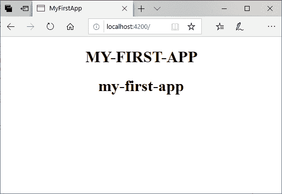
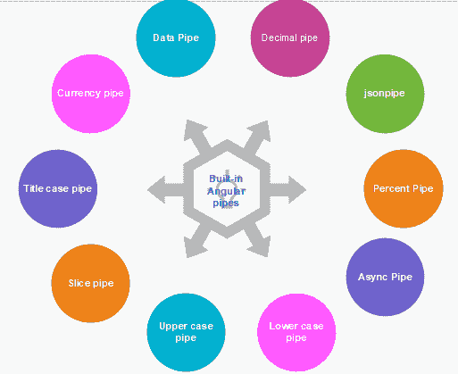
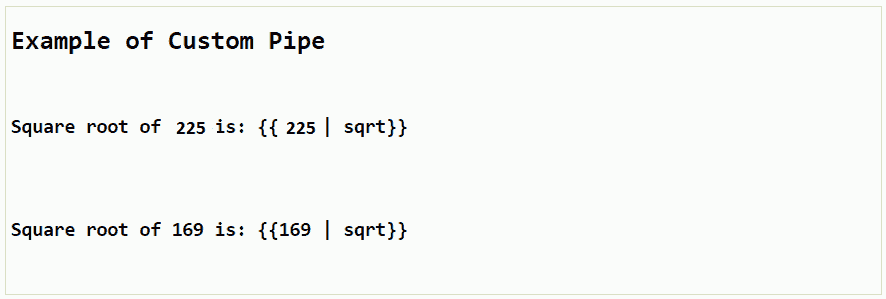

# 角形 8 管

> 原文：<https://www.tutorialandexample.com/angular-8-pipes/>

**八角管**

管道是 Angular 中的一个有用功能。这些是在角度模板中转换值的简单方法。它以整数、字符串、数组和日期作为输入，用 **|** 分隔，转换成所需的格式，并在浏览器中显示出来。

在插值表达式中，我们定义管道并根据情况使用它，因为有许多类型的管道。我们可以在角度应用中使用。

管道接收数据作为输入，并将其转换为所需的输出。有些值需要稍加编辑。我们可能会注意到，我们希望在许多应用程序内和跨应用程序重复进行许多相同的转换。

我们几乎可以把它们看作样式，事实上，我们可能想把它们应用到我们的 HTML 模板中。

**语法:**

```
{{title | uppercase}}
```

查看管道示例；之前，我们借助管道以大写和小写显示标题文本。

**举例:**

在 component.ts 文件中定义一个名为“title”的变量。

```
Import {Component} from ‘@angular/core’;
@Component ({
selector: ‘app-root’,
templateUrl: ‘.app.component.html’,
styleUrls: [‘./app.component.css’]
}]
title=’my-first-app’;
} 
```

这里，我们使用 component.html 文件中的管道符号:

```
{{ title | uppercase}} 

{{标题|小写}} 

```

运行 ng 发球，看看结果。您将看到以下结果。我们可以看到管道已经改变了标题的大小写。



### 内置弯管

Angular 有一系列管道，如日期管道、大写管道、小写管道、货币管道和百分比管道。它们可用于任何角度模板。Angular 没有过滤管道或任何 order by 管道。Angular 没有提供过滤和排序列表的管道。管道是封装和共享集体显示值转换的一种极好的方式。



*   异步管道
*   当前管道
*   数据管道
*   十进制管道
*   Jsonpipe
*   百分比管道
*   下套管
*   上部套管
*   Slicepipe
*   标题案例管道

### 以角度 8 参数化管道

我们也可以将参数移动到管道中；我们可以使用 HTML 代码来传递参数。

**app.component.html**

```
Rohan 的生日是{{生日|日期:" dd/mm/yyyy"}} 
```

**链接管道**

我们可以将管道链接在一起，并创建有用的组合，还可以在我们的示例中使用小写和大写管道。

**app.component.html**

```
Rohan 的生日是{ {生日|日期|大写}} 
```

现在，我们的日期是大写字母。

### 纯净和不纯净的管道

有两类管道:

1.  纯的
2.  肮脏的

默认情况下，角度管道是纯管道。我们看到的每一根管子都是纯净的内置管子。我们可以通过将 pure 标志设置为 false 来使管道变得不纯。

**纯管道**

Angular 仅在检测到输入值的完美变化时执行纯管道。真正的区别要么是转移到原始输入值(数字、布尔值、符号、字符串)，要么是改变对象引用(数组、函数、对象、日期)。

**不纯管道**

Angular 在每个组件更改检测周期中执行损坏的管道。不纯管道经常在每次击键或鼠标移动时被调用。

### 如何创建自定义角管？

要创建一个自定义管道，我们创建一个新的 ts 文件并根据工作使用代码，我们必须导入管道，从 Angular/Core 进行管道转换。

创建一个 sqrt 自定义管道。

**component.ts 文件:**

```
import {Pipe, PipeTransform} from
‘@angular/core’;
@Pipe ({
name: ‘sqrt’
})
Export class SqrtPipe implements PipeTransform {
transform (val: number) : number{
Return Math.sqrt(val);
}
}  
```

我们必须在 app.module.ts 中进行更改，创建一个名为 SqrtPipe 的类。

该类将实现 PipeTransform。类中定义的 transform 方法可以将参数作为数字，并在取平方根后返回该数字。

我们必须在 **app.module.ts 文件**中添加相同的代码

**module.ts 文件:**

```
import { BrowserModule } from '@angular/platform-browser';
import { NgModule } from '@angular/core';
import { AppComponent } from './app.component';
import { NewCmpComponent } from './new-cmp/new-cmp.component';
import { ChangeTextDirective } from './change-text.directive';
import { SqrtPipe } from './app.sqrt';
@NgModule({
declarations: [
SqrtPipe,
AppComponent,
NewCmpComponent,
ChangeTextDirective
],
imports: [
BrowserModule
],
providers: [],
AppComponent]
})
export class AppModule {
}
```

现在，在 component.html 文件中使用 sqrt 管道。

**component.html 文件:**

```
自定义管道示例
225 的平方根是:{{225 | sqrt}}

164 的平方根是:{{164 | sqrt}}

```

**输出:**

