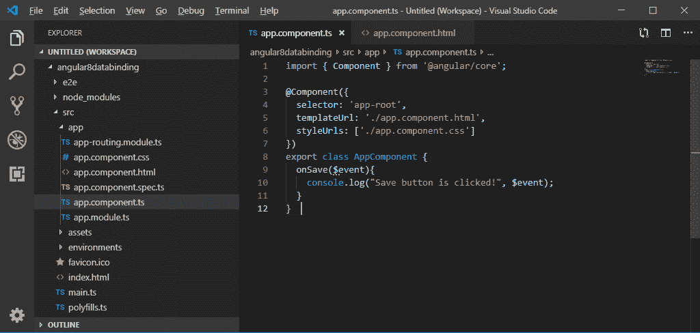
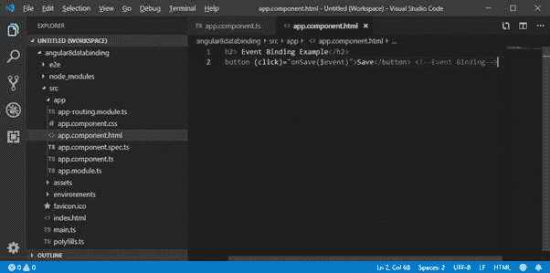
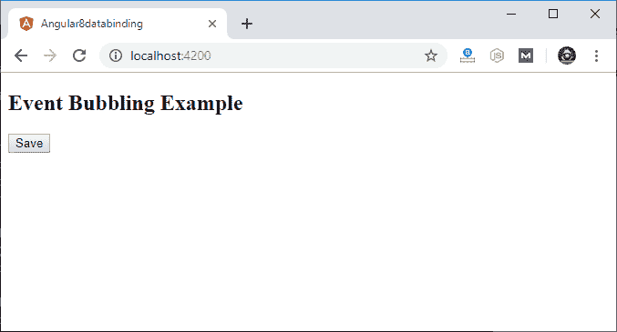
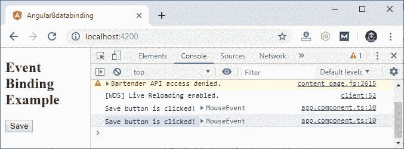
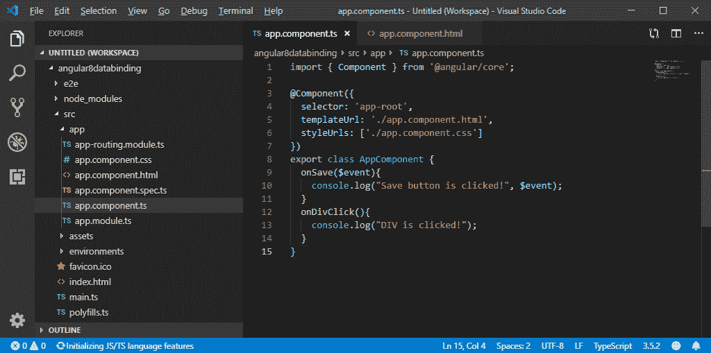

# 角度 8 中的事件绑定

> 原文：<https://www.tutorialandexample.com/event-binding-in-angular-8/>

## 角度 8 中的事件绑定

事件绑定是从元素到组件的数据绑定。可以使用事件绑定将用户操作(如击键、鼠标移动、单击和触摸)绑定到组件属性。在事件绑定中，目标将是一个事件名称。

它是单向数据绑定，将信息从视图发送到组件类。它与属性绑定相反。当单击按钮时，它调用组件中的 main 方法。

**例如**

**事件绑定示例**

按住 HTML 模板中的一个按钮，并按住该按钮的 click 事件。为了实现事件绑定，我们将把带有方法的按钮的点击事件附加到组件上。

首先，打开 **app.component.ts** 文件，使用以下代码:

```
Import { Component } from ‘@angular/core’,
@Component({
selector: ‘app-root’,
templateUrl:’../app.component.html’,
styleUrls: [‘./app.component.css’]
})
export class AppComponent {
onSave($event){
console.log(“Save button is clicked!”,$event);
}
} 
```



在**app.component.html**:

```
输入绑定示例
Save 
```



**输出:**



只需点击“保存”按钮并打开控制台来查看结果。



现在，我们可以看到单击了“保存”按钮。

### 事件冒泡

事件冒泡用于标识当一个元素嵌套在另一个元素中时调用事件处理程序的顺序。并且两个部分都注册了事件的侦听器(即，click)。

我们在组件 HTML 中的按钮上使用了一个 div 包装器，并且 div 还有一个 click 事件处理程序。它只是在 div 被点击时显示一些消息。

使用 **app.component.ts** 文件中给定的代码:

```
import { Component } from '@angular/core'; 
@Component({
selector: 'app-root',
templateUrl: './app.component.html',
styleUrls: ['./app.component.css'] 
})
export class AppComponent {
onSave($event){
console.log("Save button is clicked!", $event);
}
onDivClick(){
console.log("DIV is clicked!");
}
}
```



**app.component.html:**

```
事件冒泡示例

```