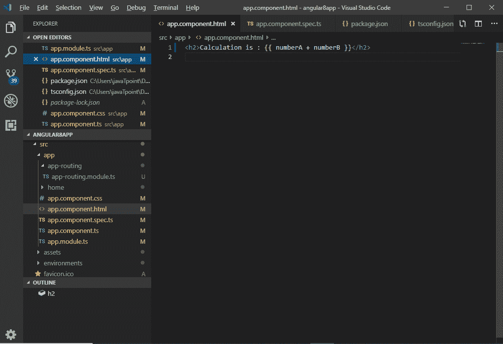

# 角度为 8 的字符串插值

> 原文：<https://www.tutorialandexample.com/string-interpolation-in-angular-8/>

**角度 8 中的字符串插补**

字符串插值是一种单向数据绑定技术，用于将数据从类型脚本代码输出到 HTML 模板。它使用模板表达式。它使用双花括号 **{{ }}** 中的模板表达式来显示组件到视图的数据。

字符串插值将组件的属性值相加。它允许用户将值绑定到 UI 元素。

插值单向绑定数据。


**语法**:

```
{{data}}
```

我们首先使用 Angular CLI 创建了一个 Angular 项目。

使用双花括号绑定字段的语法称为**绑定表达式。**

字符串插值使用双花括号 **{{ }}** 中的模板表达式来显示来自组件的数据，语法 **{{ }}，**也称为**小胡子语法。****{ { } }**包含一个可以由 angular 运行的 javascript 表达式，输出将被插入到 HTML 中。

如果我们在模板中放入{{5+5}}，十个将被插入到 HTML 中。

打开文件 app.component.ts 并在文件中使用以下代码:

```
import {Component} from ‘@angular/core’;
@Component({
selector: ‘app-root’,
templateUrl:’./app.component.html’, 
styleUrls: [‘./app.component.css’]
})
export class AppComponent {
title=’string interpolation in tutorialandexample’;
} 
```


现在，打开项目中的**app.component.html**文件，使用以下代码查看字符串插值。

```
{{ title}} 
```


现在，打开 Node.js 命令提示符，运行**ng serve–open**打开 localhost: 4200，查看程序的输出。


字符串插值也可以用来求解其他一些表达式。让我们看另一个例子。

**举例:**

使用以下代码更新 **app.component.ts** 文件:

```
import { Component } from '@angular/core';
@Component({
selector: 'app-root',
templateUrl: './app.component.html',
styleUrls: ['./app.component.css']
})
export class AppComponent {
title = 'Data binding example using String Interpolation';
numberA: number = 10;
numberB: number = 20;
}
```


**app.component.html:**

```
计算方法是:{{ numberA + numberB }}
```



**输出:**


我们也可以用另一种方式使用相同的应用程序。

**应用组件:ts:**

```
import { Component } from '@angular/core'; 
@Component({
selector: 'app-root', 
templateUrl: './app.component.html',
styleUrls: ['./app.component.css']
})
export class AppComponent {
title = 'Data binding example using String Interpolation';
numberA: number = 10;
numberB: number = 20;
addTwoNumbers() {  
return this.numberA + this.numberB;
} 
}
```


**app.component.html:**

```
计算方法是:{{ numberA + numberB }}
```


**输出:**

