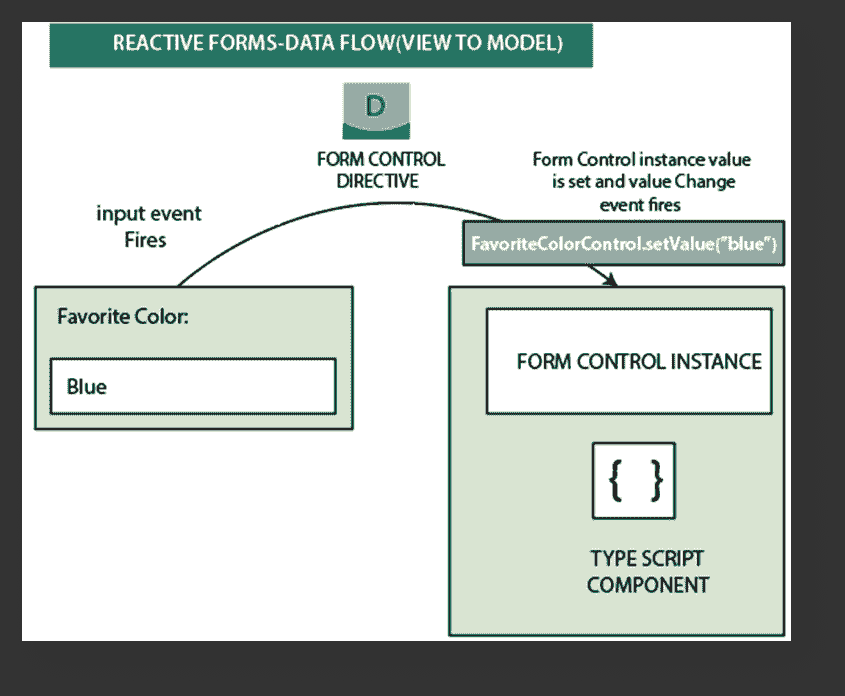
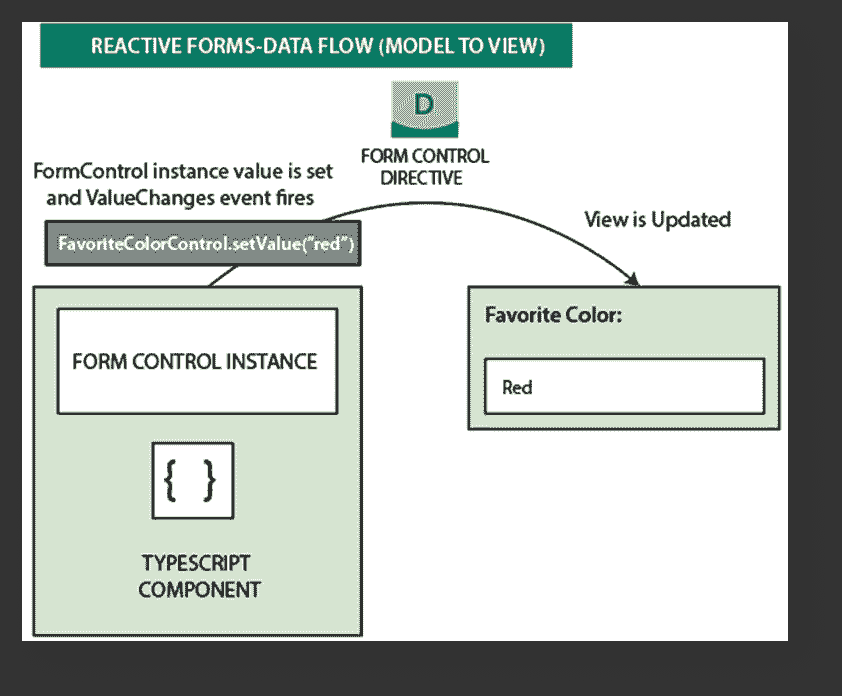
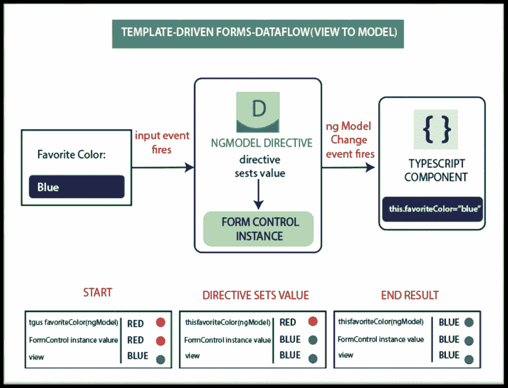
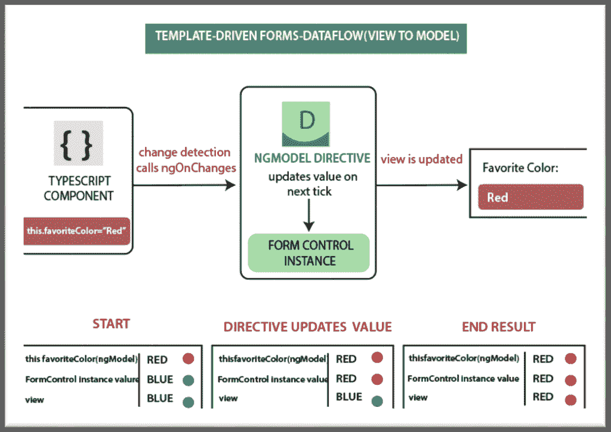

# 数据流以角度 8 形成

> 原文：<https://www.tutorialandexample.com/data-flow-forms-in-angular-8/>

当我们在 Angular 中构建表单时，理解框架如何处理来自用户的数据流或编程更改是非常重要的。反应式表单和模板驱动表单在处理表单输入时遵循两种不同的策略。

### 反应形式的数据流

在反应式表单中，视图中元素的每个表单都链接到一个表单模型(表单控件实例)。从视图到模型以及从模型到视图的更新是同步的。并且不依赖于 UI 呈现。下图使用了相同的颜色示例来演示当输入字段值从视图到模型发生变化时，数据流是如何工作的。

**数据从视图流向模型的步骤:**

**1。**用户在输入元素中键入一个值；在这种情况下，最喜欢的颜色是蓝色。

**2。**表单输入元素释放一个带有最新值的**“输入”**事件。

**3。**表单输入元素上函数的控件值访问器立即将新值传递给**表单控件实例**。

**4。**表单控件实例通过观察值变化释放原始金额。

**5。**任何订阅**值变化**的用户都会收到新值。

**数据从模型流向视图的步骤:**

1.  用户调用**favorite color control . setvalue**方法。它更新表单控件值。
2.  然后，表单控件实例通过可观察到的值变化来恢复新值。
3.  然后，valueChanges 观察值的订阅者将收到新值。
4.  至少，表单输入元素上的控制值访问器会更新新值中的元素。

### 模板驱动表单中的数据流

在模板驱动的表单中，每个表单元素都链接到一个在内部管理表单模型的指令。下面的图表使用相同的常用颜色示例来演示当任何输入字段的值在视图和模型中发生变化时，数据是如何流动的。

#### 从视图到模型的数据流

**从视图到反应式模型的数据流步骤:**

这里，用户必须将输入值从红色改为蓝色。

*   首先，用户在输入元素中键入 Blue。
*   然后，输入元素产生一个值为蓝色的**“input”**事件。
*   然后，控件值访问器连接到 FormControl 实例上的 **setValue()** 方法中的输入触发器。
*   FormControl 实例通过可观察到的值变化发出新值。
*   valueChanges observable 的任何订阅者都会获得新值。
*   控件值访问器还声明发出 ngModelChange 事件的**ngmodel . viewtomodelupdate()**方法。
*   组件模板对 favoritecolor 属性使用双向数据绑定，组件中的 favoriteColor 属性在由 **ngModel 发出的值中更新！变更事件(蓝色)。**

#### 从模型到视图的数据流

**从模型到反应式视图的数据流步骤:**

当 favoriteColor 元素从红色变为蓝色时，从 model to see 的数据流包含以下步骤。

*   之前， **favoriteColor** 在组件中被更新为一个新值。
*   变化检测创建。
*   在变更检测期间， **ngOnChanges** 生命周期钩子已经在 **NgModel** 指令实例中被调用，因为它的输入值已经改变。
*   **ngOnChanges( )** 方法对一个异步任务进行排队，以设置内部 FormControl 实例的值。
*   现在执行变更检测。
*   然后，实现修复 FormControl 实例值的任务。
*   Fromcontrol 实例发出最新的**值变化**可观察值。
*   valueChanges observable 的任何订阅者都接受新值。
*   控件值访问器使用最新的 **favoriteColor** 值从视图中的 input 元素更新。