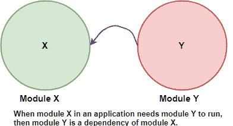
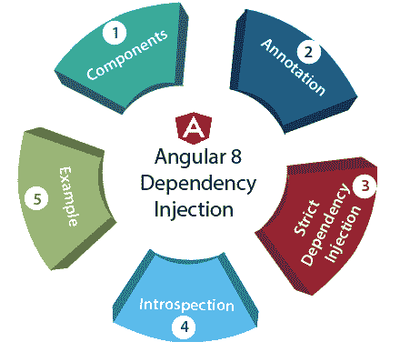
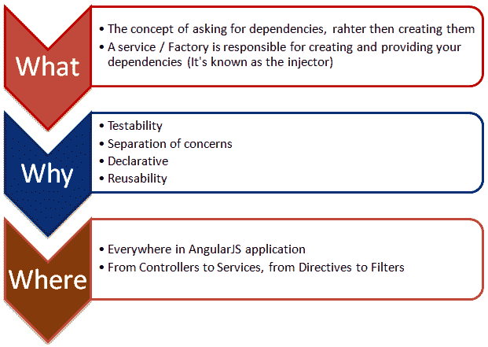
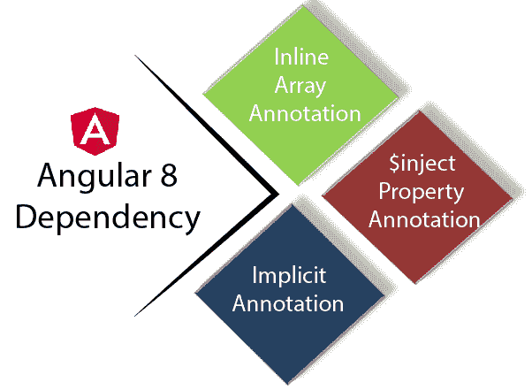

# 角度 8 中的依赖注入

> 原文：<https://www.tutorialandexample.com/dependency-injection-in-angular-8/>

**依赖注入(DI)** ，是一种基本的应用设计模式。Angular 8 有自己的 **DI** 框架，用于 Angular 应用程序的设计，以提高效率和可移植性。

依赖项是类执行其功能所需的服务。DI 是一种编码模式，在这种模式下，一个类从外部源请求依赖关系，而不是创建自己。



在 Angular 中，当类被实例化时，DI 框架提供对该类的依赖。我们可以用它来使我们的应用程序变得灵活、高效、健壮和可测试。

依赖注入(DI)是一种处理组件如何获得依赖关系的软件设计模式。

**AngularJS** 注入器子系统用于创建组件，解析其依赖关系，并根据请求将它们提供给其他组件。

### 为什么要依赖注入？

*   角度依赖注入使应用程序模块化。
*   Angular DI 使得在应用程序中重用组件变得更加容易。
*   它使得测试应用程序的组件变得更加容易。
*   它使得配置应用程序的组件变得更加容易。



### Angular 8 中依赖注入的组件

*   供应者
*   工厂
*   服务
*   常数
*   价值

**1。值**

值是一个对象。它可以是数字、字符串或 javascript 对象。Value 用于在配置或运行阶段将值传递给控制器、服务或工厂。模块中使用 Value()函数来定义值。它由两个参数组成，第一个是赋值。

```
 var demo = angular.module("myModule", []); //define the module
 demo.value("NumberAsValue", 101); //create a value object and pass in the data.
 demo.value("stringAsValue", "tutorial");
 demo.value("objectAsValue", { val1 : 103, val2 : "xyz"} ); 
```

**2。服务**

它就像一个单独的 JavaScript 对象。它由一组执行特定任务的函数组成。Service()函数用于在模块中创建服务。创建后，它被用于控制器中。

```
<! DOCTYPE html>
<html>
<head>
  <meta charset="UTF-8">
  <title>Event Registration</title>

</head>
<script  src="https://ajax.googleapis.com/ajax/libs/angularjs/1.6.4/angular.min.js"></script> 
<body>

<div ng-app = "serviceApp" ng-controller = "serviceController">
  <p>Result: {{result}}</p>
</div>
<script>
  var t = angular.module("serviceApp", []);

t.service('sum', function(){
  this.addition = function(x,y) {
    return x+y;
   } 
 });

t.controller('serviceController', function($scope, sum) {
    $scope.result = sum.addition(5,6);
});
   </script> 
   </body> 
</html> 
```

**3。常数**

它用于在配置阶段传递值，而不考虑在配置阶段不能移动值的事实。

**4。提供商**

在配置阶段，使用提供者创建工厂和服务。

**5。工厂**

工厂是一个按需返回值的函数。它根据服务和控制器的要求返回值。

它使用工厂函数来处理值并返回输出。

**角度依赖性注入示例-**

```
 <!DOCTYPE html> 
<html> 
 <head> 
    <title>AngularJS Dependency Injection</title> 
</head> 
<body> 
<div ng-app = "myApp" ng-controller = "myController"> 
 <p>Enter a number: <input type = "number" ng-model = "number" /></p> 
 <button ng-click = "square()">Result</button> 
 <p>Result: {{result}}</p> 
</div> 

<script src="https://ajax.googleapis.com/ajax/libs/angularjs/1.3.14/angular.min.js"></script>
<script> 
 var demo = angular.module("myApp", []); 
 demo.config(function($provide) { 
   $provide.provider('MathService', function() { 
     this.$get = function() { 
        var factory = {}; 
        factory.sum = function(a, b) { 
          return a + b; 
        }  
        return factory; 
      };  
    });  
 });  
 demo.value("defaultInput", 10); 
 demo.factory('MathService', function() { 
   var factory = {}; 

    factory.sum = function(a, b) { 
     return a + b; 
   }  
    return factory; 
 });  
  demo.service('demoService', function(MathService){ 
  this.addition = function(a) { 
     return MathService.sum(a,a); 
   }  
 });  
   demo.controller('myController', function($scope, 
 demoService, defaultInput) { 
   $scope.number = defaultInput; 
   $scope.result = demoService.addition($scope.number); 

   $scope.addition = function() { 
   $scope.result = demoService.addition($scope.number); 
   }  
 }); 
    </script>  
 </body>  
</html> <!DOCTYPE html>  
<html>
  <head>
     <title>AngularJS Dependency Injection</title>  
  </head>  
  <body> 
 <div ng-app = "myApp" ng-controller = "myController">
        <p>Enter a number: <input type = "number" ng-model = "number" /></p>
        <button ng-click = "square()">Result</button>
        <p>Result: {{result}}</p>
     </div> 
<script src="https://ajax.googleapis.com/ajax/libs/angularjs/1.3.14/angular.min.js">
</script> 
 <script>
        var demo = angular.module("myApp", []); 
demo.config(function($provide) {
           $provide.provider('MathService', function() {
              this.$get = function() {  
                 var factory = {}; 
 factory.sum = function(a, b) {
                    return a + b;  
                 }  
                 return factory;  
              };  
           });  
        }); 
demo.value("defaultInput", 10); 
 demo.factory('MathService', function() {
           var factory = {}; 
       factory.sum = function(a, b) {
              return a + b;  
           }  
           return factory;  
        });  
   demo.service('demoService', function(MathService){
           this.addition = function(a) {
              return MathService.sum(a,a);
           }  
        });  

        demo.controller('myController', function($scope, demoService, defaultInput) {
           $scope.number = defaultInput;
           $scope.result = demoService.addition($scope.number);
            $scope.addition = function() {
              $scope.result = demoService.addition($scope.number);
           }  
        });  
         </script>  
     </body>  
</html> 
```

**输出:**

输入一个数字: 20

**结果**

结果:40

为什么我们要使用依赖注入？



### 角度 8 从属注释

通过 Angular 8 中的注入器可以实现一些功能，如控制器、服务和工厂。因此，需要对那些函数进行注释，以便注入器将清楚地知道哪些函数，以便注入器将清楚地知道要注入哪些函数。

Angular 提供了**三种**方式来注释代码。它被提供了一个服务名。



**1。内联数组注释**

内联数组注释主要用于以角度形式注释组件。

```
var demoApp = angular.module("myApp", []);
demoApp.controller("MyController", ["$scope", "MyService", function($scope, MyService) {
    $scope.myService = MyService;
}]); 
```

在该示例中，使用了一个数组。数组的元素是依赖项和字符串类型，后跟一个函数。

**2。$inject 属性注释**

它是一个依赖数组，被注入到函数中。我们可以使用 **$inject** 属性，仅当它被允许在我们的代码中重命名函数参数并且仍然注入正确的服务时。

```
var demo app = angular.module("myApp", []);
var MyController = function($scope, MyService) {
   $scope.myService = MyService;
};
MyController.$inject = ["$scope", "MyService"];
demoApp.controller("MyController", MyController); 
```

它是一个数组的依赖名，因此，数组和函数声明中的参数之间的同步是必要的。

**3。隐式注释**

这是最简单的方法。但是如果我们正在缩小代码，那么我们不能使用隐式注释。函数内部传递的参数被视为服务的名称。

```
 var demoApp = angular.module("myApp", []);
demoApp.controller("MyController", function($scope, MyService) {
   $scope.myService = MyService;
}); 
```

### Angular 8 中的严格依赖注入

```
 <!doctype html>
<html ng-app="demoApp" ng-strict-di>
<body>
 Result of 5+5 is: {{5+5}}
 <script src="angular.js"></script>
</body>
</html> 
```

通过使用 **ng-strict-di** 指令，我们选择了 Angular 中的严格依赖注入。它将应用于与 ng-app 相同的元素。当我们使用严格模式时，它会抛出一个错误。

**输出**

**5+5:10 的结果**