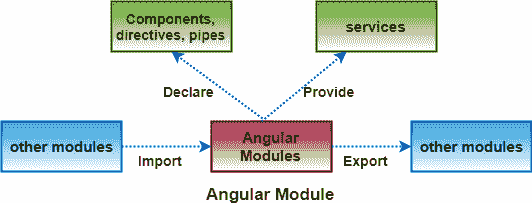
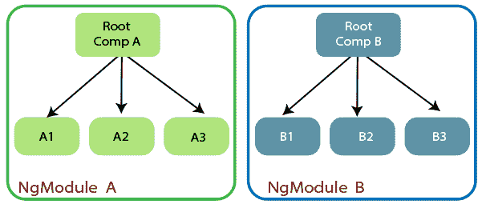
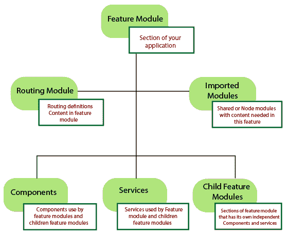
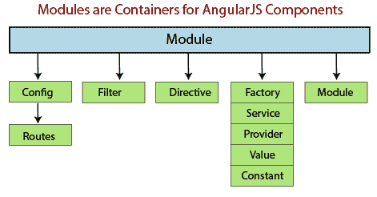
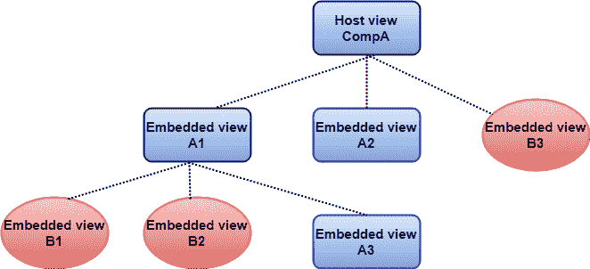

# 角度 8 模块

> 原文：<https://www.tutorialandexample.com/angular-8-module/>

**角度 8 模块**

它是**服务**、**指令**、**控制器、**、**过滤器**和**配置信息**的集合。 **angular.module** 用于配置＄注射器。模块是应用程序不同部分的容器。控制器总是属于一个模块。在开发网站的情况下，页眉、页脚、左边、中间和右边部分成为模块的一部分。



在 Angular 中，模块是一种对相关的组件、指令、管道和服务进行分组的技术，通过这种方式可以与其他模块相结合来创建应用程序。

理解角模的另一种方式是类。在类中，我们可以定义公共或私有方法。通用目的是 API，我们代码的其他部分可以使用它来进行交互，而单独的技术是隐藏的实现细节。

同样，一个模块导出或隐藏**组件、指令、管道**和**服务**。导出的元素被其他模块使用，而这些元素不在模块中导出，并且不能被应用程序的其他模块访问。



### 创建模块

使用角度功能 **angular.module** 创建一个模块

```
…

```



### 模块的使用

我们必须使用装饰器 **NgModule** 来定义模块。

```
import {NgModule} from ‘@angular/core’;
 @NgModule({
 Import:[…],
 declarations:[…],
 bootstrap:[…]
 }]
 export class AppModule{} 
```

在上面的例子中，我们通过使用 NgModule 装饰器将类 **AppModule** 变成了 Angular 模块。 **NgModule** decorator 至少需要三个属性:

*   **进口**
*   **声明**
*   **自举**

属性**导入**期望一个模块数组。在这里我们定义了拼图的一部分。

属性**声明**期望作为模块一部分的组件、指令和管道的数组。



**bootstrap** 属性是当我们定义模块的根组件时。然而，这个属性在 99%的情况下也是一个数组，我们将只解释一个元素。

*   **注意:*在某些特殊情况下，需要一个以上的组件来引导一个模块，但我们不包括这些边缘情况。*T3】**

**举例:**

**app/app.component.ts 文件**

```
import { Component }from ‘@angular/core';
 @Component ({
 selector:'app-root',
 template:
 '<h1>my angular app</h1>'
 }) 
```

**app/app.module.ts 文件**

```
import { Ngmodule } from ‘@angular/core’;
 import {BrowserModule } from ‘@angular/platform-browser’;
 import {AppComponent} from ‘./app.component’;
 @NgModule({
 imports:[BrowserModule],
 declarations: [AppComponent],
 bootstrap:[AppComponent]
 })
 export class AppModule {} 
```

**app.component.ts** 是一个“ **hello world** 组件，那里没什么有趣的。另一方面，我们之前看到的用于定义模块的结构，但是在这种情况下，我们正在定义我们将要使用的模块和组件。

第一件事是我们注意到我们的模块像一个显式依赖一样导入了 **BrowserModule** 。**浏览器模块**是一个内置模块，用于导出基本管道、指令和服务。除了以前版本的 Angular，我们必须精确地导入那些依赖项，以便在模板中使用像 ***ngFor** 或 ***ngIf** 这样的指令。

我们模块的根组件是 **AppComponent** ，在这里我们必须将它列入**引导**数组。因为在声明属性中，我们应该定义所有使我们的应用程序具有反应性的元素或管道，所以我们必须再次设置 **AppComponent** 。

在继续之前，有必要澄清一下。

**有两种类型的模块:**

*   **根模块**
*   **功能模块**

在任何应用程序中，我们都有一个根组件和许多可能的辅助组件，并且只有一个根模块和零个或多个功能模块。要理解 bootstrap，我们需要知道根模块。

### 在 Angular 8 中引导应用程序

自举指的是在没有外部输入的情况下启动一个自依赖进程。为了引导我们基于模块的应用程序，我们需要通知 Angular，它是我们在浏览器中执行编译的根模块。浏览器中的这种编译被称为“**及时**”(**JIT**)编译过程。

**main.ts 文件**

```
import { platformBrowserDynamic } from '@angular/platform-browser-dynamic';
import { AppModule } from './app/app.module';
platformBrowserDynamic().bootstrapModule(AppModule); 
```

可以像工作流的构建步骤一样执行编译。这种方法被称为“**提前**”(AOT)编译，需要一个稍微不同的引导过程。

### ng 模块元数据

NgModule 是通过一个用@NgModule() 修饰的类来定义的。@NgModule() decorator 是一个提取单个元数据对象的函数，该对象的属性描述了模块。下面给出了最重要的特性。

*   `**Declarations**`:组件[](https://angular.io/guide/architecture-components)**、*指令*、*管道*属于 **NgModule** 。**
*   **`**Exports**`:声明的子集应该在其他 **NgModules** 的*组件模板*中可见并可用。**
*   **`**Imports**`:组件模板需要其他模块，这些模块的导出类在第*个* e NgModule 中声明。**
*   **`**Providers**`:[服务的创建者【NgModule 对全球服务集合做出了贡献；在应用程序的所有部分都可以访问它们。(我们也可以在被选中的组件上指定提供者)。](https://angular.io/guide/architecture-services)**
*   **`**Bootstrap**`:主应用视图，也称为*根组件*，它托管所有的应用视图。只有*根 **NgModule*** 会设置`bootstrap`属性。**

 **`**src /app/app**`T1。 **module.ts 文件**

```
import { NgModule } from '@angular/core';
import { BrowserModule }from '@angular/platform-browser';
@NgModule ({
imports:[BrowserModule ],
providers:[Logger ], 
declarations:[ AppComponent ],
exports:[ AppComponent ],
 bootstrap:[ AppComponent ]
})
 export class AppModule{ }  
```

*****App 组件包含在导出列表中进行说明；在示例中这是不必要的。一个根 NgModule 没有任何理由从文件中导出任何东西，因为其他模块不导入根 NgModule。*****

 **### ng 模块和组件

NgModules 为其组件提供了一个*编译上下文*。根 NgModule 具有在引导程序工作期间创建的根组件，但是 NgModule 只能包括附加组件。它通过路由器加载或由模板创建。

一个组件及其模板同时定义了一个*视图*。一个部件包含一个*视图层次*，它允许我们将复杂的无目的的屏幕区域表示为一个单元，可以被创建、修改和销毁。视图层次结构可以定义属于不同 NgModules 的组件。

 **

**当我们创建一个组件时，它直接与一个单独的视图相连，称为*宿主视图*。主机视图是视图层次结构的根，它包含*嵌入式视图*，而这些视图又是其他组件的主机视图。这些组件可以在同一个**ng 模块**中，也可以从其他**ng 模块**中导入。树中的视图可以嵌套到任意深度。**

 ***   **注意:视图的层次结构是 Angular 检测和响应 DOM 和应用程序数据变化的一个关键因素。**

### NgModules 和 JavaScript 模块

**Ngmodule** 系统不同于用于管理 JavaScript 对象集合的 JavaScript 模块系统。这些是互补的模块系统，我们可以一起使用来编写我们的应用程序。

在 JavaScript 中，每个文件都是一个模块，文件中定义的对象属于该模块。模块。该模块通过用 export 关键字标记一些对象来声明它们。其他 JavaScript 模块使用 import 语句从其他模块访问公共对象。

```
import { NgModule }     from '@angular/core';
import { AppComponent } from './app.component';
export class AppModule { } 
```

### 模块和组件之间的差异

| **模块** | **组件** |
| 模块是组件、服务、管道、指令等的集合。 | Angular 中的组件是带有相关模板视图的应用程序的构建块。 |
| angular 应用程序将包含许多模块，每个模块都专用于一个目的。 | 每个组件可以使用在同一个模块中声明的另一个组件。要使用向其他模块声明的组件，它们需要从该模块导出。 |
| 由@ngModule 表示 | 由@component 表示 |********