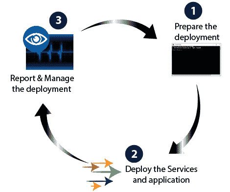
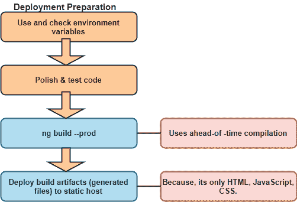
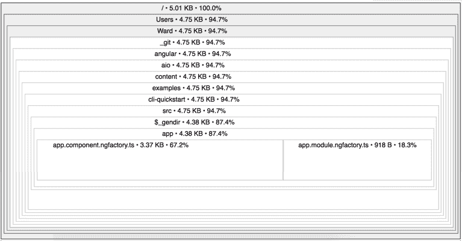

# 部署 Angular 8 应用程序

> 原文：<https://www.tutorialandexample.com/deployment-of-an-angular-8-app/>

**部署 Angular 8 应用**

要实现我们的应用程序，我们必须编译它，然后在 web 服务器上托管 JavaScript、CSS 和 HTML。构建一个可移植性很强的 Angular 应用程序，它可以存在于任何环境中，也可以由任何技术提供服务，比如 Node、java。net、PHP 和许多其他语言。

当我们准备好将 angular 应用程序部署到远程服务器时，我们有各种部署选项。



### 简单的部署选项

在完全部署我们的应用程序之前，我们可以通过使用以下技术之一来测试流程、构建配置和部署行为:

### 从磁盘构建和服务

在开发过程中，我们通常使用 webpack dev server，使用 **ng serve** 命令从本地内存构建、监视和服务应用程序。当我们准备部署时；然而，我们必须使用 **ngmodule** 命令来构建应用程序并部署构建，我们必须生成源自方法论的系统。

ng build 和 ng serve 都会在创建项目之前清除输出文件夹。但是只有 ng build 命令用于构建应用程序和在任何地方部署构建构件。

***注意:输出文件夹默认为 dist/project name。要输出不同的文件夹，请在 angular JSON 中更改输出路径。*T3】**

我们将需要两个终端来获得实时重装体验。

*   在第一个终端上，在监视模式下运行 ng build 命令，将应用程序编译到 dist 文件夹中。

```
ng build --watch
```

与 ng serve 命令一样，当源文件改变时，它会重新生成输出文件。

*   在第二个终端上，安装一个 web 服务器，并针对输出文件夹运行它。例如:

```
lite-server –baseDir=”dist”  
```

当新文件输出时，服务器会自动重新加载我们的浏览器。

***注意:该方法仅用于开发和测试，不支持或不安全的部署应用*** 的方式。



### 从不同的服务器请求服务(CORS)

Angular 开发人员在向应用程序的主机服务器之外的服务器发出服务请求(数据服务请求)时，可能会遇到跨源资源共享错误。除非服务器明确允许，否则浏览器禁止此类声明。

客户端应用程序对这些错误无能为力。服务器必须配置为接受应用程序的请求。

**生产优化**

**–prod 元标志**采用了以下构建优化特性。

*   **提前(AOT)编译:** AOT 编译是角度组件模板的预组合。
*   **生产模式:**部署生产环境，启用生产模式。
*   **捆绑:**它将我们的许多应用程序和库文件打包成几个包。
*   **缩小:**用于删除多余的空白、注释和可选符号。
*   **丑化:**它重写代码，使用简短、隐晦的变量和函数名。
*   **死代码删除:**删除未引用的模块和大量未使用的代码。

**衡量绩效**

当我们清楚而准确地理解了让应用程序变慢的原因时，我们就可以更好地决定优化什么以及如何优化。

我们浪费了大量的时间和金钱来优化一些没有实际好处的东西，甚至使应用程序变得更慢。我们应该衡量应用程序在对我们很重要的环境中运行时的实际行为。

WebChromeTest 工具是另一个不错的选择，它也可以帮助验证我们的部署是否成功。

**检查捆包**

source-map-explorer 工具是在产品构建之后检查生成的 JavaScript 包的好方法。

安装源地图资源管理器:

```
npm install source-map-explorer –save-dev 
```

构建我们的生产应用程序，包括源地图

```
ng build –prod –source-map
```

在 dist/文件夹中列出创建的包。

```
ls dist/*.bundle.js
```

运行 explorer 以生成其中一个包的图形表示。以下示例显示了主束的图形。

```
node_module/bin/source-map-explorer dist/.main.*.bundle.js
```

**source-map-explorer** 分析捆绑包生成的源映射，并绘制所有依赖关系的映射，显示包中包含的类。

主包的输出称为**CLI-快速启动。**



**差动加载**

当我们构建 web 应用程序时，确保我们的应用程序与目标中的大多数浏览器兼容。即使 JavaScript 在不断发展，引入了新的特性，但并不是所有的浏览器都以同样的速度支持这些新特性。

我们在开发中使用 **TypeScript** 编写的代码被编译并捆绑到 ES2015 中，es 2015 是与大多数浏览器兼容的 JavaScript 语法。

为了最大化兼容性，我们可以发布一个包，其中包含我们所有的编译代码，以及可能需要的任何聚合填充。使用现代浏览器的用户不应该为 polyfills 带来的包大小增加而付出代价，polyfills 可以弥补提供浏览器支持的旧版本 JavaScript 中不存在的功能的差距。

为了最大限度地提高兼容性，您可以发布一个包，其中包含所有已编译的代码，以及任何可能需要的聚合填充。

差异加载是一种策略，其中 CLI 构建两个独立的已部署应用包。

*   第一个**包**包含现代 **ES2015** 语法，利用了现代浏览器中的内置支持，提供了更少的 polyfills，导致包的大小更小。
*   第二个包**包含旧的 **ES5** 语法的代码，以及所有必要的聚合填充。这导致了一个很大的包大小，但是支持**旧的**浏览器。**

这种策略允许我们继续构建支持多种浏览器的 web 应用程序，但只加载浏览器需要的必要代码。