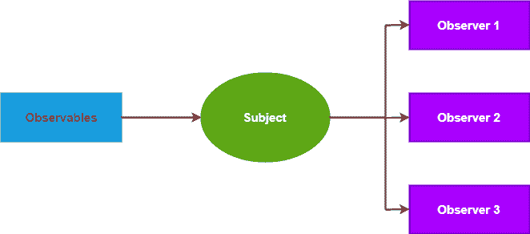
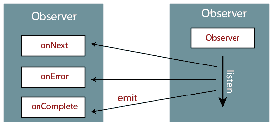
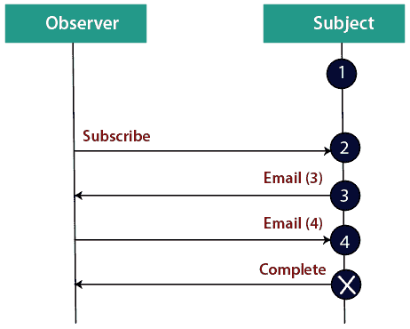

# 角度 8 可观测量

> 原文：<https://www.tutorialandexample.com/angular-8-observables/>

Observables 在我们的应用程序中为发布者和订阅者之间传递消息提供支持。根据内容的不同，observables 可以传递任何类型的多个值，比如文字**、**消息**。**

 **它是一个对象，定义回调方法来处理可观察对象可以发送的三种类型的通知。以下是这些。

*   **下一个:必选。**处理程序为每个被传递的值调用零个或多个类型后开始执行。
*   **错误:** **可选。**该处理程序用于错误警告。错误会停止可观察实例的执行。
*   完成:可选。执行完成通知的执行。延迟值可以在执行完成后继续传递给下一个处理程序。



根据上下文，一个可观察对象可以传递任意类型的多个值——文字、消息或事件。无论值是否在上下文中提供，用于接收值的 API 都是相同的。因为安装和拆卸逻辑是由 observables 处理的，我们的应用程序代码只需要订阅消费值，以及何时完成或取消订阅。

### 基本用法和术语

作为发布者，我们创建一个定义订阅者函数的观察者实例。它是当消费者调用 **subscribe()** 方法时执行的函数。

为了执行我们创建的可观察对象并开始接收通知，我们调用`subscribe()`方法，传递一个*观察者*。这是一个 JavaScript 对象，它为我们接收的通知定义了处理程序。这个`subscribe ()`调用比[](https://angular.io/api/service-worker/SwPush#unsubscribe)**方法返回一个`subscription`对象，我们称之为停止接收通知。**

 **

**举例:**

 **```
Observe geolocation updates
 // Create an Observable which will start listening to gelolocation updates
 // when a consumer subscribed.
 const locations = new Observable((observer) => {
   // Get the next callbacks. It will be passed in when 
 const {next, error} = observer;
   let watchId; 
 if ('geolocation' in navigator) {
     watchId = navigator.geolocation.watchPosition(next, error);
   } else {
     error('Geolocation not available');
   }
 return {unsubscribe() { navigator.geolocation.clearWatch(watchId); }};
 }); 
 const locationsSubscription = locations.subscribe({
 next(position) {console.log('Current Position: ', position); },
 error(msg) { console.log('Error Getting Location: ', msg); }
 });
 setTimeout(() => { locationsSubscription.unsubscribe(); }, 10000); 
```

### 创造可观察的

使用 observable 构造函数创建任何类型方法的任何可观察流。当可观察对象的 subscribe()方法执行时，构造函数将它的参数作为订户函数来运行。订阅者函数接收一个观察者对象，并可以向观察者的 next()方法发布值。



**例如:**

### 用构造函数创建可观察对象

```
// The function runs when subscribe() is called in the function.
 function sequenceSubscriber(observer) {
  //It synchronously deliver 1, 2, and 3, then complete 
   observer.next(1);
   observer.next(2);
   observer.next(3);
   observer.complete();
  return {unsubscribe() {}}; 
 }
 const sequence = new Observable(sequenceSubscriber);
 sequence.subscribe({
   next(num) { console.log(num); },
   complete() { console.log('Finished sequence'); }
 }); 
 // Logs:
 // 1..
 // 2..
 // 3..
 // Finished sequence
```

为了进一步说明这个例子，我们可以创建一个发布事件的可观察对象。

**举例:**

**用自定义的 fromEvent 函数创建**

```
function fromEvent(target, eventName) {
   return new Observable((observer) => {
     const handler = (e) => observer.next(e);
     // Add the event handler to the target
     target.addEventListener(eventName, handler);
 return () => {
       // Detach the event handler from the target
       target.removeEventListener(eventName, handler); 
     };
   });
 } 
```

现在我们可以使用函数来创建一个发布 keydown 事件的可观察对象:

**使用自定义 fromEvent 函数**

```
const ESC_KEY = 27;
 const nameInput = document.getElementById('name') as HTMLInputElement;
 const subscription = fromEvent(nameInput, 'keydown')
   .subscribe((e: KeyboardEvent) => {
     if (e.keyCode === ESC_KEY){ 
   nameInput.value = '';
   } 
   }); 
```

**组播**

一个可观察对象为订阅的观察者创建一个新的、独立的执行。当观察者订阅时，可观察对象连接一个事件处理程序，并将值传递给观察者。当第二个观察者订阅时，observables 会连接一个新的事件处理程序，并在单独的执行中将值传递给第二个观察者。

有时，我们希望每个订阅获得相同的值，而不是为每个订阅启动独立的执行——即使值已经开始发出。

让我们看一个从 1 数到 3 的例子，每个数字发出后有一秒钟的延迟。

**创建一个延迟序列**

```
function sequenceSubscriber(observer) {
  const seq = [1, 2, 3];
   let timeoutId;
   function doSequence(arr, idx) {
     timeoutId = setTimeout(() => {
       observer.next(arr[idx]);
       if (idx === arr.length - 1) { 
         observer.complete();
       } else {
         doSequence(arr, ++idx);
       }
     }, 1000);
   }
 doSequence(seq, 0); 
   return {unsubscribe() {
     clearTimeout(timeoutId);
   }};
 }
 //It Create a new Observable that will deliver the above sequence 
 const sequence = new Observable(sequenceSubscriber);
 sequence.subscribe({
   next(num) { console.log(num); },
   complete() { console.log('Finished sequence'); }
 });
 // Logs:
 // (at 1 second): 1 
 // (at 2 seconds): 2
 // (at 3 seconds): 3
 // (at 3 seconds): Finished sequence 
```

请注意，如果我们订阅两次，将会有两个单独的流，每个流每秒发出一次值。它看起来像这样:

**两个订阅**

```
// Subscribe starts the clock, and emit after per second 
 sequence.subscribe({
 next(num) { console.log('1st subscribe: ' + num); },
 complete() { console.log('1st sequence finished.'); }
 });
 // After 1/2 second, subscribe again.
 setTimeout(() => {
 sequence.subscribe({ 
 next(num) { console.log('2nd subscribe: '+ num); },
 complete() { console.log('2nd sequence finished.'); }
   });
 }, 700)
 // Log:
 // (In 1 second): 1st subscribe: 1
 // (In 1.5 seconds): 2nd subscribe: 1 
 // (In 2 seconds): 1st subscribe: 2
 // (In 2.5 seconds): 2nd subscribe: 2
 // (In 3 seconds): 1st subscribe: 3
 // (In 3 seconds): 1st sequence finished
 // (In 3.5 seconds): 2nd subscribe: 3
 // (In 3.5 seconds): 2nd sequence finished 
```

将可观察对象更改为多播，如下所示:

### 创建多播订户

```
function multicastSequenceSubscriber(){
   const seq = [1, 2, 3];
 const observers = [];
   let timeoutId;
  (runs when subscribe()
   // function is invoked)
   return (observer) => {
     observers.push(observer); 
     if (observers.length === 1) {
       timeoutId = doSequence({
         next(val) {
           observers.forEach(obs => obs.next(val));
         },
         complete() {
           observers.slice(0).forEach(obs => obs.complete()); 
         }
       }, seq, 0);
     }
  return {
       unsubscribe() {
         observers.splice(observers.indexOf(observer), 1);
         if (observers.length === 0) { 
           clearTimeout(timeoutId);
         }
       }
     };
   };
 } 
 function doSequence(observer, arr, idx) {
   return setTimeout(() => {
     observer.next(arr[idx]);
     if (idx === arr.length - 1) {
       observer.complete();
     } else {
       doSequence(observer, arr, ++idx); 
     }
   }, 1000);
 }
 const multicastSequence = new Observable(multicastSequenceSubscriber());
 // Subscribe starts the clock, and begins to emit after 1 second
 multicastSequence.subscribe({ 
   next(num) { console.log('1st subscribe: ' + num); },
   complete() { console.log('1st sequence finished.'); }
 });
 // After 1 1/2 seconds, subscribe again (should "miss" the first value).
 setTimeout(() => {
   multicastSequence.subscribe({
     next(num) { console.log('2nd subscribe: ' + num); },
     complete() { console.log('2nd sequence finished.'); } 
   });
 }, 1500);
 // Logs:
 // (at 1 second): 1st subscribe: 1
 // (at 2 seconds): 1st subscribe: 2
 // (at 2 seconds): 2nd subscribe: 2
 // (at 3 seconds): 1st subscribe: 3
 // (at 3 seconds): 1st sequence finished 
 // (at 3 seconds): 2nd subscribe: 3
 // (at 3 seconds): 2nd sequence finished 
```

### 错误处理

因为可观察对象异步产生值，所以 try/catch 不能有效地捕捉错误。相反，我们通过在观察器上指定错误回调来处理错误。可观察对象可以产生值(调用下一个回调)，也可以完成，调用 complete 或 error 也会导致可观察对象清除订阅并停止产生值。

```
myObservable.subscribe({
   next(num) { console.log('Next num: ' + num)},
   error(err) { console.log('Received an errror: ' + err)}
 }); 
```******