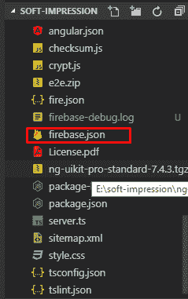

# 角度 8 通用

> 原文：<https://www.tutorialandexample.com/angular-8-universal/>

**八角万向**

Angular Universal 是一种允许对 Angular 应用程序进行服务器端渲染的技术。angular 应用程序是一个单页应用程序，它在客户端浏览器中运行。在 DOM 中呈现页面是对用户反应的响应。

Angular Universal 在服务器中执行，生成静态应用程序页面，这些页面在客户机上引导。这意味着应用程序渲染速度更快，让用户有机会在应用程序完全交互之前查看应用程序布局。


我们可以使用 Angular CLI 轻松准备一个用于服务器端渲染的应用程序。CLI scematic @ nguniversal/express-engine 执行所需的步骤，如下所述。

**万能教程**

英雄之旅教程是本演练的基础。在这个例子中，带有**提前(AoT** )编译器的应用程序。Node Express web 服务器根据客户的请求用 Universal 编译 HTML 页面。

要创建服务器端应用程序模块 **app.server.module.ts** ，请运行以下 CLI 命令。

```
ng add @nguniversal/express-engine --clientProject angular.io-example
```

该命令创建以下文件夹结构。

```
src/index.html                    app web page
   main.ts                         bootstrapper for client app
   main.server.ts             * bootstrapper for server app
   style.css                       styles for the app
   app/ ...                         application code
     app.server.module.ts     * server-side application module
 server.ts                               * express web server 
 tsconfig.json                    TypeScript client configuration
 tsconfig.app.json            TypeScript client configuration
 tsconfig.server.json         * TypeScript server configuration
 tsconfig.spec.json            TypeScript spec configuration
 package.json                     npm configuration
 webpack.server.config.js     * webpack server configuration 
```

标有*的文件是新的，不在原始教程示例中。

**通用在行动**

要在本地系统上使用 universal 开始呈现我们的应用程序，请使用以下命令。

```
npm run builds:ssr && npm serve:ssr
```

打开浏览器，将其转换为[**http://localhost:4000/**](http://localhost:4000/)。我们可以熟悉一下英雄之旅仪表盘页面。

通过 **routerLinks** 导航可以正常工作，因为它们使用本地锚(< a >)标签。我们可以从仪表板到仪表板，再到英雄页面，然后返回。我们可以单击仪表板页面上的英雄来显示其详细信息页面。

我们可以模拟一个较慢的网络，以便更清楚地看到转换结果，如下所示:

1.  打开 chrome 开发工具，进入网络选项卡。
2.  在菜单栏的最右边找到网络节流下拉菜单。
3.  尝试“ **3G** 速度之一。

### 为什么我们使用服务器端渲染？

创建我们的应用程序的通用版本主要有三个原因。

*   通过搜索引擎优化方便网络爬虫 **(SEO)**
*   提高移动设备和低功耗设备的性能。
*   用最满意的颜料显示第一页 **(FCP)**

**通用网络服务器**

通用 web 服务器接收由通用模板引擎重新定义的静态 HTML 内的应用页面请求。服务器响应来自客户端(如浏览器)和服务器静态资产(如脚本、CSS 和图像)的 HTTP 请求。

通用应用程序使用 Angular platform-server 包，该包提供了对 **DOM** 、 **XMLHttpRequest** 和其他底层特性的服务器实现。

**renderModuleFactory()** 函数将一个模板 HTML 页面(通常是 index.html)中的输入、一个包含组件的角度模块以及一个决定我们必须显示哪些组件的路径作为输入。路由来自客户端对服务器的请求。

每个请求都会产生所请求路线的适当视图。 **renderModuleFactory()** 函数在模板的 **< app >** 标签中呈现视图，为客户端创建一个完整的 HTML 页面。

**第一步:添加角度通用**

首先，我们必须为我们的角度应用添加通用角度支持，因为我们将运行一个 cmd。

```
ng add @nguniversal/express-engine –clientProject<project name>
```


一旦完成，我们将在我们的项目中看到许多变化，以了解更多关于这个过渡访问**角宇宙官方**

**步骤 2:在 server.ts 中进行更改**

下一步是对我们的服务器进行更改。ts

1.  我们需要在应用程序变量前添加导出


*   我们需要对我们的应用程序的监听进行注释，这通常在 server.ts 文件的末尾。


**第三步:将我们的应用程序导出为库**

现在，我们需要将我们的应用程序导出为一个库，库目标为 web pack 配置中的 umd，通常它的名称是 **webpack.server.config.js**


**步骤 4:初始化并配置 firebase**

在这个级别，我们首先需要在我们的系统中安装 firebase 工具。


然后，我们需要从我们的 cli 登录到 firebase

然后，我们将在项目中初始化一个 firebase 主机

```
Npm g firebase-tools
Once the above cmd succeeds
firebase login
firebase init 
```


有一次，我们的 angular 项目中有 firebase，我们需要在 firebase.json 文件中做一些更改。



我们必须更改其中的重写属性。


【功能】:**“angularUniversalFunction”**

**步骤 5:构建我们的项目**

```
npm run build:ssr
```

上面的 **cmd** 生成了一个 dist 文件夹，里面有三样东西:我们系统中的 browser 文件夹和 serve.js 文件。


**步骤 6:自动化构建文件夹的移动**

我们需要将根项目中的构建文件夹复制到 Smartcodehub 的 functions 文件夹中。

```
npm i --save fs-extra
```

在 cmd 之后，我们将创建一个文件，并将其命名为 movedist.js，内容为

```
const fs = require('fs-extra');
 (
     async()=>{
         const src = './dist';
         const dist = './functions/dist';await fs.remove(dist);
         await fs.copy(src,dist);
     }
 )()
```

上面的函数将从根目录复制 dist 并粘贴到 functions 文件夹中。

**步骤 7:配置我们的主要 firebase 功能**

在这一步中，我们需要设置我们的主要 firebase 函数，它位于 functions 文件夹 src 目录中，文件名是 index.ts。

```
import * as functions from 'firebase-functions';const universal  = require(`${process.cwd()}/dist/server`).app;export const angularUniversalFunction = functions.https.onRequest(universal);
```

**步骤 8:部署 firebase 功能**

重建我们的项目

Npm 运行构建:ssr

节点 movedist.js

cd 功能

消防基地部署


与传统应用相比，水疗有许多优势，例如:

*   客户端负责进行大部分渲染。对于服务器来说，它的主要作用是将应用程序文件提供给客户端。
*   不刷新页面
*   不需要每个动作都到达服务器。
*   不同页面之间的轻松导航。
*   改进的性能。
*   服务器没有加载新页面的特殊请求。
*   用户友好性等。

我们称**为通用**应用，它与**服务器端渲染**相结合。