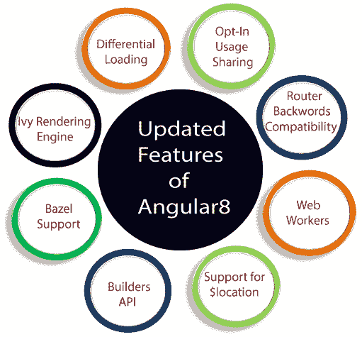
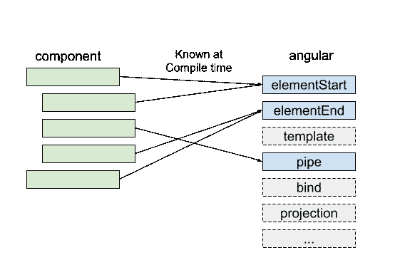
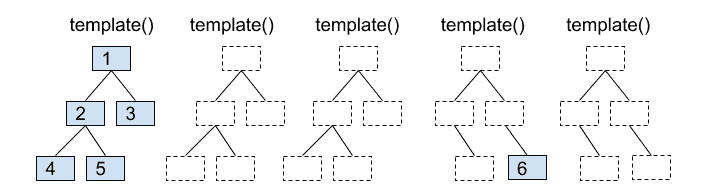
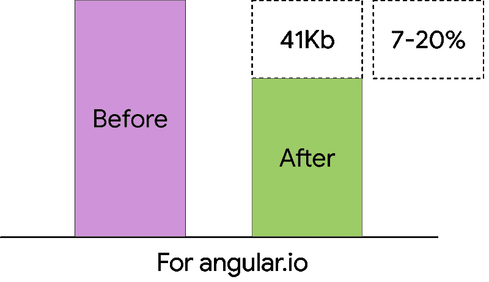
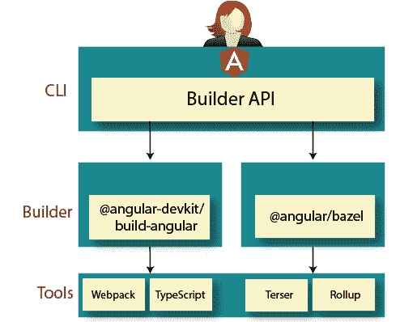

# 角度 8 变化和新功能

> 原文：<https://www.tutorialandexample.com/angular-8-changes-and-new-features/>

有角度的版本号表示该版本引入的变更级别。语义版本化的使用帮助我们理解更新到新版本的潜在影响。

Angular 是开发客户端(前端)移动和桌面 web 应用程序或 spa 的最流行的平台。随着 Angular 8 的新发布，我们有了一组新的强大功能，开发人员将会喜欢这些功能，这些功能在许多层面上都有所增加。核心框架、角度素材库和 CLI。



**常春藤预告**

如果我们一直跟着 Angular 走，那么我们很可能遇到了“Ivy”这个词。常春藤是角史上的重大变化；这是一个有角度的渲染，因为它使用了增量 DOM，所以与其他渲染方式完全不同。它改变了下面的内部工作方式，而不改变我们的运行时代码来重写 Angular 编译器和运行时代码。

### Angular Ivy 如何在增量 DOM 上工作

增量 DOM 背后的关键思想是每个组件都被编译成一系列指令。这些指令创建 DOM 树，并在数据发生变化时就地更新它们。

**常春藤的两个主要概念**

1.  **Tree shakable:** 这意味着删除我们代码中未使用的部分，框架不会像解释特定指令一样解释组件引用。它永远不会被使用，所以我们可以从包中省略剩余的方向，从而得到更小的包和更快的加载时间。



*   **内存占用少:**增量 DOM 在不改变 DOM 的情况下，不需要任何内存来重新渲染视图。以便在内存中添加或删除 DOM 节点时分配内存。因为大多数渲染/模板调用不会改变任何东西，所以可以节省大量内存。



**差动加载**

Angular 8 应用程序现在将更具性能。通过差异加载，Angular CLI 生成的新应用现在将包含传统 JavaScript 和现代 Javascript 的单独捆绑包。



正确的捆绑包将自动加载到浏览器中，并能够下载更小、更高效、加载和渲染速度更快的应用包。

### 角度路由器向后兼容性

Angular 8 功能为 Angular router 添加了后台兼容模式，有助于为大型项目升级路径，并通过允许立即将 Angular v1.x 应用程序的部分内容延迟加载到 angular 2+来更容易地迁移到 Angular。

**改进的 Web Worker Building**

在构建产品包时，Web workers 也包括在内，这对于提高并行性和帮助提高性能是必不可少的。

```
ng g web worker <name>
```

**数据库支持**

Angular 8 的最新特性之一是用 bazel 构建我们的 CLI 应用。棱角分明的框架本身就是用 bazel 制作的。

它可以选择加入，预计将包含在@angular/cli 版本 9 中。



### Bazel 的主要优势是:

*   我们将能够用相同的工具构建我们的后端和前端
*   更快的构建时间首先会非常慢，因为 bazel 的目标是精确可复制的构建，但是并发构建会快得多。如果我们的应用程序使用几个模块和库，这将是有益的。
*   **增量构建** : Codebase 只会触发最小可能的重建，有助于构建和部署仅更改过的应用，而不是整个应用。
*   我们可以弹出 Bazel 文件，默认情况下它们是隐藏的。
*   在构建场进行远程构建的可能性。

**惰性加载**

延迟加载基于角度路由的概念，因为它通过延迟加载所需的数据来降低大文件的大小。在以前的 angular 版本中，路由配置使用属性 **@loadChildren** ，该属性接受一个字符串，如果有错误的模块名称或任何类型，则与一个系列一致。如果在编写代码时有错误的模块名称或任何类型的名称，Angular 不会认为它是错误的，并且在我们尝试构建它之前，它会接受字符串形式的任何值。

**选择加入使用共享**

让他们的努力与社区的需求保持一致，Angular CLI 将获得另一个新功能，即选择加入使用共享。此功能将允许选择加入与 Angular 团队共享有关我们 Angular CLI 使用情况的遥测信息。现在 Angular 8 可以收集数据，如使用的命令，并在用户允许的情况下提高速度，这将有助于开发人员未来的改进。

### CLI 工作流改进

Angular CLI 正在不断改进，现在 ng-build、ng-test 和 ng-run 都配备在 extended by 3 <sup>rd</sup> -party 库和工具中。

例如 **: AngularFire**

**建筑商 API**

新版本允许我们使用构建器 API。它使用构建器进行主要操作，如服务、构建、测试、lint 和 e2e。构建器是实现任务的逻辑和行为的函数，它可以替换我们从@angular-devkit/architect 包传递给 createBuilder()方法的命令&现在我们也可以创建自定义的构建器了。

### 使用$location service 改进 AngularJS API 迁移

angular 团队希望为所有使用 AngularJS 的开发者提供支持，将他们升级到最新的 Angular。因此，我们做了一些改进，以便在混合(AngularJS <=> Angular)应用程序中更好地集成 AngularJS $定位服务。增加了一个新的组件**角度/普通/上坡**。

*   从定位服务中检索状态。
*   跟踪所有的位置变化。

**服务人员**

带有服务工作者实现的 Angular ships 从版本 5 开始。Angular 服务人员和 Angular CLI 内置 PWA 支持。angular 开发人员可以利用这种服务工作者，并从其提供的更高的可靠性和性能中受益，而无需针对低级 API 进行编码，并可以实现类似本机的应用程序下载和安装。

**将 Typescript 更新到 3.4.x**

在 Angular 8 的最新版本中，他们已经将 Angular 的依赖项更新到 3.4 版，其中包括 RxJS 和 TypeScript 等工具(Angular 7 使用 3.2 版)。通过 Angular CLI 生成的新应用程序也将默认使用最新版本的 TypeScript。

**角状火基**

Angular 增加了对 firebase 的支持，现在我们可以使用 Angular CLI 部署我们的应用程序，

```
ng run [Project_name]: deploy
```