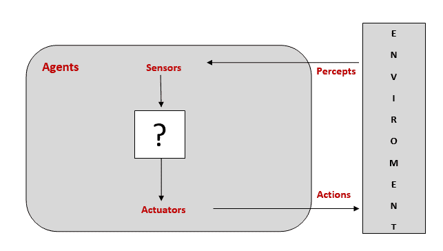
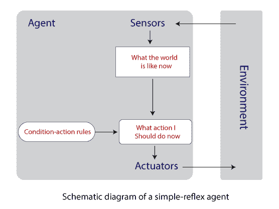
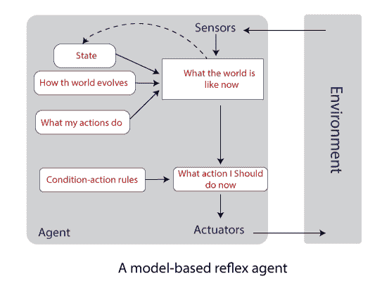
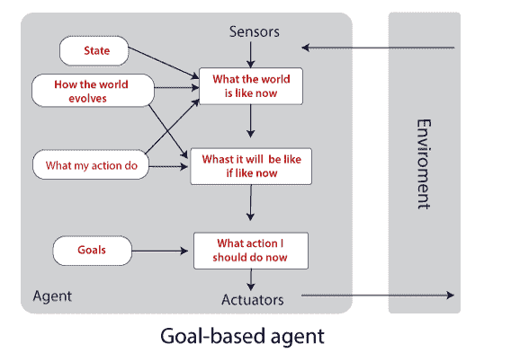
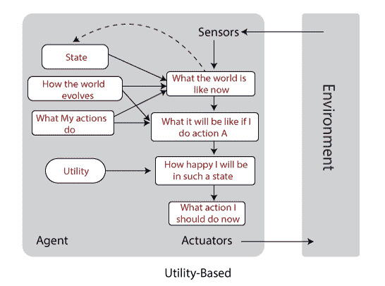

# 智能代理|人工智能中的代理

> 原文：<https://www.tutorialandexample.com/intelligent-agents/>

### 什么是代理？

智能体可以被看作是通过传感器感知其环境并通过执行器作用于该环境的任何东西。

例如，人类通过称为传感器的感觉器官感知周围环境，并使用手、腿等采取行动。，称为致动器。

**代理的图示**

**智能体通过传感器和执行器与环境互动**

### 智能代理

智能代理是一个目标导向的代理。它通过传感器利用观察和内置知识感知环境，通过执行器对环境起作用。

### 理性代理人

一个理性的主体是一个对每一个感知都采取正确行动的主体。通过这样做，它最大化了性能测量，这使得代理成为最成功的。

**注:**理性智能体和智能体略有区别。

### 全知代理人

全知代理是一个提前知道其行为实际结果的代理。然而，这样的代理在现实世界中是不可能的。

**注意:**理性主体不同于全知主体，因为一个理性主体试图用当前的感知获得最好的可能结果，这导致了不完美。一个**象棋人工智能**可以是一个理性代理的好例子，因为在当前的行动中，不可能预见每一个可能的结果，而一个**井字游戏人工智能**是无所不知的，因为它总是提前知道结果。

### 软件代理

这是一个在动态环境中工作的软件程序。这些代理也被称为**软机器人**，因为软件代理的所有身体部分都只是软件。例如，电子游戏、飞行模拟器、**等。**

### 代理人的行为

数学上，代理行为可以描述为:

*   **Agent Function:** 是给定感知序列到动作的映射。这是一个抽象的数学解释。
*   **代理程序:**是代理功能的实际物理实现。

例如，**自动干手机**通过其传感器检测信号(手)。当我们把手放在干衣机附近时，它会打开加热电路并吹风。当信号检测消失时，它会断开加热电路并停止吹风。

### 代理人的合理性

人们期望智能代理以最大化其性能度量的方式行动。因此，一个代理人的理性取决于四件事:

*   定义成功标准的绩效衡量标准。
*   代理关于环境的固有知识。
*   代理可以执行的操作。
*   到目前为止代理的感知序列。

例如:考试分数取决于试卷以及我们的知识。

**注:**理性使预期表现最大化，完美使实际表现最大化从而导致全知。

### 任务环境

任务环境是一个问题，rational agent 被设计为一个解决方案。因此，在 2003 年， **Russell 和 Norvig** 介绍了几种对任务环境进行分类的方法。但是，在对环境进行分类之前，我们应该了解以下术语:

*   **性能测量:**它通过测量不同的因素来指定代理为实现其目标而采取的步骤序列。
*   **环境:**指定了代理与不同类型环境的交互。
*   **执行器:**它指定了智能体通过采取预期的行动来影响环境的方式。
*   **传感器:**它指定了代理从其环境中获取信息的方式。

这些术语缩写为 **PEAS** (性能测量、环境、执行器、传感器)。为了更详细地理解 PEAS 术语，让我们讨论以下示例中的每个元素:

| **代理类型** | **性能** | **环境** | **执行器** | **传感器** |
| 出租车司机 | 安全、快速、正确的目的地 | 道路、交通 | 转向、喇叭、刹车 | 摄像头，全球定位系统，速度表 |
| 自动出租车司机的 PEAS 摘要 |

### 任务环境的属性/分类

### 完全可观察与部分可观察:

当代理的传感器允许在每个时间点访问环境的完整状态时，则任务环境是完全可观察的，而如果代理没有环境的完整和相关信息，则任务环境是部分可观察的。

**举例:**在跳棋游戏中，代理完全观察环境，而在扑克游戏中，代理部分观察环境，因为它看不到其他代理的牌。

**注意:**完全可观察的任务环境是方便的，因为不需要维护内部状态来跟踪世界。

### 单代理与多代理

当单个主体为实现一个目标而工作时，我们称之为单主体，而当两个或多个主体为实现一个目标而一起工作时，我们称之为多主体。

**示例:**玩填字游戏——单个代理

下棋-多代理(需要两个代理)

### 确定性与随机性

如果主体的当前状态和动作完全决定了环境的下一个状态，那么环境是确定性的，而如果下一个状态不能从当前状态和动作中确定，那么环境是随机的。

**示例:**图像分析–确定性

出租车驾驶——随机(无法决定交通行为)

**注意:**如果环境是部分可观测的，它可能表现为随机的

### 情节与顺序

如果主体的情节被分成原子情节，并且下一个情节不依赖于先前的状态动作，则环境是情节性的，而如果当前的动作可能影响未来的决策，则这样的环境是顺序性的。

**示例:**零件拾取机器人——情节性的

下棋——顺序

### 静态与动态

如果环境随时间变化，这样的环境是动态的；否则，环境就是静态的。

**举例:**纵横字谜游戏有一个静态的环境，而物理世界有一个动态的环境。

### 离散与连续

如果一个主体有有限数量的动作和状态，那么环境就是离散的，否则就是连续的。

**举例:**在跳棋游戏中，有有限数量的移动——离散的

一辆卡车在到达目的地时可以有无限的移动——连续不断。

### 已知与未知

在已知的环境中，代理知道其行动的结果，但是在未知的环境中，代理需要从环境中学习以便做出好的决策。

例如:一个网球运动员知道其动作的规则和结果，而一个运动员需要学习一个新的视频游戏的规则。

**注:**已知环境部分可观测，未知环境完全可观测。

### 代理的结构

人工智能的目标是设计一个实现代理功能的代理程序，即从感知到行动的映射。一个程序需要一些带有物理传感器和执行器的计算机设备来执行，这就是所谓的**架构。**

因此，代理是体系结构和程序的结合，即

**代理=架构+程序**

**注意:**代理程序和代理函数的区别在于，代理程序将当前感知作为输入，而代理函数将整个感知历史作为输入。

### 代理程序的类型

根据任务的智能和复杂程度的不同，有以下四种类型的代理:

*   简单反射智能体:它是最简单的智能体，只根据当前的感知动作，而不关注其余的感知历史。这种类型的代理函数依赖于**条件-动作规则**—“如果条件，则动作”只有在环境完全可观测的情况下，它才能做出正确的决策。当环境是部分可观测的时，这些智能体不能忽略无限循环，但是如果智能体随机化其动作，则可以从无限循环中逃脱。

**示例:** iDraw，一个绘图机器人，它将输入的字符转换成

写入时不存储过去的数据。

**注:**简单反射智能体不维持内部状态，不依赖感知理论。

*   基于模型的代理:这些类型的代理可以通过维护一些内部状态来处理部分可观测的环境。内部状态取决于感知历史，它至少反映了当前状态的一些未被观察到的方面。因此，久而久之，内部状态需要更新，这需要在智能体程序中编码两种类型的知识或信息，即世界自身的进化和智能体行动的影响。

**举例:**当一个人走在一条小巷里，他在脑海里绘制路径。

*   **基于目标的代理:**只有当前状态信息是不够的，除非目标尚未确定。因此，基于目标的智能体在多种可能性中选择一种方式来帮助它达到目标。

**注:**在搜索和规划(人工智能的子领域)的帮助下，基于目标的智能体很容易到达目的地。

*   **基于效用的代理:**这些类型的代理关心性能度量。代理选择那些最大化性能测量并致力于目标的行动。

**举例:**下棋的主要目标是‘将死’国王，但玩家事先完成了几个小目标。

**注意:**基于效用的代理会跟踪它的环境，在达到它的主要目标之前，它会完成几个可能出现在路径之间的微小目标。

*   **学习智能体:**这些智能体的主要任务是教会智能体机器在未知的环境中运行，尽可能多地获取知识。学习代理分为四个概念性组件:
    *   **学习元素:**这个元素负责做出改进。
    *   **Performance element:** 负责根据所采取的感知选择外部动作。
    *   它向学习代理提供关于代理做得如何的反馈，这可以在将来最大化性能测量。
    *   **问题发生器:**它建议可以带来新的有益体验的行动。

**例子:**人类出生后才学会说话。

**注意:**学习代理的目标是提高代理的整体性能。

**T2】**

 **## 代理程序组件的工作

代理组件的功能是回答一些基本的问题，比如“现在的世界是什么样的？”，“我的行为是做什么的？”等等。

我们可以通过在增加表达能力和复杂性的轴上进行区分，以各种方式表示由代理继承的环境，如下所述:

*   **原子表象:**在这里，我们无法划分世界的每个状态。所以，它没有任何内部结构。**搜索、玩游戏、隐马尔可夫模型和马尔可夫决策过程**都与原子表示一起工作。
*   **分解表示:**在这里，每个状态被分解成一组固定的具有值的属性或变量。它允许我们表现不确定性。**约束满足、命题逻辑、贝叶斯网络**和**机器学习**算法与分解的表示一起工作。

注意:两个不同的分解状态可以共享一些变量，比如当前的 GPS 位置，但是两个不同的原子状态不能这样做。

*   **结构化表示:**在这里，我们可以明确地描述世界上存在的不同对象之间的各种不同的关系。**关系数据库和一阶逻辑、一阶概率模型、自然语言理解**是结构化表示的基础。

#### 相关帖子:

*   [2020 年十大人工智能技术。](https://www.tutorialandexample.com/artificial-intelligence-technologies-in-2020/)
*   [AI 中的正向链接:人工智能](https://www.tutorialandexample.com/forward-chaining/)
*   [AI 中的反向链接:人工智能](https://www.tutorialandexample.com/backward-chaining/)
*   [命题逻辑](https://www.tutorialandexample.com/propositional-logic/)
*   [人工智能中基于知识的智能体](https://www.tutorialandexample.com/knowledge-based-agents-in-ai/)
*   [人工智能中的知识表示](https://www.tutorialandexample.com/knowledge-representation-in-ai/)
*   人工智能中的密码算法问题
*   [人工智能中的约束满足问题](https://www.tutorialandexample.com/constraint-satisfaction-problems-in-artificial-intelligence/)
*   [阿尔法-贝塔剪枝|人工智能](https://www.tutorialandexample.com/alpha-beta-pruning/)
*   [人工智能中的启发式函数](https://www.tutorialandexample.com/heuristic-functions/)
*   [人工智能中的问题解决](https://www.tutorialandexample.com/problem-solving-in-artificial-intelligence/)
*   [人工智能教程| AI 教程](https://www.tutorialandexample.com/artificial-intelligence-tutorial/)**