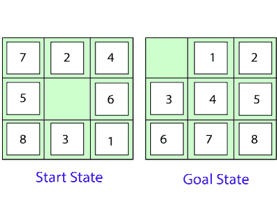
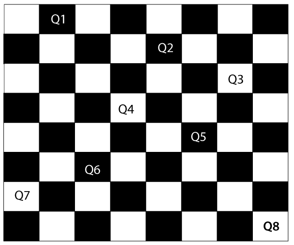

# 人工智能中的问题解决

> 原文：<https://www.tutorialandexample.com/problem-solving-in-artificial-intelligence/>

反射代理被认为是最简单的代理，因为它们直接将状态映射为动作。不幸的是，这些代理无法在映射太大而无法存储和学习的环境中运行。**另一方面，基于目标的智能体**考虑未来的行动和期望的结果。

在这里，我们将讨论一种称为**问题解决代理**的基于目标的代理，它使用原子表示，没有对*问题解决算法*可见的内部状态。

### 问题解决代理

问题解决代理通过定义问题及其几种解决方案来精确地执行。

根据心理学，“解决问题是指我们希望从目前的状态或条件达到一个明确目标的状态。”

> 根据计算机科学，问题解决是人工智能的一部分，它包含许多技术，如算法、启发式算法来解决问题。

因此，问题解决代理是一个**目标驱动的代理**，专注于满足目标。

**问题解决代理执行的步骤**

*   **目标制定:**是解决问题的第一步，也是最简单的一步。它组织了从多个目标中制定一个目标所需的步骤/顺序，以及实现该目标的行动。目标的制定是基于当前的情况和代理的绩效衡量(下面讨论)。
*   **问题制定:**这是解决问题最重要的一步，它决定了应该采取什么行动来实现制定的目标。问题公式化涉及以下五个部分:
*   **初始状态:**是主体向其目标迈进的起始状态或初始步骤。
*   **动作:**它是对代理可用的可能动作的描述。
*   **转换模型:**它描述了每个动作做什么。
*   **目标测试:**确定给定状态是否为目标状态。
*   **路径成本:**它为每一条遵循目标的路径分配一个数字成本。问题解决代理选择反映其性能度量的成本函数。记住，**一个最优解是所有解中路径成本最低的。**

**注:** **初始状态、动作**和**转移模型**一起隐式定义了问题的**状态空间**。问题的状态空间是一组所有状态的集合，这些状态可以从初始状态开始，随后是任何一系列的动作。状态空间形成有向图或图形，其中节点是状态，节点之间的链接是动作，路径是由动作序列连接的状态序列。

*   **搜索:**识别从当前状态到达目标状态的所有最佳可能动作序列。它将问题作为输入，将解决方案作为输出返回。
*   **解:**从各种算法中找出最佳算法，可能被证明为最佳最优解。
*   **执行:**执行搜索算法中的最优解，从当前状态到达目标状态。

**例题**

基本上，有两种类型的问题解决方法:

*   **玩具问题:**它是对问题的简洁而准确的描述，研究人员用来比较算法的性能。
*   **现实世界问题:**基于现实世界的问题需要解决方案。不像玩具问题，它不依赖于描述，但我们可以有一个问题的一般公式。

**一些玩具问题**

*   **8 拼图问题:**这里我们有一个 3x3 的矩阵，可移动的瓷砖从 1 到 8 编号，中间有一个空格。与空白空间相邻的区块可以滑入该空间。目标是达到与目标状态相似的指定目标状态，如下图所示。

*   在图中，我们的任务是通过将数字滑动到空白处，将当前状态转换为目标状态。

在上图中，我们的任务是通过将数字滑动到空白处，将当前(开始)状态转换为目标状态。

**问题公式化如下:**

*   **States:** 描述了每个编号瓷砖和空白瓷砖的位置。
*   **初始状态:**我们可以从任何状态开始作为初始状态。
*   **动作:**这里定义了空格的动作，即**左、右、上、下**
*   **转换模型:**根据给定的状态和动作返回结果状态。
*   目标测试:它确定我们是否达到了正确的目标状态。
*   **路径代价:**路径代价是路径中每一步的代价为 1 的步数。

**注:**八难题是 **[滑块问题](https://github.com/topics/sliding-puzzle-game?o=desc&s=updated)** 的一种，用于测试[人工智能](https://www.tutorialandexample.com/artificial-intelligence-tutorial/)中新的搜索算法。

*   8 皇后问题:这个问题的目的是将八个皇后按顺序放在棋盘上，这样任何一个皇后都不能攻击另一个。一个女王可以攻击对角或者同一行同一列的其他女王**。**

从下图中，我们可以了解问题以及正确的解决方法。

从上图中可以注意到，每一个皇后都被放置在棋盘中的一个位置，在同一行或同一列中，没有其他皇后被放置在对角线上。因此，这是解决 8 皇后问题的一种正确方法。

**对于这个问题，主要有两种提法:**

*   **增量公式:**从空状态开始，操作员在每一步增加一个皇后。

**本配方包括以下步骤:**

*   **状态:**棋盘上任意 0 到 8 个皇后的排列。
*   **初始状态:**空棋盘
*   **动作:**在任何空盒子里添加一个皇后。
*   **转场模式:**返回一个盒子里加了皇后的棋盘。
*   **目标测试:**检查棋盘上是否放置了 8-queen，没有任何攻击。
*   **路径开销:**不需要路径开销，因为只计算最终状态。

在这个公式中，大约有**1.8×1014**个可能的序列可供研究。

*   **完整状态公式:**它从棋盘上所有的 8 皇后开始，移动它们，避开攻击。

**本配方涉及以下步骤**

*   状态:所有 8 个女王的排列，每列一个，没有女王攻击其他女王。
*   动作:将女王移到安全的地方，以免受到攻击。

该公式优于增量公式，因为它将状态空间从**1.8×1014**减少到 **2057** ，并且很容易找到解。

一些现实世界的问题

*   **旅行推销员问题(TSP):** 这是一个**旅行问题**，推销员只能访问每个城市一次。目标是找到最短的旅游路线，并在每个城市销售一空。
*   **VLSI 布局问题:**在这个问题中，为了最小化面积、电路延迟、杂散电容和最大化制造产量，数百万个组件和连接被放置在一个芯片上。

**布局问题分成两部分:**

*   **单元布局:**在这里，电路的基本元件被分组为单元，每个单元执行其特定的功能。每个细胞都有固定的形状和大小。任务是将细胞放置在芯片上，但不要相互重叠。
*   **通道布线:**它为每根电线找到一条穿过电池之间缝隙的特定路线。
*   **蛋白质设计:**目标是找到一个氨基酸序列，它将折叠成具有治疗某种疾病特性的 3D 蛋白质。

**寻找解决方案**

我们看到了许多问题。现在，有必要寻找解决这些问题的方法。

在本节中，我们将了解代理如何使用搜索来解决问题。

为了解决不同类型的问题，智能体使用不同的策略，通过搜索可能的最佳算法来达到目标。这个搜索过程被称为**搜索策略。**

### 衡量解决问题的表现

在讨论不同的搜索策略之前，应该测量一个算法的**性能指标**。因此，有四种方法可以衡量算法的性能:

**完备性:**它衡量算法是否保证找到一个解(如果存在任何解)。

**最优性:**衡量策略是否搜索到最优解。

**时间复杂度:**算法找到一个解所用的时间。

**空间复杂度:**执行搜索所需的内存量。

算法的复杂度取决于**分支因子**或**最大后继数**、**最浅目标节点的深度**(即从根到路径的步数)和**状态空间中任意路径的最大长度。**

**搜索策略**

有两种类型的策略描述给定问题的解决方案:

#### 不知情搜索(盲目搜索)

除了问题定义中提供的信息之外，这种类型的搜索策略没有关于状态的任何附加信息。他们只能生成后继者并区分目标状态和非目标状态。这些类型的搜索不保持任何内部状态，这就是为什么它也被称为**盲目搜索。**

**不知情的搜索有以下几种类型:**

*   广度优先搜索
*   统一成本搜索
*   深度优先搜索
*   深度受限搜索
*   迭代深化搜索
*   双向搜索

#### 知情搜索(启发式搜索)

这种类型的搜索策略包含一些关于问题定义之外的状态的附加信息。这种搜索使用特定于问题的知识来找到更有效的解决方案。这种搜索通过启发式函数(提供提示)保持某种内部状态，因此也被称为 **[启发式搜索](https://www.tutorialandexample.com/informed-search-heuristic-search/)。**

**有以下类型的知情搜索:**

*   最佳首次搜索(贪婪搜索)
*   A*搜索

#### 相关帖子:

*   [2020 年十大人工智能技术。](https://www.tutorialandexample.com/artificial-intelligence-technologies-in-2020/)
*   [人工智能中的约束满足问题](https://www.tutorialandexample.com/constraint-satisfaction-problems-in-artificial-intelligence/)
*   [人工智能中的启发式函数](https://www.tutorialandexample.com/heuristic-functions/)
*   [动态贝叶斯网络](https://www.tutorialandexample.com/dynamic-bayesian-networks/)
*   [人工智能中的效用函数](https://www.tutorialandexample.com/utility-functions-in-artificial-intelligence/)
*   [概率推理](https://www.tutorialandexample.com/probabilistic-reasoning/)
*   [量化不确定性](https://www.tutorialandexample.com/quantifying-uncertainty/)
*   [经典策划](https://www.tutorialandexample.com/classical-planning/)
*   [隐马尔可夫模型](https://www.tutorialandexample.com/hidden-markov-models/)
*   [人工智能中基于知识的智能体](https://www.tutorialandexample.com/knowledge-based-agents-in-ai/)