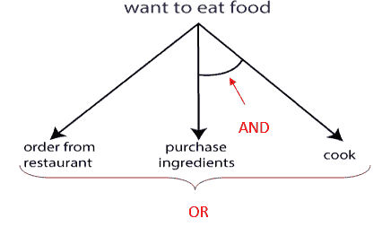

# 人工智能中的知情搜索/启发式搜索

> 原文：<https://www.tutorialandexample.com/informed-search-heuristic-search/>

有信息的搜索比无信息的搜索更有效，因为在有信息的搜索中，除了当前状态信息之外，还存在一些附加信息，这使得更容易到达目标状态。

下面我们讨论了不同类型的知情搜索:

### 最佳优先搜索(贪婪搜索)

最佳优先搜索是知情搜索的一般方法。这里，基于**评估函数 f(n)** 、**选择节点用于扩展，其中 f(n)解释成本估计值**。评估函数首先扩展具有最低成本的那个节点。f(n)的一个分量是 **h(n)** ，它携带搜索算法所需的附加信息，即，

**h(n)=从当前节点 n 到目标节点的最便宜路径的估计成本。**

**注意:**如果当前节点 n 是目标节点，h(n)的值将为 0。

最佳优先搜索被称为贪婪搜索，因为它总是试图探索离目标节点最近的节点，并选择该路径，从而给出快速解决方案。因此，它在启发式函数的帮助下评估节点，即 **f(n)=h(n)。**

### 最佳优先搜索算法

1.  设置一个**打开**列表和一个**关闭**列表，其中**打开**列表包含已访问但未展开的节点，而**关闭**列表包含已访问和已展开的节点。
2.  最初，遍历根节点并访问它的下一个后继节点，并按照启发式值的升序将它们放入 **OPEN** 列表中。
3.  从**打开的**列表中选择启发值最低的第一个后继节点，并进一步展开**。**
4.  现在，重新排列**打开**列表中所有剩余的未展开节点，并重复上述两个步骤。
5.  如果到达目标节点，则终止搜索，否则进一步扩展。

在上图中，根节点是 **A，**，它的下一级后继节点是 **B** 和 **C** ，其中 **h(B)=2** 和 **h(C)=4。我们的任务是探索具有最低 h(n)值的节点。因此，我们将选择节点 **B** 并将其进一步扩展到节点 **D** 和 **E** 。再次搜索出具有最低 h(n)值节点，并进一步探索它。**

**最佳优先搜索算法的性能度量:**

*   **完备性:**即使在有限状态空间中，最佳优先搜索也是不完备的。
*   **最优性:**不提供最优解。
*   **时空复杂度:**它有**O(b****m****)**最差时空复杂度，其中 **m 是搜索树的最大深度**。如果启发式函数的质量好，复杂性可以大大降低。

注意:最佳优先搜索结合了 BFS 和 DFS 的优势来寻找最佳解决方案。

### 最佳优先搜索的缺点

*   BFS 不保证达到目标状态。
*   由于最佳优先搜索是一种贪婪的方法，它不能给出优化的解决方案。
*   在某些情况下，它可能覆盖很长的距离。

### A*搜索算法

A*搜索是最广泛使用的信息搜索算法，其中通过组合函数 **g(n)** 和 **h(n)** 的值来评估节点 n。函数 **g(n)是从开始/初始节点到节点 n** 的路径成本，而 **h(n)是从节点 n 到目标节点的最便宜路径的估计成本。**因此，我们

**f(n)=g(n)+h(n)**

其中 **f(n)是通过 n 的最便宜解决方案的估计成本**

所以，为了找到最便宜的解，试着找到 f(n)的最低值。

让我们看看下面的例子，以便更好地理解。

在上面的例子中，S 是根节点，G 是目标节点。从根节点 **S** 开始，向其下一个连续节点 **A** 和 **B** 移动。为了达到目标节点 **G** ，使用评估等式计算节点 **S、A** 和 **B** 的 f(n)值，即

**f(n)=g(n)+h(n)**

#### 节点 S 的 f(n)的计算:

f(S)=(从节点 S 到 S 的距离)+ h(S)

*   0+10=10.

**节点 A 的 f(n)的计算:**

f(A)=(从节点 S 到 A 的距离)+h(A)

*   2+12=14

**节点 B 的 f(n)的计算:**

f(B)=(从节点 S 到 B 的距离)+h(B)

*   3+14=17

因此，节点 A 具有最低的 f(n)值。因此，节点 A 将被探索到它的下一级节点 C 和 D，并再次计算最低的 f(n)值。经过计算，我们得到的序列是**S->A**-**T5】D->G**其中 f(n)=13(最低值)。

### 如何使 A*搜索可容许得到优化解？

A*搜索找到一个最优解，因为它有*个容许的启发式函数 h(n ),该函数认为解决一个问题的成本小于它的实际成本*。一个启发式函数可以**低估**或者**高估**到达目标节点所需的成本。但是一个容许的启发式函数永远不会高估达到目标状态所需的成本值。低估成本值意味着我们头脑中假设的成本小于实际成本。高估成本值意味着我们假设的成本大于实际成本，即，

这里， **h(n)是实际启发式成本值**，而**h’(n)是估计启发式成本值**。

**注意:**高估的成本值可能会也可能不会导致优化的解决方案，但低估的成本值总是会导致优化的解决方案。

让我们借助一个例子来理解:

考虑下面的搜索树，其中开始/初始节点是 **A** ，目标节点是 **E** 。我们有不同的路径到达目标节点 **E** ，它们具有不同的启发式成本 h(n)和路径成本 g(n)。实际的启发式代价是 **h(n)=18。**让我们假设两个不同的估计值:

**h1'(n)= 12** 这是低估的成本值

**H2’(n)= 25**这是高估的成本值

因此，当成本值被高估时，搜索最佳最优路径并获得第一条最优路径不会花费任何负载。但是如果 h(n)值被低估，它将试图达到 h(n)的最佳值，这将导致一个好的最优解。

**注:**低估 h(n)导致更好的最优解，而不是高估该值。

**a*搜索的性能测量**

*   **完备性:**a*搜索中的星号(*)保证到达目标节点。
*   **最优:**一个被低估的成本总会给出一个最优解。
*   **时空复杂度:** A*搜索有**O(b****T5】d**T8)时空复杂度。

### A*搜索的缺点

*   A*通常会在很长一段时间内耗尽空间。

### AO*搜索算法

AO* search 是基于**和/或 o** 运算的专用图形。这是一种问题分解策略，将一个问题分解成更小的部分，分别解决，以获得达到预期目标所需的解决方案。虽然 A *搜索和 AO*搜索都遵循最佳优先搜索顺序，但是它们彼此不同。

让我们借助下面的例子来理解 AO*的工作原理:

在这里，目的地/目标是吃一些食物。我们有两种方法，要么在任何一家餐馆点餐，要么买一些食材，煮着吃菜。因此，我们可以应用两种方法中的任何一种，选择取决于我们。不能保证订单是否能按时送达，食物是否可口等。但是如果我们购买并烹饪它，我们会更满意。

因此，AO*搜索提供了两种选择**或**或**和**的方式。最好选择**和**而不是**或**来获得一个好的最优解。

#### 相关帖子:

*   [智能代理|人工智能中的代理](https://www.tutorialandexample.com/intelligent-agents/)
*   [人工智能教程| AI 教程](https://www.tutorialandexample.com/artificial-intelligence-tutorial/)
*   [阿尔法-贝塔剪枝|人工智能](https://www.tutorialandexample.com/alpha-beta-pruning/)
*   [人工智能中的对抗性搜索](https://www.tutorialandexample.com/adversarial-search-in-artificial-intelligence/)
*   [爬山算法](https://www.tutorialandexample.com/hill-climbing-algorithm/)
*   [人工智能中的启发式函数](https://www.tutorialandexample.com/heuristic-functions/)
*   [不知情的搜索策略——人工智能](https://www.tutorialandexample.com/uninformed-search-strategies/)
*   [命题逻辑中的推理规则](https://www.tutorialandexample.com/inference-rules-in-proposition-logic/)
*   [人工智能中基于知识的智能体](https://www.tutorialandexample.com/knowledge-based-agents-in-ai/)
*   [人工智能中的知识表示](https://www.tutorialandexample.com/knowledge-representation-in-ai/)
*   人工智能中的密码算法问题