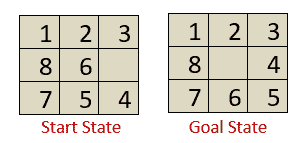

# 人工智能中的启发式函数

> 原文：<https://www.tutorialandexample.com/heuristic-functions/>

**AI 中的启发式函数**:正如我们已经看到的，知情搜索利用启发式函数，以便以更显著的方式到达目标节点。因此，从当前节点到目标节点，搜索树中有多条路径。选择一个好的启发式函数当然很重要。*一个好的启发式函数是由其效率决定的。更多的是关于问题的信息，更多的是处理时间。*

一些玩具问题，比如 8 字谜，8 皇后，井字游戏等。可以在启发式函数的帮助下更有效地解决。让我们看看如何:

考虑下面的 8 个难题，我们有一个开始状态和一个目标状态。我们的任务是滑动当前/开始状态的瓷砖，并将其按照目标状态中的顺序放置。可以有四种移动**向左、向右、向上或向下**。有几种方法可以将当前/开始状态转换为目标状态，但是，我们可以使用启发式函数 h(n)来更有效地解决问题。

#### 8 个难题的启发式函数定义如下:

h(n)=未就位的牌的数量。

因此，总共有三张牌不在位置上，即 6、5 和 4。不计算目标状态中存在的空区块)。即 h(n)=3。现在，我们要求最小化 **h(n) =0 的值。**

我们可以构建一个状态空间树，将 h(n)值最小化为 0，如下所示:

从上面的状态空间树可以看出，目标状态从 h(n)=3 到 h(n)=0 是最小化的。但是，我们可以根据需要创建和使用几个启发式函数。从上面的例子也可以清楚地看出，启发式函数 h(n)可以被定义为更有效地解决给定问题所需的信息。该信息可以与状态的**性质、从一个状态转换到另一个状态的成本、目标节点特征、**等相关。，表示为启发式函数。

### 启发式搜索算法的性质

在启发式搜索算法中使用启发式函数会导致启发式搜索算法的以下特性:

*   **可容许条件:**如果一个算法返回一个最优解，那么它就是可容许的。
*   **完备性:**一个算法被认为是完备的，如果它终止于一个解(如果这个解存在)。
*   **优势性质:**如果有两个容许的启发式算法 **A1** 和 **A2** 具有 **h1** 和 **h2** 启发式函数，那么如果对于节点 **n 的所有值 **h1** 优于 **h2** 则称 **A1** 优于 **A2****
*   **最优性:**如果一个算法是**完备的，可容许的**，并且**支配**其他算法，那么它将是最好的一个，一定会给出最优解。

#### 相关帖子:

*   [2020 年十大人工智能技术](https://www.tutorialandexample.com/artificial-intelligence-technologies-in-2020/)
*   [动态贝叶斯网络](https://www.tutorialandexample.com/dynamic-bayesian-networks/)
*   [人工智能中的效用函数](https://www.tutorialandexample.com/utility-functions-in-artificial-intelligence/)
*   [AI 中的正向链接:人工智能](https://www.tutorialandexample.com/forward-chaining/)
*   [人工智能中的约束满足问题](https://www.tutorialandexample.com/constraint-satisfaction-problems-in-artificial-intelligence/)
*   人工智能中的密码算法问题
*   [人工智能中的知识表示](https://www.tutorialandexample.com/knowledge-representation-in-ai/)
*   [命题逻辑中的推理规则](https://www.tutorialandexample.com/inference-rules-in-proposition-logic/)
*   [人工智能中的对抗性搜索](https://www.tutorialandexample.com/adversarial-search-in-artificial-intelligence/)
*   [阿尔法-贝塔剪枝|人工智能](https://www.tutorialandexample.com/alpha-beta-pruning/)
*   [局部搜索算法和优化问题](https://www.tutorialandexample.com/local-search-algorithms-and-optimization-problem/)
*   [人工智能中的问题解决](https://www.tutorialandexample.com/problem-solving-in-artificial-intelligence/)