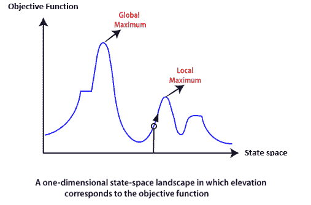

# 局部搜索算法和优化问题

> 原文：<https://www.tutorialandexample.com/local-search-algorithms-and-optimization-problem/>

[知情](https://www.tutorialandexample.com/informed-search-heuristic-search/)和[不知情搜索](https://www.tutorialandexample.com/uninformed-search-strategies/)以两种方式系统地扩展节点:

*   在内存中保存不同的路径
*   选择最合适的路径，

这导致到达目标节点所需的解决方案状态。但是除了这些**“经典搜索算法**”之外，我们还有一些**“局部搜索算法”，其中路径成本无关紧要，只关注到达目标节点所需的解状态。**

局部搜索算法通过遍历单个当前节点而不是多条路径并通常跟随该节点的邻居来完成其任务。

 ****虽然局部搜索算法并不系统，但它们仍然有以下两个优点**:

*   局部搜索算法使用非常少或恒定量的存储器，因为它们仅在单个路径上操作。
*   大多数情况下，他们在大型或无限状态空间中找到合理的解决方案，而经典或系统的算法不起作用。

局部搜索算法对纯优化问题有效吗？

**是的，**局部搜索算法对纯优化问题有效。一个纯优化问题是所有的节点都能给出一个解。但是目标是根据**目标函数**找到所有状态中的最佳状态。遗憾的是，纯优化问题未能找到从当前状态到达目标状态的高质量解。

**注意:**目标函数是在优化问题的不同上下文中其值最小化或最大化的函数。在搜索算法的情况下，目标函数可以是到达目标节点的路径成本等。**T3】**

### 局部搜索算法的工作原理

让我们借助一个例子来理解局部搜索算法的工作原理:

考虑以下两种状态空间的情况:

*   **位置:**由状态定义。
*   **提升:**由目标函数值或启发式代价函数值定义。

局部搜索算法通过找到以下两点来探索上述情况:

*   **全局最小值:**如果高程对应成本，那么任务就是寻找最低的谷底，这就是所谓的**全局最小值。**
*   **全局最大值:**如果海拔对应于一个目标函数，那么它会找到最高峰，这个最高峰被称为**全局最大值**。这是山谷的最高点。

在爬山搜索中，我们将更好地理解这些点的作用。

下面是一些不同类型的本地搜索:

*   爬山搜索
*   模拟退火
*   局部波束搜索

我们将在下一节讨论上述搜索。

**注意:**局部搜索算法不会负担记忆存储器中的所有节点；它基于完整的状态公式运行。

#### 相关帖子:

*   [2020 年十大人工智能技术](https://www.tutorialandexample.com/artificial-intelligence-technologies-in-2020/)
*   [人工智能中的效用函数](https://www.tutorialandexample.com/utility-functions-in-artificial-intelligence/)
*   [AI 中的正向链接:人工智能](https://www.tutorialandexample.com/forward-chaining/)
*   [命题逻辑中的推理规则](https://www.tutorialandexample.com/inference-rules-in-proposition-logic/)
*   [人工智能中基于知识的智能体](https://www.tutorialandexample.com/knowledge-based-agents-in-ai/)
*   [人工智能中的知识表示](https://www.tutorialandexample.com/knowledge-representation-in-ai/)
*   [人工智能中的约束满足问题](https://www.tutorialandexample.com/constraint-satisfaction-problems-in-artificial-intelligence/)
*   [阿尔法-贝塔剪枝|人工智能](https://www.tutorialandexample.com/alpha-beta-pruning/)
*   [人工智能中的启发式函数](https://www.tutorialandexample.com/heuristic-functions/)
*   [不知情的搜索策略——人工智能](https://www.tutorialandexample.com/uninformed-search-strategies/)
*   [人工智能中的问题解决](https://www.tutorialandexample.com/problem-solving-in-artificial-intelligence/)**