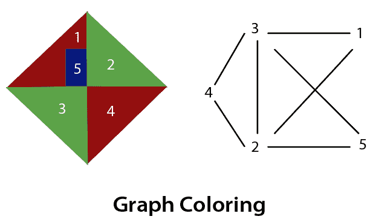
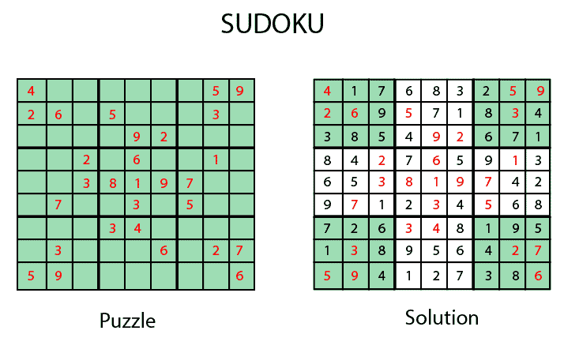
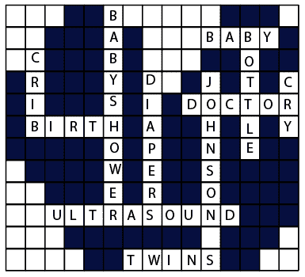
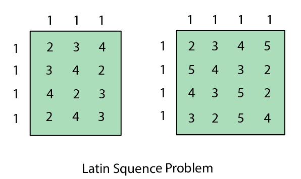

# 人工智能中的约束满足问题

> 原文：<https://www.tutorialandexample.com/constraint-satisfaction-problems-in-artificial-intelligence/>

**人工智能中的约束满足问题**

我们已经看到了很多像局部搜索、对抗搜索这样的技术来解决不同的问题。每一种解决问题的技巧都有一个目的，即找到达到目标的解决方案。虽然，在对抗性搜索和局部搜索中，在解决问题和达到其解决方案时，对代理没有约束。

在本节中，我们将讨论另一种类型的问题解决技术，称为约束满足技术。顾名思义，约束满足是指*在一定的约束或规则下解决一个问题。*

约束满足是一种技术，其中当问题的值满足问题的某些约束或规则时，问题被解决。这种类型的技术导致对问题结构及其复杂性的更深入理解。

约束满足取决于三个组成部分，即:

*   **X:** 它是一组变量。
*   **D:** 它是变量所在的一组域。每个变量都有一个特定的域。
*   **C:** 是一组约束，后面跟着一组变量。

在约束满足中，域是变量所在的空间，遵循问题特定的约束。这是约束满足技术的三个主要元素。约束值由一对 **{scope，rel}** 组成。**范围**是参与约束的变量元组，而 **rel** 是一个关系，包括变量可以用来满足问题约束的值列表。

**解决约束满足问题**

解决约束满足问题(CSP)的要求是:

*   状态空间
*   解决方案的概念。

状态空间中的状态是通过给一些或所有变量赋值来定义的，例如

**{ X****1****= v****1****，X****2****= v****2****，以此类推……}。**

**变量赋值有三种方式:**

*   不违反任何约束或规则的转让称为一致转让或合法转让。
*   **完全赋值:**给每个变量赋值，CSP 的解保持一致的赋值。这种转让称为完全转让。
*   **部分赋值:**只给某些变量赋值的赋值。这种类型的转让称为部分转让。

**CSP 中的域类型**

**变量使用以下两种类型的域:**

*   **离散域:**它是一个无限域，可以有多个变量的一个状态。**例如**一个起始状态可以为每个变量分配无限次。
*   **有限域:**它是一个有限域，可以有连续的状态描述一个特定变量的一个域。它也被称为连续域。

**CSP 中的约束类型**

关于变量，基本上有以下类型的约束:

*   **一元约束:**它是限制单个变量的值的最简单的约束类型。
*   **二元约束:**是关联两个变量的约束类型。值**x****T5】2**将包含位于 **x1** 和 **x3** 之间的值。
*   **全局约束:**涉及任意数量变量的约束类型。

**一些特殊类型的求解算法用于求解以下类型的约束:**

*   **线性约束:**这类约束通常用于线性规划，其中每个包含整数值的变量仅以线性形式存在。
*   **非线性约束:**这些类型的约束用于非线性规划，其中每个变量(整数值)以非线性形式存在。

**注意:**在现实世界中起作用的一种特殊约束被称为**偏好约束。**

**约束传播**

在局部状态空间中，选择只有一个，即寻找解。但是在 CSP 中，我们有两种选择:

*   我们可以寻找解决方案或者
*   我们可以执行一种特殊类型的推理，称为**约束传播**。

*约束传播是一种特殊类型的推理，有助于减少变量值的合法数量。*约束传播背后的思想是**局部一致性。**

在局部一致性中，变量被视为**节点**，每个二元约束被视为给定问题中的**弧**。**下面讨论以下局部一致性:**

*   **节点一致性:**如果变量定义域中的所有值都满足变量上的一元约束，则称单个变量是节点一致的。
*   **弧一致性:**如果一个变量在其定义域中的每个值都满足该变量的二元约束，则该变量是弧一致性的。
*   **路径一致性:**当一组两个变量相对于第三个变量的评估可以扩展到另一个变量，满足所有的二元约束。它类似于弧一致性。
*   k-一致性:这种类型的一致性用于定义更强的传播形式的概念。在这里，我们检查变量的 k-一致性。

**CSP 问题**

约束满足包括那些在解决问题时包含一些约束的问题。CSP 包括以下问题:

*   **图着色:**约束条件是相邻边不能有相同颜色的问题。

*   **数独玩法:**游戏规则是 0-9 之间的数字不能在同一行或同一列重复出现。

*   **n 皇后问题:**在 n 皇后问题中，约束条件是任何皇后都不能放在同一行或同一列的对角线上。

注意:n 皇后问题已经在人工智能的解题部分讨论过了。

*   **纵横字谜:**纵横字谜题中，约束条件是单词要有正确的构成，而且要有意义。

*   **拉丁方块问题:**在这个游戏中，任务是搜索游戏中多次出现的图案。它们可能会被打乱，但将包含相同的数字。

*   密码算法问题:这个问题有一个最重要的约束，就是我们不能给同一个字符分配不同的数字。所有数字都应该包含一个唯一的字母。

注:我们将在下一节详细讨论密码算法。

#### 相关帖子:

*   [2020 年十大人工智能技术。](https://www.tutorialandexample.com/artificial-intelligence-technologies-in-2020/)
*   [概率推理](https://www.tutorialandexample.com/probabilistic-reasoning/)
*   [动态贝叶斯网络](https://www.tutorialandexample.com/dynamic-bayesian-networks/)
*   [人工智能中的效用函数](https://www.tutorialandexample.com/utility-functions-in-artificial-intelligence/)
*   [量化不确定性](https://www.tutorialandexample.com/quantifying-uncertainty/)
*   [隐马尔可夫模型](https://www.tutorialandexample.com/hidden-markov-models/)
*   [隐马尔可夫模型](https://www.tutorialandexample.com/hidden-markov-models/)
*   [AI 中的正向链接:人工智能](https://www.tutorialandexample.com/forward-chaining/)
*   [反向链接](https://www.tutorialandexample.com/backward-chaining/)
*   [动态路由](https://www.tutorialandexample.com/dynamic-routing/)