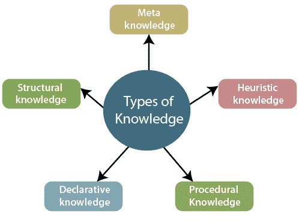
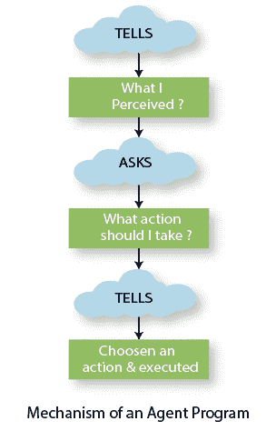
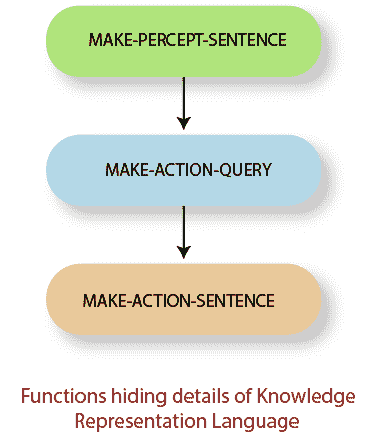

# 人工智能中基于知识的智能体

> 原文：<https://www.tutorialandexample.com/knowledge-based-agents-in-ai/>

知识是人脑从逻辑上认识和理解事物的基本要素。当一个人变得对某件事有所了解时，他就能以更好的方式去做那件事。在人工智能中，复制人类这种元素的智能体被称为基于知识的智能体。

### 什么是逻辑？

逻辑是任何知识背后的关键。它允许一个人从大量信息中筛选出必要的信息并得出结论。在[人工智能](https://www.tutorialandexample.com/artificial-intelligence-tutorial/)中，知识的表示是通过逻辑来完成的。

逻辑有三个主要组成部分，如下所示:

*   **句法:**是一种特定语言为了构成一个句子而应该遵循的顺序。句法是一种语言的表现形式。每种语言都有自己的语法。
*   **例如，** **ax <sub>2</sub> +bx+c** 是一个二次方程的良构语法。
*   **语义:**一个逻辑所遵循的句子或者句法应该是有意义的。语义学定义了与现实世界相关的句子的意义。

**比如**印度人每年都会庆祝排灯节。这句话代表了这个国家和印度人民的真实情况。因此，这个句子在句法和语义上都是正确的。

*   **逻辑推理:**推理是指对某一事实或某一问题进行推断或得出某种结论。逻辑推理是思考所有可能导致正确结果的原因。推理算法用于执行逻辑推理。

### 知识的类型

主要有五种知识。



*   **元知识:**是关于知识的信息/知识。
*   **启发式知识:**是关于特定主题的知识。
*   **程序性知识:**它给出关于达成某事的信息。
*   **陈述性知识:**它是描述特定对象及其属性的信息。
*   **结构知识:**描述对象之间的知识。

### 基于知识的代理

到目前为止，我们已经研究了智能代理，它们获取关于世界的知识，以便在现实世界中做出更好的决策。基于知识的代理使用一些特定于任务的知识来有效地解决问题。

**基于知识的系统由两个可区分的特征组成，它们是:**

*   知识库
*   推理机

**知识库:******知识库代表现实世界中存在的实际事实。它是基于知识的代理的核心组件。它是一组描述与世界有关的信息的句子。****

 ******注:**这里，一个句子不是英语语言句子，而是用一种叫做**知识表示语言**的语言来表示。

**推理机:**它是基于知识的系统的引擎，允许在系统中推理新知识。

### 代理人的行为

当需要在*知识库系统*中**添加/更新**一些新的信息或句子时，我们需要一个推理系统。同样，为了知道什么信息是代理已经知道的，我们需要推理系统。用于描述推理系统机制的技术词汇有:**告诉**和**询问**。当代理解决一个问题时，它每次都调用代理程序。**代理程序执行三件事情:**

1.  它**告诉**它从环境中感知到了什么。
2.  它**询问**知识库关于它应该采取的行动？
3.  它**告诉**所选择的动作，最后，代理执行该动作。



在这三个函数下抽象出知识表示语言的细节。这些功能在智能代理的两个主要组件之间创建了一个接口，即**传感器和**执行器。



**功能讨论如下:**

*   **MAKE-PERCEPT-SENTENCE()**

该函数返回一个句子，该句子告诉代理在给定时间所感知的信息。

*   **MAKE-ACTION-QUERY()**

这个函数返回一个句子，告诉代理当前必须采取什么行动。

*   **MAKE-ACTION-SENTENCE()**

这个函数返回一个句子，告诉你一个动作被选中并被执行。

让我们借助下面的函数来理解推理引擎下这些函数的工作原理:

```
functionKB-AGENT(percept ) returnsan action
persistent: KB, a knowledge base
t, a counter, initially 0, indicating time
TELL(KB,MAKE-PERCEPT-SENTENCE(percept , t ))
action ?ASK(KB,MAKE-ACTION-QUERY(t ))
TELL(KB,MAKE-ACTION-SENTENCE(action, t ))
t ?t + 1
return action 
```

### 基于知识的代理的层次

*   **知识级别:**在该级别中，通过指定以下内容来决定代理的行为:
    *   代理当前所了解的知识。
    *   代理人的目标。
*   **实现层面:**这个层面是知识层面的物理表征。这里理解为“基于知识的智能体实际上是如何实现其存储的知识的。”

**例如，**考虑一台自动化空调。储存在它系统中的内在知识是“它会根据天气调节温度。”这代表了代理的知识水平。实际工作及其调整决定了知识型代理的实现水平。

### 用于构建基于知识的代理的方法

有以下两种方法用于设计基于知识的系统的行为:

*   **陈述法:** 在一个空洞的知识体系中灌输必要的信息。这种类型的方法用于设计基于知识的系统。代理设计者**向空系统一个接一个地讲述**个句子，直到系统变得有足够的知识来处理环境。
*   **程序化方法:**在这种方法中，知识以程序代码的形式存储在一个空的系统中。这是一种与声明性方法相反的方法。它通过编码设计系统的行为。

**注:**在 20 世纪 70 年代和 80 年代，一场团队辩论导致了上述两种方法的结合，以构建一个成功的基于知识的代理。

#### 相关帖子:

*   [概率推理](https://www.tutorialandexample.com/probabilistic-reasoning/)
*   [动态贝叶斯网络](https://www.tutorialandexample.com/dynamic-bayesian-networks/)
*   [人工智能中的效用函数](https://www.tutorialandexample.com/utility-functions-in-artificial-intelligence/)
*   [量化不确定性](https://www.tutorialandexample.com/quantifying-uncertainty/)
*   [经典策划](https://www.tutorialandexample.com/classical-planning/)
*   [隐马尔可夫模型](https://www.tutorialandexample.com/hidden-markov-models/)
*   [动态路由](https://www.tutorialandexample.com/dynamic-routing/)
*   [一阶逻辑中的推理](https://www.tutorialandexample.com/inference-in-first-order-logic/)
*   [AI 中的解析方法](https://www.tutorialandexample.com/resolution-method-in-ai/)
*   [一阶逻辑理论](https://www.tutorialandexample.com/theory-of-first-order-logic/)****