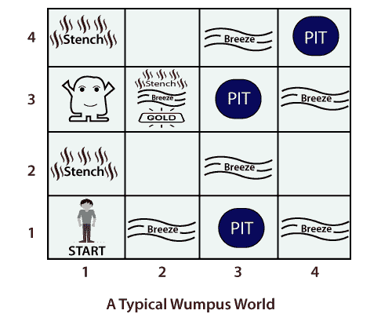

# 温普斯世界

> 原文：<https://www.tutorialandexample.com/the-wumpus-world/>

Wumpus world 是一个游戏，它为基于知识的代理提供了一个展示其存储知识的环境。它是由格雷戈里·约伯在 1973 年发明的。

### 关于游戏:

*   这是一个单人游戏。
*   这是一个由房间组成的洞穴，房间通过通道相互连接。
*   游戏中有一只名叫 **Wumpus，**的野兽或怪物潜伏在洞穴的某处。
*   凡试图进入洞穴的人都会被温普斯吃掉。
*   玩家需要杀死温普斯。
*   玩家只有一个箭头来射出怪物。
*   有些房间里有无底洞，可以困住任何在房间里游荡的人。
*   游戏的目标是**寻找一堆黄金**。

### 豌豆对温普斯世界的描述

*   **表现衡量:**玩家获得以下效用:
*   **(+1000):** 为了带着黄金安全走出山洞。
*   **(-1000):** 用来掉坑或者被万普斯吃了。
*   **(-1):** 是针对玩家的每一个动作。
*   **(-10):** 用于将箭头向上抬起。

如果玩家安全走出洞穴或者死亡，游戏结束。

1) **环境:**Wumpus 世界提供的环境如下:

*   这是一个 4X4 的房间网格。
*   玩家总是从标有[1，1]的方块开始，面朝右。
*   怪物和黄金的位置是在均匀分布中随机选择的。
*   记住，选择的地点永远不会是起点。
*   除了起始房间以外的每个正方形房间都可以是 0.2 概率的坑。

2) **执行器:**玩家执行以下动作:

*   代理可以向前或左转 90 0 和右转 90 0 。
*   如果玩家进入一个有坑或活怪物的房间，他就会死亡。如果温普斯死了，进入房间是安全的。
*   如果玩家将试图向前移动并撞到墙上，那么玩家将不会移动。
*   使用动作 ***抓取*** ，玩家可以在同一个房间内拾取黄金。
*   使用动作 ***射*** ，玩家可以用箭射中怪物。这支箭要么会射中怪物，要么会击中墙壁。
*   动作 ***攀爬*** 用于从洞穴中出来，但只能从方块【1，1】中出来。

3) **传感器:**玩家配备有五个传感器，它们给出一个比特的信息:

*   如果温普斯出现在与玩家直接相邻的房间里，玩家会感觉到一股*的恶臭。*
*   *玩家会感知到一个 ***微风*** ，如果在广场上就直接挨着坑。*
*   *如果方块中有黄金，玩家将感知到一个 ***闪光*** 。*
*   *玩家会感知到一个 ***的凸起*** ，当玩家走进墙壁的时候。*

 *当玩家将怪物射出时，它会发出可怕的 ***尖叫*** ，在洞穴的任何地方都能听到/感知到。

现代技术使用 Wumpus World 技术开发新的趋势游戏。*