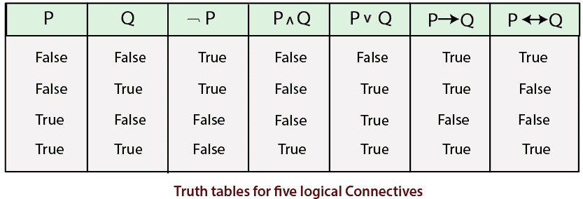

# 命题逻辑

> 原文：<https://www.tutorialandexample.com/propositional-logic/>

它是逻辑的一个分支，也被称为**陈述逻辑、句子逻辑、零阶逻辑、**等等。它处理命题及其逻辑联系。它处理值为**真、假、**或未知的命题或陈述。

**命题逻辑的语法和语义**

*句法和语义定义了一种确定句子真值的方式。*

**语法:**一个问题中给出的语句是通过命题符号来表示的。每个句子由一个命题符号组成。命题符号以大写字母开头，后面可能会跟一些其他下标或字母。我们有两个固定的命题符号，即真和假。

为了把简单的句子变成复杂的句子，可以使用下列连接词(连接词用于连接两个或更多的句子):

*   **not(** **):** 它被称为一个句子的**否定**。文字可以是正文字，也可以是负文字。
*   **和(**)**？** **):** 一个句子什么时候有 **(** **)？** **)** 为主要连接词。它被称为**连词，**及其组成部分被称为**连词**。比如，**(Y****1******V****Y****2****)****？****(Y****3**T42】V Y**4****)****？****……(Y****n****V Y****m****)、**这类句子称为**连词句**。**
*   ****或(V):** 当一个句子以 **(V)** 为主要连接词时。它被称为**析取，**及其部分被称为**析取**。比如，**(Y****1******？****Y****2****)****V****(Y****3******？****Y****4****)****V****……(Y****n******？****Y****m****)、**这类句子称为**转折句**。********

 *****   **蕴涵(= > ):** 当**(Y1V Y2)=>Y3**给定时，称为一句话的**蕴涵**。这就像是 **if- > then** 从句，其中 if 这意味着 then 它会发生。蕴涵有时被称为**规则或 if-then** 语句。它也可以被定义为( )或()。
*   **当且仅当(** ó **):** 表示两边的含义，其中表达式为 **(a 1 V a 2 )** ？**一个三个** ，。这种连接词叫做**双条件蕴涵**。如果双方都满意，则返回 true，否则返回 false。这也可以表示为(？).

**连接词的优先顺序**

下表显示了连接词按降序排列的优先顺序:

| **名称** | **符号** |
| 括号/方括号 | () |
| 否定/否 | 或 **~** |
| 连接词/和 | ？ |
| 析取/或 | V |
| 含义 | ？ |
| 双条件/当且仅当 | ó |

**语义:**它定义了相对于特定模型确定句子真值的规则。语义应该能够计算任何给定句子的真值。

**关于给定模型 m 中复句 P 和 Q 的语义，有以下五个规则:**

**P:** 其值将为假，当且仅当在模型 m 中为真。

**(P？Q):** 其值为真，当且仅当 P 和 Q 在 m 中都为真。

**(P v Q):** 其值为真，当且仅当要么 P 为真，要么 Q 在 m 中为真。

**(P= > Q):** 其值为真，当且仅当 P 的值为假，m 中 Q 的值为真

**(P？Q):** 值将为真，当且仅当 P 和 Q 值在给定的模型 m 中不是真就是假。

**注:**这里 iff 的意思是当且仅当。

**这五个连接词也可以借助下面描述的真值表来理解:**

**命题逻辑的例子**

**例题 1:** **考虑所给语句:**

如果天气潮湿，那就是在下雨。

**解法:**设，P，Q 为两个命题。

p =天气潮湿。

q =下雨了。

它被表示为( **P？q)。**

例 2:现在是中午，拉姆正在睡觉。

**解:** A=现在是中午。

B= Ram 正在睡觉。

它被表示为 **(A** **V B)。**

**例 3:如果下雨，那就不是晴天。**

**解:** P=下雨了。

Q=天气晴朗。

表示为 **P** ？ **( ~Q)**

例 4:拉姆是男人还是男孩。

**解** **:** X= Ram 是男的。

Y= Ram 是个男孩。

表示为 **(X** **？** **Y)。**

例 5:当且仅当天气不潮湿时，我才会去德里。

**解:** A=我要去德里。

B=天气潮湿。

它被表示为**(一个** **？** **B)。**

**命题逻辑可以有很多例子。**

### 命题定理证明

*定理证明是指将推理规则直接应用于句子。*

**有以下概念用于定理证明:**

*   **逻辑等价:**如果在同一套模型中，P 和 Q 的值为真，那么称它们为逻辑等价。

| **规则名称** | **规则** |
| 幂等定律 | (A？A) = A(AV A) = A |
| 交换律 | (A？B) = (B？A)(AV B) = (B V A) |
| 德摩根定律 | ~(A？B) =( ~A V ~B)~(A V B) = (~A？~B) |
| 结合律 | AV(B V C) = (A V B) V CA？(B？C) = (A？b)？C |
| 分布率 | 答？(B V C) = (A？B) V (A？C)A V (B？C) = (A V B)？(影音) |
| 反证法 | 答？B = ~A？~B
~A？~B(逆的逆) |
| 隐含去除 | 答？B = ~A V B |
| 双条件去除 | 一个**？** B = (A？b)？(B？答 |
| 吸收律 | 答？(A V B)？AAV (A？b)？A |
| 双重否定消除 | ~(~A)=A |

定义命题逻辑中使用的规则的表格，其中 A、B 和 C 代表一些任意的句子。

*   **有效性:**如果一个句子在所有模型集合中都有效，那么它就是一个有效句子。有效性也被称为**重言式，**这里需要对每组模型都有真值。
*   **可满足性:**如果一个句子至少对于某组值为真，那么它就是一个可满足的句子。

**让我们借助例子来理解有效性和可满足性:**

**例 1:**

**(P V Q)** ？ **(P？问)**

| **P** | **问** | **P V Q** | **P** **？** **问** | **(P****V****Q)(P**T6)？ **Q)** |
| 错误的 | 错误的 | 错误的 | 错误的 | 真实的 |
| 错误的 | 真实的 | 真实的 | 错误的 | 错误的 |
| 真实的 | 错误的 | 真实的 | 错误的 | 错误的 |
| 真实的 | 真实的 | 真实的 | 真实的 | 真实的 |

所以，从上面的真值表中，很明显，给定的表达式是可满足的，但不是有效的。

**例 2:**

| **答** | **B** | **一个**？ **B** | **(一**？ **B)？答** | **((一个**？ **B)？一)**？ **B** |
| 错误的 | 错误的 | 真实的 | 错误的 | 真实的 |
| 错误的 | 真实的 | 真实的 | 错误的 | 真实的 |
| 真实的 | 错误的 | 错误的 | 错误的 | 真实的 |
| 真实的 | 真实的 | 真实的 | 真实的 | 真实的 |

**((一个**？ **B)？一)**？ **B**

因此，从真值表中可以清楚地看出，给定的表达式是有效的，也是可满足的。

**注意:**如果给定的表达式有效，默认情况下是可满足的。****