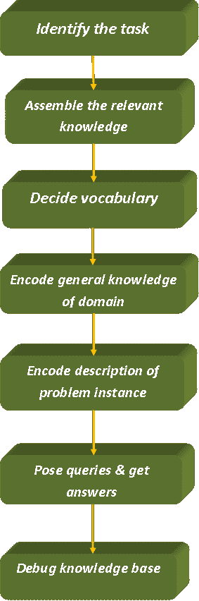

# 一阶逻辑理论

> 原文：<https://www.tutorialandexample.com/theory-of-first-order-logic/>

**一阶逻辑理论**

一阶逻辑也叫**谓词逻辑**和**一阶谓词演算** (FOPL)。它以量词的形式表示逻辑。在谓词逻辑中，输入被视为一个实体，它给出的输出不是真就是假。

### FOPL 的句法和语义

**语法:**它定义了给定谓词的表示方式。因为这些谓词是通过量词表示的，所以使用了不同类型的量词:

*   **全称量词(For all/every):** 谓语表示关于所有/一切的时候，我们用**表示所有的**量词。表示为****？”****
*   ****存在量词(For some):** 当谓语表示某种数量时，我们用**表示某种**量词。它被称为**？”****
*   ****嵌套量词:**是同类型量词的嵌套。一个谓词嵌套在另一个谓词下。**
*   **原子句:这些句子是由谓词符号构成的，这些谓词符号后面可能有也可能没有一系列术语。**

 ****示例:** Parents(Ram，Sita)其中 Ram 和 Sita 是父级。

*   复合句:这些句子利用逻辑连接词来构建更复杂的句子。
*   **相等:**我们用等号表示两个术语指的是同一个对象**。例如，** Eleveenth_President(印度)APJ 阿卜杜勒·卡拉姆博士。这里，两个 LHS 都等于 RHS。这意味着这两个术语指的是同一个实体/人。

**谓词逻辑中的元素及其符号**

**定义了不同符号的元素有:**

*   **对象:**指存在于现实世界中的实体。**例如，**拉姆、约翰等。被称为对象。
*   **功能:**对象/对对象执行的任何功能。**比如**左腿，写字，吃饭等等。是一些函数。
*   **关系:**一个对象与另一个对象的关系定义了它的关系**。比如**哥哥，妈妈，国王等。是现实世界中存在的一些关系类型。

现在，让我们讨论一下用来表示这些元素的符号。它们如下:

*   **常数符号:**这些符号用来表示物体。
*   **谓词符号:**这些符号用来表示关系。
*   **功能符号:**这些符号用来表示对象所执行的功能。

**语义:**它定义了给定谓词的意义。它允许通过设计语义来进行更符合逻辑的表达。语义让我们理解句子的意思。

**让我们借助下面的例子来理解谓词逻辑:**

**例一:**立顿是一种茶。

**解:**这里，对象是立顿。

它将被表示为**茶(立顿)。**

**注意:**在这个例子中，因为给定谓词中没有指定数量，所以不需要量词。**让我们多看看。**

**例二:**凡人皆有一死。

**解:**这里的量词是万能标识符，宾语是人。

让 x 成为男人。

于是，就表示为 **x: man(x)？凡人(x)。**

**例三:**所有的女生都很漂亮。

**解决方法:**这里说的是所有女生。意思是会用到全称量词。对象是女生。让你成为女孩。

所以会表现为**女生(y)** **？** **美丽(y)。**

**例 4:** 闪光的不一定都是金子。

**解法:**这里我们将黄金表示为 x。

所以会表现为**闪光(x)** **？****(x)金。**

**例 5:** 有些男生很听话。

**解决方法:**在这里，男生是对象。使用的量词将是存在量词。让 x 成为男孩。因此，它将被表示为

**？x:男生(x)** **？****(x)听话。**

**例 6:** 有的牛是黑色的，有的牛是白色的。

**解法:**设，x 为牛。因此，它将被表示为:

**？x:牛(x)** **？** **黑(x)？白色(x)。**

```
Note: There can be several examples of Predicate logic.
```

## FOPL 的知识工程

知识工程是知识工程师调查特定领域、学习关于该领域的重要概念并创建该领域中的对象和关系的正式表示的过程。

### 知识工程过程

当我们谈论任何项目时，都会用到工程术语。**因此，项目的知识工程包括下述步骤:**



*   **识别任务:**知识工程师应该能够通过问一些问题来识别任务，例如:
*   知识库会支持吗？
*   对于每一个具体的问题，有哪些类型的事实可用？

该任务将确定将问题实例与答案联系起来所需的知识要求。

*   **汇集相关知识:**知识工程师应该是该领域的专家。如果不是，他应该和真正的专家一起工作，吸取他们的知识。这个概念被称为**知识获取**。

**注:**在这里，我们并不正式表示知识。而且要理解知识库的范围，还要理解领域的工作。

*   **决定常量、谓词和函数的词汇表:**将重要的领域级概念转化为逻辑级概念。

**在这里，知识工程师会问这样的问题:**

*   哪些元素应该被表示为对象？
*   应该选择什么功能？

满足所有选择后，词汇量就决定了。它被称为领域的**本体。本体确定存在的事物的类型，但不确定它们的具体属性和相互关系。**

*   **对领域的一般知识进行编码:**在这一步，知识工程师写下所有选择的词汇术语的公理。

**注意:**这里，词汇术语之间出现了误解。

*   **对具体问题实例进行编码描述:**我们为选定的词汇术语编写简单的原子句子。我们对选择的问题实例进行编码。
*   **向推理过程提出疑问并得到答案:**这是测试步骤。我们对那些我们想知道的公理和特定问题的事实应用推理过程。
*   **调试知识库:**这是知识工程过程的最后一步，知识工程师在这里调试所有的错误。**