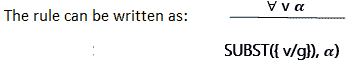
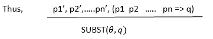

# 一阶逻辑中的推理

> 原文：<https://www.tutorialandexample.com/inference-in-first-order-logic/>

**一阶逻辑中的推理**

当定义推论时，我们的意思是定义回答 FOPL 问题的有效程序。

**FOPL 提供了以下推理规则:**

*   **量词的推理规则**
*   **通用实例化(UI):** 在这里，我们可以用一个基础项(没有变量的项)代替变量来推断任何句子。简而言之，当我们创建给定语句的 FOPL 时，我们可以很容易地使用该 FOPL 推断出任何其他语句

**批注:** Let， **SUBST(** ？**，**？ **)** 是给定句子的结果？，而它的替代品是？。



其中 **v** 是变量， **g** 是基本项。

例如:每个人都会死。

它被表示为？ **x: man(x)** ？**凡人(x)。**

在 UI 中，我们可以推断出不同的句子:

**男人(约翰)**？**凡人(约翰)**

**曼(Aakash)** ？**凡人(Aakash)等。**

*   **存在实例化(EI):** 在 EI 中，变量被一个新的常量符号代替。

**符号:**设，变量为 **v** 换成常量符号 **k** 任意一句？ **k** 的值是唯一的，因为它不会出现在知识库中的任何其他句子中。这种类型的常数符号被称为**斯科莱姆常数。**因此，EI 是 **Skolemization 过程的一个特例。**

**注意:** UI 可以应用多次，产生许多句子，而 EI 可以应用一次，然后可以丢弃存在的量化句子。

**比如:**？ **x:偷(x，钱)。**

我们可以由此推断:**偷(贼，钱)**

*   广义伪命题:它是伪命题的提升版本，因为它将伪命题从基本命题提升到了 FOPL。广义伪命题比伪命题更广义。这是因为，一般来说，已知的事实和隐含的前提只能匹配到一个替代，而不是完全匹配。

**符号:**对于像 pi.pi '和 q 这样的原子句子，我们有一个替代物
？那个 **SUBST(** ？pi)，用于每个 **i.**



**例如** : p1 '是小偷(查理)p1 是小偷(x)

“p2”是无声的(y)

？会是{x/Charlie，y/Charlie} q 是恶(x)

SUBST(？，q)是恶(查理)。

*   **统一:**它是一阶推理算法的关键组成部分。统一是被提升的推理规则用来寻找可以给出相同但不同的逻辑表达式的替代物的过程。意思是句子的意思不应该改变，而是应该用多种方式表达。UNIFY 中的 **UNIFY** 算法将两个句子作为输入，然后返回一个 unifier(如果存在的话):

**UNIFY(p，q)=** ？**哪里 SUBST(** ？**，p) = SUBST(** ？，**问)。**

让我们借助下面的例子来看看 UNIFY 是如何工作的:

**给定:**知道(Ram，x)。问题是- **拉姆认识谁？**

unify 算法将搜索知识库中所有相关的句子，可以用 Knows(Ram，x)进行 UNIFY。

UNIFY (Knows(Ram，x)，Knows(Ram，Shyam))？{x/Shyam}

UNIFY(知道{Ram，x}，知道{y，Aakash})？{x/Aakash，y/Ram}

UNIFY(知道{Ram，x}，知道{x，Raman})？失败了。

最后一个失败了，因为我们同时对两个人使用了同一个变量。

**统一算法**

前面，我们已经研究了用于通知和询问知识库的**告诉**和**询问**功能。这些是**存储**和**获取**函数**的原函数。STORE** 函数用于将一个句子 **s** 存储到知识库中，而 **FETCH** 函数用于返回所有包含一些句子的 unifiers。

```
function UNIFY(a , b, ?) returns a substitution to make a, b identical
 inputs: a , a variable, constant, list, or compound expression
 a, a variable, constant, list, or compound expression
 ?, the substitution built up earlier (optional, defaults to empty)
 if ? = failure then return failure
 else if a = b then return ?
 else if VARIABLE?(a ) then return UNIFY-VAR(a , b, ?) 
 else if VARIABLE?(b) then return UNIFY-VAR(a, b, ?)
 else if COMPOUND?(a ) and COMPOUND?(b) then
 return UNIFY(a.ARGS, b.ARGS, UNIFY(a.OP, b.OP, ?))
 else if LIST?(a) and LIST?(b) then
 return UNIFY(a .REST, b.REST, UNIFY(a .FIRST, b.FIRST, ?)) 
 else return failure
 function UNIFY-VAR(var, a , ?) returns a substitution
 if {var/val} ? ?then return UNIFY(val , a , ?)
 else if {a/val} ? ? then return UNIFY(var, val , ?)
 else if OCCUR-CHECK?(var, a ) then return failure
 else return add {var/a } to ? 
```

**注:**上例:Knows(Ram，x)？它是 FETCH 函数的一个实例。

*   **正向链接:**在正向链接中，我们从知识库中的原子句子开始，并正向应用假言。还增加新的句子，直到没有任何推论。

**注:**我们将在前向链接部分详细了解前向链接。

*   **反向链接:** 该算法与正向链接算法相反。它反向工作。它从目标出发，通过规则链搜索已知事实，并从已知事实反向推断句子。

**注:**我们将在反向链接部分详细了解反向链接。

*   **解析方法:**统一、反向链接以及正向链接，都是基于解析方法。解决方法是一种决策规则，由机器决定做什么和不做什么。可以理解为:

首先，我们将给定的语句转换成 FOPL。

其次，我们从中推断出一些相关的句子。

然后，实现我们的目标，我们需要证明它。

这里，我们利用分解法从各种可能的 FOPL 中确定最佳的。

注:我们将在下一节了解命题逻辑和谓词逻辑的归结方法。