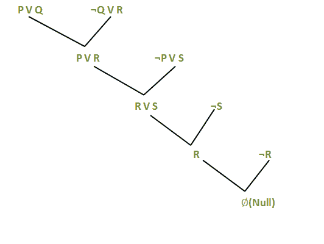
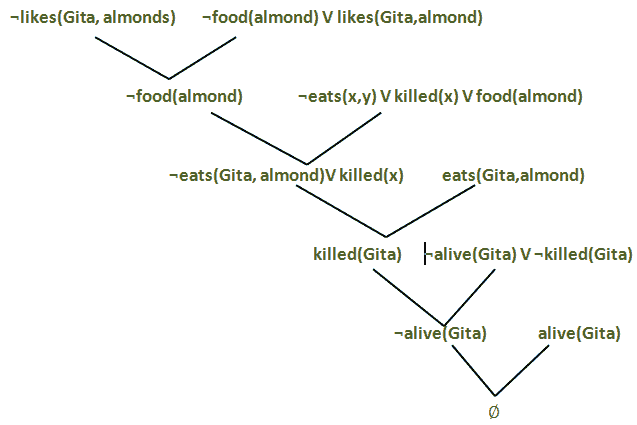

# 人工智能中的解决方法

> 原文：<https://www.tutorialandexample.com/resolution-method-in-ai/>

**AI 中的解析方法**

归结方法是一种推理规则，以不同的方式用于命题逻辑和一阶谓词逻辑。这种方法基本上用于证明一个句子的可满足性。在归结方法中，我们使用**反证法**来证明给定的陈述。

消解方法的核心思想是使用知识库和否定目标来获得空子句(表示矛盾)。消解法也叫**证伪**。既然知识库本身是一致的，那么矛盾一定是由一个被否定的目标引入的。因此，我们不得不得出结论，原来的目标是正确的。

### 命题逻辑中的归结方法

在命题逻辑中，归结方法是当两个或多个子句耦合在一起时给出新子句的唯一推理规则。

使用命题分解，使定理证明器对所有人来说都是合理和完整的变得很容易。

**将命题逻辑转换成归结方法的过程包括以下步骤:**

*   将给定的公理转换成子句形式，即析取形式。
*   运用否定法则证明给定的目标。
*   使用那些需要证明的文字。
*   一起解从句，达到目的。

但是，在使用归结方法解决问题之前，让我们先了解两种范式

### 合取范式(CNF)

在命题逻辑中，归结方法只适用于那些文字析取的子句。**转换成 CNF 有以下步骤:**

1)通过替换 A 来消除双条件蕴涵？b 带(A？b)？(B？答

2)通过替换 A 来消除蕴涵？带 V 的 b。

3)在 CNF，否定( )只出现在字面上，因此我们将其向内移动为:

*   **(一)？一个**(双重否定消除
*   **(A？b)？**(德摩根)
*   **(A V B)？(A？B)** (德摩根)

4)最后，在句子上使用分配律，并形成 CNF 为:

**(A1V B1)****？****(A2V B2)****？** **…。** **？****(AnV Bn)。**

**注:CNF 也可描述为和的或** **S**

 **### 析取范式(DNF)

这与 CNF 的方法相反。该过程类似于 CNF，但有以下区别:

**(一 1** **？**T6】B1)T10】V(A2？b2V…V(An？B n )。在 DNF，它是 OR of 和****的乘积之和，或者说是一个集群概念，而在 CNF，它是 ANDs of Ors。****

 **#### 命题归结的例子

考虑以下知识库:

1.  湿度高或天空多云。
2.  如果天空多云，就会下雨。
3.  如果湿度高，那么它是热的。
4.  天气不热。

**目标:**要下雨了。

使用命题逻辑并应用归结方法证明目标可从给定的知识库导出。

**解法:**让我们逐一构造给定句子的命题:

1.  让，P:湿度高。

问:天空多云。

它将被表示为 **P V Q.**

2)问:天空多云。… **从(1)**

会下雨。

会表示为 b **Q** ？**居**

3) P:湿度大。… **从(1)**

让我们说:天气很热。

会表示为 **P** ？ **S.**

学生:不热。

### 应用解决方法:

在(2)中，Q？R 将被转换为(Q V R)

在(3)中，P？S 将被转换为(P V S)

**否定目标(** **R):** 不会下雨。

**最后，应用如下所示的规则:**

**在**对目标应用反证法(矛盾)后，问题得到解决，并以**无效子句(****)终止。因此，目标达到了。因此，没有下雨。**

**注:**我们可以有很多借助命题归结方法证明的命题逻辑的例子。

### FOPl/谓词逻辑中的归结方法

FOPL 归结方法是命题归结方法的提升版本。

**在 FOPL，应用解决方法的流程如下:**

*   将给定的公理转化为 CNF，即从句的连词。每个子句都应该是字面量的分支。
*   对给定的目标进行否定。
*   使用必要的文字并证明它。
*   与命题逻辑不同，如果一个 FOPL 字面量与另一个字面量的否定统一，那么它就是互补的。

**比如** : {Bird(F(x)) V Loves(G(x)，x)}和{ Loves(a，b) V Kills(a，b)}

消除互补文字 Loves(G(x)，x)和 Loves(a，b)) with？={a/G(x)，v/x}给出以下输出子句:

{Bird(F(x)) V Kills(G(x)，x)}

下例中应用的规则称为**二进制解析**,因为它正好解析了两个文字。但是，二进制解析并不完整。另一种方法是扩展**因式分解**，即删除一阶情况下的冗余文字。这样，二进制分解和因式分解的结合就完成了。

### 合取范式

**转换成 CNF 有以下步骤:**

*   消除以下影响:

？ **x: A(x)** ？ **B(x)带{ x: A(** ？ **x) V B(x)}**

*   向内移动否定( )为:

****T3】？ **x: A 变成**？ **x: A 和，******

 ******T3】？ **x: A 变成**？ **x: A******

 **意思是全称量词变成了存在量词，反之亦然**。**

*   **规范变量:**如果两个句子使用同一个变量，需要改变其中一个变量的名称。采取这一步骤是为了消除量词将被丢弃时的混淆。

**例如** : {？x: A(x) V？x: B(x)}

*   **Skolemize:** 是通过消去法去掉存在量词的过程。
*   **Drop universal quantifiers:**如果我们到了这一步，就意味着剩下的所有变量都必须通用量化。去掉量词。
*   **分发 V 过** **？** **:** 这里嵌套的合取和析取被扁平化。

**FOPL 决议示例**

考虑以下知识库:

1.  吉塔喜欢各种各样的食物。
2.  芒果和查帕蒂是食物。
3.  Gita 吃杏仁还活着。
4.  任何被人吃了还活着的东西都是食物。

**目标:** Gita 喜欢杏仁。

**解法:**将给定的句子转换成 FOPL 为:

设 x 是浅睡者。

1.  ？x:食物(x)？喜欢(Gita，x)
2.  食物(芒果)，食物(查帕蒂)
3.  ？x？y:吃(x，y)？被杀(x？食物(y)
4.  吃(Gita，杏仁)？活着(博伽梵歌)
5.  ？x:被杀(x)？活着(x)
6.  ？x:活着(x)？死亡人数(x)

**目标:**喜欢(Gita，杏仁)

**否定目标**:喜欢(Gita，杏仁)

**现在，用 CNF 形式重写:**

1.  食物(x) V 喜欢(Gita，x)
2.  食物(芒果)，食物(查帕蒂)
3.  吃(x，y) V 杀(x) V 食(y)
4.  吃(博伽梵歌，杏仁)，活着(博伽梵歌)
5.  死亡(x) V 活着(x)
6.  活着的(x)被杀死的(x)

**最后，构建解析图:**

因此，借助于反证法，我们达到了既定的目标。由此，证明吉塔喜欢杏仁。

**注:**在 FOPL 可以有几种解决方法的例子

#### 相关帖子:

*   [2020 年十大人工智能技术。](https://www.tutorialandexample.com/artificial-intelligence-technologies-in-2020/)
*   [人工智能中的效用函数](https://www.tutorialandexample.com/utility-functions-in-artificial-intelligence/)
*   [隐马尔可夫模型](https://www.tutorialandexample.com/hidden-markov-models/)
*   [动态路由](https://www.tutorialandexample.com/dynamic-routing/)
*   [反向链接](https://www.tutorialandexample.com/backward-chaining/)
*   [量化不确定性](https://www.tutorialandexample.com/quantifying-uncertainty/)
*   [概率推理](https://www.tutorialandexample.com/probabilistic-reasoning/)
*   [一阶逻辑中的推理](https://www.tutorialandexample.com/inference-in-first-order-logic/)
*   [命题逻辑中的推理规则](https://www.tutorialandexample.com/inference-rules-in-proposition-logic/)
*   [人工智能中基于知识的智能体](https://www.tutorialandexample.com/knowledge-based-agents-in-ai/)
*   [温普斯世界](https://www.tutorialandexample.com/the-wumpus-world/)********