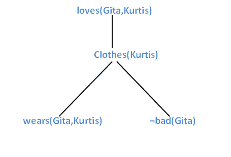

# 人工智能中的反向链接:人工智能

> 原文：<https://www.tutorialandexample.com/backward-chaining/>

反向链接是一种反向方法，它在反向工作。它从球门后面开始它的旅程。

比如，[正向链接](https://www.tutorialandexample.com/forward-chaining/)，我们有**命题逻辑**以及**谓词逻辑**的反向链接，后面跟随着它们各自的算法。

*让我们逐一讨论这两种类型:*

### 命题逻辑中的反向链接

在命题逻辑中，反向链接从目标开始，并使用给定的命题来证明要求的目标。有一个**反向链接**算法，用于对给定的公理执行反向链接。给出的第一种算法被称为 **Davis-Putnam 算法**。它是由**马丁·戴维斯和希拉里·普特南在 1960 年提出的。**1962 年**，戴维斯、洛格曼和洛夫兰**提出了戴维斯-普特南算法的新版本。它以所有四位作者名字的首字母命名为 **DPLL。**版本化算法(DPLL)将语句的输入作为 **CNF。**

**DPLL 算法如下:**

```
function DPLL-SATISFIABLE?(s) returns true or false
inputs: s, a sentence in propositional logic
clauses ? clause set  in CNF representation of s
symbols?list of proposition symbols in s
return DPLL(clauses, symbols,{ })
function DPLL(clauses, symbols,model ) returns true or false
if every clause is true in model then return true
if some clause is false in model then return false
P, value?FIND-PURE-SYMBOL(symbols, clauses,model )
if the value of P is non-null then return DPLL(clauses, symbols – P,model ? {P=value})
P, value?FIND-UNIT-CLAUSE(clauses,model )
if the value ofP is non-null then return DPLL(clauses, symbols – P,model ? {P=value})
P ?FIRST(symbols); rest ?REST(symbols)
return DPLL(clauses, rest ,model ? {P=true}) or
DPLL(clauses, rest ,model ? {P=false}))                                                                                               
```

**注:**以上反向链接算法用于检查命题逻辑中一个句子的可满足性。

### 为什么介绍 DPLL？

**戴维斯-普特南算法需要进行以下改进，从而引入了 DPLL 算法:**

*   **提前终止:**用于检测句子必须为真还是为假的算法，即使是部分完成的模型。
*   **纯符号启发式:**就是在每一个子句中总是以相同的符号出现的符号。
*   单元子句试探法:它早先被定义为只有一个文字的子句。在 DPLL，它还意味着这样的子句，其中除了一个字面值以外的所有字面值都已经在模型中被赋予了一个 false 值。

上述算法仅限于小问题。

但是对于大的问题，我们有一些具体的技巧描述如下:

*   **成分分析:** DPLL 给变量赋值真值，因此子句集可能成为不相交的子集。它们被称为没有未赋值变量的**组件**。如果提供了有效的检测方法，求解器可以分别求解每个分量。
*   **变量和值排序:**在上面的 DPLL 算法中，我们已经使用了一个任意的变量，并且总是试图首先使值为真。程度启发式有助于这样做。
*   **智能回溯:**几个小时解决不了的问题，应用智能回溯，几分钟就能轻松解决。
*   **随机重新开始:**从初始状态重新开始，我们可以随机决定选择哪个方向来达到目标。就像爬山一样，我们可以从头开始，以更有效的方式达到目标。
*   **巧妙索引:**快速索引方法有助于快速处理回溯。

**命题逻辑中反向链接的例子**

**让我们考虑一下上一节的例子:**

**鉴于:**

1.  如果 D 叫，D 吃骨头，那么 D 就是狗。
2.  如果 V 是冷的，V 是甜的，那么 V 就是冰淇淋。
3.  如果 D 是一只狗，那么 D 是黑色的。
4.  如果 V 是冰淇淋，那么它就是香草。

使用给定的已知事实推导反向链接，证明 Tomy 是黑的。

*   汤米叫了起来。
*   汤米吃骨头。

**解决方案:**

1.  **在用 Tomy 替换(3)中的 D 时，它变成:**

如果汤米是一只狗，那么汤米是黑色的。

因此，目标与上述公理相匹配。

*   现在，我们必须证明汤米是一只狗。**……(新目标)**

将(1)中的 D 替换为 Tomy，它将变为:

如果汤米叫，汤米吃骨头，那么汤米就是一只狗。**……(新目标)**

再次，目标达成。

*   现在，我们必须证明汤米叫，汤米吃骨头。**……(新目标)**

正如我们所看到的，目标是两个句子的组合，可以进一步分为:

汤米叫了起来。

汤米吃骨头。

从(1)中，很明显 Tomy 是一只狗。

因此，汤米是黑人。

**注:**陈述(2)和(4)不用于证明给定的公理。因此，很明显，目标永远不会与公理的否定版本相匹配。总是使用**方式，而不是**方式。****

### FOPL 的反向链接

在 FOPL，反向链接从目标的反向开始工作，将规则应用于可以支持证据的已知事实。反向链接是一种**和/或**搜索，因为我们可以通过应用知识库中的任何规则来证明目标。反向链接算法用于处理反向链接。

**算法如下:**

```
function FOL_BACKWARD_ASK(KB, query) returns  generator of the substitutions
return FOL_BACKWARD_OR(KB, query,{ })
generator FOL_BACKWARD_OR(KB, goal , ?) yields the substitution
for each (lhs ? rhs) rule in FETCH-RULES-FOR-GOAL(KB, goal ) do
(lhs, rhs)?STANDARDIZE-VARIABLES((lhs, rhs))
for each ? in FOL_BACKWARD_AND(KB, lhs, UNIFY(rhs, goal , ?)) do
yield ?_
generator FOL_BACKWARD_AND(KB, goals, ?) yields a substitution
if ? = failure then return
else if LENGTH(goals) = 0 then yield ?
else do
first,rest ?FIRST(goals), REST(goals)
for each ? in FOL_BACKWARD_OR(KB, SUBST(?, first), ?) do
for each ? in FOL_BACKWARD_AND(KB, rest , ?_) do
yield 
```

上面展示的是 FOPL 下的一个简单的反向链接算法。

**FOPL 反向链接的例子**

让我们用反向链接来解决前一节 FOPL 正向链接的例子。

**考虑下面的公理:**

1) Gita 爱所有类型的衣服。

2)西装就是衣服。

3)夹克是衣服。

4)任何可以穿且不会坏的东西都是衣服。

5) Sita 穿裙子，不错。

6)西塔穿什么，雷努就穿什么。

**应用反向链接，证明吉塔爱库尔提斯。**

**解法:**将给定公理转换成 FOPL 为:

1.  x:衣服(x)？爱(Gita，x)。
2.  套装(x)？衣服(x)。
3.  夹克(x)？衣服(x)。
4.  穿(x，y)？？坏(y)？衣服(x)
5.  穿(西塔，裙子)？好(锡塔)
6.  穿(Sita，x)？磨损(Renu，x)

**证明:**吉塔爱库尔提斯。

**FOPL:** 爱(Gita，Kurtis)。

**在下图中应用反向链接:**



从上图很明显 Gita 穿 Kurtis 也不难看。因此，**吉塔爱库尔提斯。**

**注:**我们已经看到正向和反向链接的图形是相同的。这意味着正向链接遵循**自下而上的方法**，反向链接遵循**自上而下的方法。**