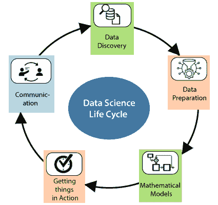

# 数据科学教程

> 原文：<https://www.tutorialandexample.com/data-science-tutorial>

**数据科学**

数据科学是第 21 代人最具挑战性的领域。每种类型的 IT 行业都在寻找具有数据科学知识的候选人。我们提供了与操作相关的基本概念和一些高级概念，这些操作可以在不同技术的帮助下对数据执行。

在本教程中，我们将讨论以下主题:

1.  [什么是数据科学](#wds)
2.  [对数据科学的需求](#nds)
3.  [数据科学领域的工作](#jds)
4.  [数据科学领域的工作类型](#tjds)
5.  [数据科学的先决条件](#pds)
6.  [数据科学的组成部分](#cds)
7.  [数据科学工具](#tds)
8.  [数据科学的工作流程](#wfds)
9.  [数据科学的生命周期](#lcds)
10.  [BI(商业智能)与数据科学](#bids)
11.  [数据科学的应用](#ads)
12.  [数据科学与大数据](#dsbd)
13.  [结论](#cds)

### 什么是数据科学？

数据科学是一个多元校正领域，它使用科学方法、流程、算法和系统从有序和无形的数据中提取知识和见解。它是人工智能的未来。

数据科学是对大量数据的深入研究，涉及从原始、结构化和非结构化数据中提取有意义的观察结果，这些数据通过使用科学方法、不同技术和算法进行处理。这与数据挖掘和大数据是同一个概念。

数据科学是“统一统计学、数据分析、机器学习及其相关方法的概念”，以便理解和分析与数据相关的原始现象。这对更好的营销至关重要。大多数公司利用这些数据来分析他们的营销策略，制作更好的广告。

数据科学的主要目的是发现数据中的模式，并使用多种技术来分析和提取数据中的感知。在数据科学中，数据科学家有责任根据数据做出预测。因此，数据科学家的目标是从全部数据中得出结论。在这些结论的帮助下，数据科学家可以支持行业做出更明智的业务决策。

图:数据科学的用例。

**示例-从优步搭车很容易，怎么做**

简单地说，用户可以打开应用程序，设置他的上车点和下车地点，然后出租车被预订。如果有人通过优步或 Ola 预订了出租车，用户可以获得预计的价格和时间来完成特定的距离。

这些应用程序是如何显示所有信息的？这个问题的答案就是**数据科学**的概念。数据科学中的预测分析有助于优步向用户、取货点、卸货地点和到达时间进行展示。

数据科学使用强大的硬件、编程系统和高效的算法来解决数据相关的问题。

简而言之，我们可以定义数据科学是关于:

*   提出正确的问题并分析原始数据
*   可视化数据以获得更好的视角。
*   我们正在使用各种复杂而有效的算法对数据进行建模。
*   理解数据以做出更好的决策并找到最终结果。

### 对数据科学的需求

几年前，我们没有大量的数据，数据以结构化的形式存在，可以存储在 excel 表中，并使用简单的商业智能工具进行处理。

但是，现在数据已经变得巨大。因此，我们有大量的数据要处理，每天大约产生 2.5 兆字节的数据。下面给出了一些与数据科学需求相关的要点:

*   IT 行业需要数据来帮助他们做出谨慎的决策。数据科学是将原始数据转化为有意义的观察结果。

*   所有的行业都需要数据科学来处理大量的数据，这增加了它的重要性。

*   几乎每种行业都使用数据科学，但一些主要行业是医疗保健、金融、银行、商业、创业公司等。

*   数据科学是面向未来的职业。每个行业都在变得由数据驱动，每天都有创新出现。

*   该行业需要一名数据科学家来支持他们做出更明智的决策。每个人都需要数据科学家来预测信息。

*   数据科学对于更好的营销非常重要。这些行业正在使用数据来分析他们的营销策略，并制作更好的广告。可以通过分析客户的反馈做出决策；因此，各行业正在利用数据科学来开展特定的活动。

*   数据科学也在为自动化交通服务，例如创造自动驾驶汽车，这是交通的未来。

每个公司都需要数据来工作、发展和改进业务。在数据科学中，处理如此大量的数据对每个组织来说都是一项具有挑战性的任务。我们需要一些复杂、强大和高效的算法来处理、加工和分析数据。

### 数据科学领域的工作

根据不同的调查，由于对数据科学的需求不断增加，数据科学家档案是目前最热门的工作。所以，它也被称为当今“最热门的职位”。

数据科学家是那些能够使用多种统计工具和机器学习算法来理解和分析与特定组织相关的数据的专家。根据调查，数据科学家的平均年薪在 95，000 美元到 165，000 美元之间。

### 数据科学领域的工作类型

如果有人学习数据科学，那么他就有机会在该领域找到几个令人兴奋的工作角色。以下是一些主要的工作角色:

1.数据科学家

2.数据分析师

图:数据科学家 vs .数据分析师。

3.数据架构师

4.数据工程师

5.机器学习专家

6.数据管理员

7.商业分析员

8.商业智能经理

9.数据科学通才

10.应用程序架构师

11.基础设施架构师

12.企业架构师

13.统计员

### 数据科学的先决条件

数据科学是一个基于多个领域的广阔领域。它是 21 世纪最热门的航空公司。有无限量的数据或信息可以被存储、解释和应用于各种目的。数据科学的前提条件分为以下两类:

### 技术先决条件

成为一名数据科学家需要许多技能，具体如下:

**1。r 编程**

任何个人都需要至少一个像 R 编程这样的分析工具的深度知识，这是数据科学的首选。这种 R 编程语言是专门为数据科学设计的。

我们可以使用 R 编程语言来解决数据科学中遇到的任何问题。事实上，46%的数据科学家正在使用 R 编程语言来解决统计问题。R 编程语言有一个陡峭的学习曲线。

**2。Python 语言**

Python 是最常见的编程语言。它与 Java、Perl、C/C++等一起在数据科学中扮演着重要的角色。这种编程语言对数据科学家很有帮助。Python 用于数据科学是因为它的多功能性；我们可以将它用于数据科学过程中涉及的几乎所有步骤。python 可以接受多种格式的数据，我们可以轻松地将 SQL 表导入到我们的代码中。它允许用户创建数据集，用户可以根据自己的需要在 Google 上找到任何数据集。

**3。Hadoop 平台**

数据科学并不总是需要 Hadoop 平台，在某些情况下，这是首选。Hive 或者 Pig 的知识和经验是使用 Hadoop 平台的加分项。

它还熟悉云工具，如亚马逊 S3，这对数据科学非常有益。作为一名数据科学家，我们可能会遇到这样的情况:我们拥有的数据量超过了系统的内存，或者我们需要将数据发送到不同的服务器。

我们可以使用 Hadoop 将数据快速传输到系统中的几个点。我们可以用它来进行数据探索、数据过滤、数据采样和汇总。

**4。SQL 数据库/编码**

NoSQL 和 Hadoop 已经成为数据科学的重要元素。SQL 是一种编程语言，可以帮助我们执行添加、删除和从数据库中提取数据等操作。

仍然期望候选人能够用 SQL 编写和执行复杂的查询。SQL 数据库还帮助用户执行分析功能和转换数据库结构。

SQL 数据库是专门为帮助用户访问、交流和处理数据而设计的。用户需要像数据科学家一样精通。当用户使用它在数据库中进行查询时，它为用户提供了洞察力。

SQL 数据库具有简洁的命令，可以帮助用户节省时间，并减少用户执行复杂查询所需的编程量。SQL 的学习将帮助用户更好地理解关系数据库，并提升用户作为数据科学家的形象。

**5。阿帕奇火花**

Apache Spark 正在成为全球最受欢迎的大数据技术。它是一个大数据计算框架，就像 Hadoop 一样。Spark 比 Hadoop 更快。

Hadoop 读取和写入磁盘，这使它变慢，但 Spark 将其计算缓存在内存中。Apache spark 是专门为数据科学设计的，可以更快地运行复杂的算法。当我们处理大量数据以节省时间时，它也有助于传播数据处理。

Apache sparks 还帮助数据科学家处理复杂的非结构化数据集。我们可以在一台机器或一组机器上使用 Apache Spark。数据科学家可以借助数据科学中的 Apache Spark 来防止数据丢失。

阿帕奇火花的速度就是它的力量。在 Apache Spark 的帮助下，用户可以执行从数据获取到分布式计算的分析。

**6。机器学习和人工智能**

有大量的数据科学家并不精通机器学习领域和技术。机器学习有几个领域，如神经网络、强化学习、对抗学习、监督机器学习、决策树、逻辑回归等。

这些机器学习技术技能将帮助用户解决不同类型的数据科学问题，这些问题基于对主要组织成果的预测。数据科学总是涉及处理大量数据集，因此用户可能希望熟悉机器学习。

**7。数据可视化**

商业世界经常产生大量数据。这种产生的数据需要转换成一种易于理解的格式。人们能够比原始数据更好地理解图表形式的图片。有一句习语的话“一幅画胜过千言万语”，所以，我们应该更喜欢图形表示。

数据科学家必须能够借助数据可视化工具来可视化数据，如 ggplot、d3.js、Matplottlib 和 Tableau 等。这些数据可视化工具将帮助用户将复杂的项目结果转换成易于理解的格式。数据可视化提供了直接处理数据的机会。

**8。非结构化数据**

数据科学可以处理非结构化数据，这一点非常重要。这种类型的数据定义了不适合数据库表的内容。非结构化数据包括视频、博客帖子、客户评论、社交媒体帖子、视频源、音频等。这些数据的排序并不容易，因为非结构化数据并不精简。

图:非结构化数据的流动。

大多数人将非结构化数据称为“黑暗分析”，因为它的复杂性很低。作为数据科学家，用户有能力理解和操作来自不同平台的非结构化数据。

### 非技术先决条件

**1。求知欲**

阿尔伯特·爱因斯坦说“我没有特殊的天赋。我只是强烈好奇。”好奇心可以被定义为获取更多知识的欲望。如果用户有好奇心，那么，用户可以对数据提出越来越多的问题。因为数据科学家花费 80%的时间来发现和准备数据。

**2。团队合作**

数据科学家不能独自工作。他将不得不与公司高管合作制定战略，与产品经理和设计师合作制造更好的产品。数据科学家将不得不与营销人员合作，发起更好的转换活动，与客户和服务器软件开发人员合作，创建数据管道，并改进工作流程。

**3。沟通技巧**

每个行业都需要一名活跃的数据科学家，他正在寻找能够清晰流利地将他的技术发现翻译给非技术团队(如营销或销售部门)的人。

### 数据科学的组成部分

数据科学中存在各种类型的组件，如下所示:

**组织数据**

组织数据是规划和执行物理存储的方式。数据的结构是在应用数据处理的最佳实践之后产生的。

**打包数据**

数据的打包意味着原型的创建、统计的应用和可视化的开发。它在逻辑上是相关的，并且在美学上以可呈现的形式修改和组合数据。

**传送数据**

数据的交付与被叙述的故事相关，并且价值在过程之后被接收。这将传递数据，以确保最终输出已经传递给相关人员。

**数据分析**

数据分析就像问答活动。它是通过发现有用的信息或数据来检查、转换和建模数据的过程。

数据集成是数据分析的先导，它与数据可视化和数据传播紧密相连。数据分析将数据的宏观图像分解为微观图像。它帮助用户识别新的或不寻常的模式，并掌握困难的概念。

**数据分析**

数据分析是数据分析的技术。它可以检查数据集并总结信息。数据分析广泛应用于商业行业。

**数据挖掘**

数据挖掘是一个帮助工业将原始数据转化为有用的信息形式的过程。可以增加盈利。数据挖掘是数据分析的一种高级类型。

它使用那种在大量数据中寻找模式的软件。数据挖掘帮助用户提高客户关系的质量，确保并提供最佳质量的产品。

**大数据**

大数据是指海量、高容量、结构化或非结构化的数据。正是这种处理增强了洞察力、决策能力和流程自动化。大数据是组织的资产。它可以通过情感分析工具来控制网络声誉。

**机器学习**

机器学习是人工智能的一个细分领域，或者说是一个应用。它适用于多维度和多种类的数据，在动态环境中也是兼容的。机器学习通过使用数据输入简化了耗时的文档。

**统计数据**

统计学是数据科学的一个广阔领域。这是一种分析数字数据的方法。它用于从数字数据中发现有意义的见解。

**领域专长**

领域专家将数据科学结合在一起。它与特定领域的专业知识或技能相关。在数据科学中，有几个领域我们需要领域专业知识。

**数据工程**

数据工程是数据科学的一个方面，侧重于数据收集和分析的实际应用。

**可视化**

数据可视化是指通过将数据或信息编码为包含在图形中的可视对象来传达数据或信息的技术。它包括图形、图表、思维导图、信息图和其他帮助传达关键数据的视觉材料。

**高级计算**

高级计算是数据科学的重担。它涉及计算机程序源代码的设计、编写、调试和维护。

**数学**

数学是数据科学中非常重要的一部分。它与数量、结构、空间和变化的研究有关。良好的数学知识对于数据科学家来说是必不可少的。

### 数据科学工具

数据科学家负责从数据中提取、操作、预处理和生成预测。所以，他们需要统计工具和编程语言。数据科学家使用这些工具来执行他们的数据操作。

下面给出了各种类型的数据科学工具:

**1。SAS(统计分析软件)**

SAS(统计分析软件)是专门为统计操作设计的数据科学工具之一。它是大型组织用来分析数据的闭源专有软件。

该软件使用基础 SAS(统计分析软件)编程语言来执行统计建模。专业人员广泛使用 SAS，行业正在开发可靠的商业软件。

**2。阿帕奇火花**

Apache Spark 是强大的分析引擎和最有用的数据科学工具。它是专门为处理批处理和流处理而设计的。Apache spark 有许多 API，便于数据科学家为机器学习创建重复的数据访问。

Apache Spark 是对 Hadoop 的改进，执行速度比 Map Reduce 快 100 倍。它有几个机器学习 API，可以帮助数据科学家用给定的数据创建强大的预测。

该软件在处理流数据的能力方面比其他大数据平台做得更好。这意味着与其他只能批量处理历史数据的分析工具相比，该工具可以处理实时数据。

**3。BigML**

BigML 是另一个广泛使用的数据科学工具。该工具旨在提供一个完全可交互的、基于云的 GUI 环境，用户可以使用该环境来处理机器学习算法。它还通过使用云计算为行业需求提供标准化的软件。

它可以通过使用 Rest APIs 提供简单易用的 web 界面，用户可以根据自己的需要创建免费帐户或高级帐户。这个 BigML 工具允许数据的交互式可视化，并为用户提供在用户的移动或物联网设备上导出可视图表的能力。

**4。D3.js**

JavaScript 主要用于客户端脚本语言。D3.js 是 JavaScript 库，它允许用户在 web 浏览器上进行交互式可视化。用户可以通过 D3.js 的几个 API 使用不同的函数在 web 浏览器上进行动态可视化。

动画转场的使用是 D3.js 的一个强大特性，它允许文档在客户端更新，从而使文档变得动态。它还使用数据中的主动变化来反映浏览器上的可视化。

用户可以将 D3.js 与 CSS 结合起来，创建出色而简洁的可视化效果，帮助用户在网页上实现定制的图形。对于在基于物联网的设备上工作的数据科学家来说，这是一个非常有用的工具，这些设备需要客户端交互来进行可视化和数据处理。

**5。MATLAB**

MATLAB 是用于处理数学信息的多范例数值计算环境。它是促进矩阵函数、算法实现和数据统计建模的闭源软件。它在几个科学学科中得到最广泛的应用。

它主要用于模拟数据科学中的神经网络和模糊逻辑。用户可以使用 MATLAB 图形库创建强大的可视化效果。它还用于图像和信号处理，这使得它对于数据科学家来说非常通用。

MATLAB 是一个理想的数据科学工具，因为它易于集成到企业应用程序和嵌入式系统中。它还有助于自动完成从数据提取到决策脚本重用等多项任务。

**6。Excel**

微软为电子表格计算开发了 Excel，但现在，它被广泛用于数据处理、可视化和复杂计算。它是数据科学最强大的分析工具。

Excel 带有不同的公式、表格、过滤器、切片器等。用户还可以使用 excel 制作自定义函数和公式。它不用于计算大量的数据。尽管如此，它仍然是创建强大的数据可视化和电子表格的理想选择。

用户还可以将 SQL 与这个 excel 工具连接起来，并使用它来操作和分析数据。有很多科学家使用 excel 进行数据清理，因为它提供了一个可交互的 GUI(图形用户界面)环境来方便地预处理信息。

7 .**。ggplot2**

ggplot2 是一个用于 R 编程语言的高级数据可视化包。开发者创建这个 gglpot2 工具主要是为了替代 R 编程语言的原生图形包。它是数据科学家使用最广泛的库，用于从分析的数据中创建可视化。这个工具使用强大的命令来创建出色的可视化效果。

这个工具是 tidy verse 的一部分，tidy verse 是 R 编程语言的包，是为数据科学设计的。在 ggplot2 的帮助下，数据科学家可以创建定制的可视化效果，以增强讲故事的能力。

**8 .表**

Tableau 是一个数据可视化软件，它包含强大的图形来创建交互式可视化。它被用在商业智能领域的那些类型的行业中。它能够与数据库、电子表格、OLAP(在线分析处理)立方体等接口。它还可以将地理数据可视化，并在地图上绘制经度和纬度。

除了可视化，用户还可以使用其分析工具来分析数据。Tableau 是免费版的企业软件，名为 Tableau public。

**9\. Jupyter**

Jupyter 是一个基于 Python 语言的开源工具，用于帮助开发人员在交互计算中制作开源软件和体验。Jupyter 支持多种语言，如 Julia、Python 和 R 编程。

这个工具是一个 web 应用程序工具，用于编写实时代码、可视化和演示。它是一种全球流行的工具，旨在满足数据科学的要求。有一个名为 Collaborator 的在线 Jupyter 环境，它运行在云上，并将数据存储在 Google Drive 中。

Jupyter 是一个交互式环境，数据科学家可以通过它履行所有的职责。该工具提供不同类型的演示功能。任何人都可以通过使用 Jupyter 笔记本来执行各种任务，如数据清理、统计计算、可视化以及创建预测性的机器学习模型。

10。Matplotlib

Matplotlib 是用 Python 编程语言开发的绘图和可视化库。该工具主要用于通过简单的代码行绘制复杂的图形。任何人都可以生成条形图、直方图、散点图等。它有几个基本模块。Pyplot 是使用最广泛的模块之一。

Matplotlib 提供了一个类似 MATLAB 的接口。它也是 MATLAB 图形模块的开源替代品。它是数据可视化的首选工具，被数据科学家用来代替当代工具。

NASA 也使用 Matplotlib 来说明航天器着陆期间的数据可视化。该工具也是初学者学习 Python 数据可视化的理想工具。

**11。NLTK(自然语言工具包)**

自然语言处理已经发展成为数据科学中最热门的领域。自然语言处理与统计模型的发展有关，统计模型有助于计算机理解人类语言。

这种类型的统计模型是借助几种算法的机器学习的一部分。Python 语言附带了库的集合，称为自然语言工具包。

该工具广泛用于不同的语言处理技术，如标记化、词干化、标记、解析和机器学习。NLTK 工具由 100 多个公司或团体组成，它们是用于构建机器学习模型的数据集合。这个工具有多种应用，如词性标注、分词、机器翻译、文本到语音识别等。

**12\. Scikit-learn**

Scikit-learn 是基于 Python 语言的库，用于实现机器学习算法。Scikit- learn 简单、易于实现，广泛用于分析和数据科学。该工具还支持机器学习中的多种功能，如数据预处理、分类、回归、聚类、降维等。

该工具可以使用不同的 Python 语言底层库，如 Scipy、Numpy 和 Metplotlib 等。Scikit- learn 工具使得使用复杂的机器学习算法变得容易。

13。张量流

张量流已经成为机器学习的标准工具，用于深度学习等高级机器学习算法。开发者将其命名为张量流，是因为其中使用了张量，张量是多维数组。这个工具是一个开源的、不断发展的工具包，以其高性能和计算能力而闻名。

这个工具可以在 CPU 和 GPU 上运行。它最近出现在更强大的 TPU 平台上。这些平台在高级机器学习算法的处理能力方面赋予了它前所未有的优势。

由于张量流的高处理能力，它有多种应用，如语音识别、图像分类、药物发现、图像和语言生成等。

**14。Weka**

Weka 工具是知识分析机器学习软件的环境，用 Java 编写。它是几个用于数据挖掘的机器学习算法的集合。它由不同的机器学习工具组成，如分类、聚类、回归、可视化和数据准备。

这个工具是开源 GUI 软件，它允许通过可交互的平台更容易地实现机器学习算法。用户可以理解机器学习对数据的作用，而不必编写一行代码。Weka 是初学机器学习的数据科学家的理想选择。

### 数据科学的工作流程

数据科学的工作流程中有多个步骤。据说很多数据科学家把 80%的时间花在清理数据上，只有 20%的时间给分析数据。下图给出了数据科学中工作流的顺序:

数据无处不在；2012 年每天产生 25 亿千兆字节的数据。数据清理、准备和分析是数据科学工作流程的三个主要部分。

### 数据科学的生命周期

通过使用各种数据科学编程工具，数据科学的生命周期与跳回和独立的数据科学任务相关。数据科学项目不像软件开发生命周期那样有清晰明确的步骤。

数据科学的生命周期有不同的步骤，如下所示:

**1。数据发现**

数据科学生命周期的第一阶段是数据发现，这与提出正确的问题相关。如果我们开始任何数据科学项目，那么我们需要确定基本要求、优先级和项目预算。

**2。数据准备**

数据准备是数据科学生命周期的第二阶段。我们需要执行下面给出的各种任务:

*   数据清理
*   数据简化
*   数据整合
*   数据转换

完成以上所有步骤后，我们可以轻松地使用数据进行进一步处理。

**3。数学模型**

模型构建流程始于数据科学生命周期的这一阶段。我们需要用于训练和测试目的的数据集。数据科学中有几种建模技术，如关联、分类和聚类等。

数据科学中有一些构建模型的常用工具，如下所示:

*   矩阵实验室
*   新西兰黑秧鸡
*   SAS 企业矿工
*   spss 建模器

**4。行动起来**

在生命周期的这个阶段，我们将交付整个项目的最终报告，以及简短的代码和技术文档。这个阶段为用户提供了整个项目的完美概览。在项目全面部署之前，用户可以在小范围内检查性能和许多其他组件。

**5。通信**

在沟通阶段，我们将检查我们是否达到了目标。这个目标是在生命周期的初始阶段决定的。找到最终结果后，就可以和公司的业务团队沟通了。

### BI(商业智能)与数据科学

| **BI(商业智能)** | **数据科学** |
| 1.商业智能处理商业平台上的数据分析。 | 1.数据科学由几个领域的不同数据操作组成。 |
| 2.用户可以在 BI 的帮助下分析过去的数据。 | 2.数据科学家可以分析过去的数据来预测未来。 |
| 3.我们可以处理 BI 中的静态和结构化数据。 | 3.结构化和非结构化数据在数据科学中处理，这是动态的。 |
| 4.数据主要存储在商业智能的数据仓库中。 | 4.在数据科学中，数据利用分布在实时集群中。 |
| 5.BI 帮助不同行业解决与业务相关的各种问题。 | 5.数据科学家解决数据科学中的几种类型的问题。 |
| 6.MS Excel、SAS BI Science、Microstrategy 是商业智能的各种工具 | 6.Python，R 编程语言，Hadoop，Spark，SAS。张量流是数据科学的重要工具。 |
| 7.商业智能只需要两种技能，统计和可视化。 | 7.机器学习、Python 语言、统计学、可视化等数据科学所需的几项技能。 |

### 数据科学的应用

下面给出了数据科学的各种应用:

*   欺诈和风险检测
*   互联网搜索
*   卫生保健
*   目标广告
*   网站推荐
*   高图像识别度
*   航线规划
*   语音识别
*   游戏应用
*   增强现实

### 数据科学与大数据

| **数据科学** | **大数据** |
| 1.数据科学提供了分析数据的方法或技术。 | 1.大数据按其速度、种类和数量进行分类。 |
| 2.数据科学是指专注于科学活动的数据。 | 2.大数据意味着使用传统数据库编程无法处理的大量数据。 |
| 3.在数据科学中，涉及处理大数据的科学编程工具、模型和技术的专门领域 | 3.从大数据中的多个数据源生成的不同数据类型。 |
| 4.数据科学涉及数学、统计学和其他工具的广泛使用。 | 4.大数据主要用于发展业务敏捷性和获得竞争力。 |
| 5.数据科学用于理解数据中的模式并做出决策。 | 5.大数据的用途是处理海量数据并产生洞察力。 |

### 结论

在本数据科学教程的最后，我们可以说数据科学的主要目的是提取、预处理和分析数据。数据科学家是数据密集型行业的中坚力量。在数据科学的帮助下，行业可以做出更好的决策。它是分析工程和探索的结合。企业提出了一个问题，我们希望借助数据科学来解决这个特殊的问题。