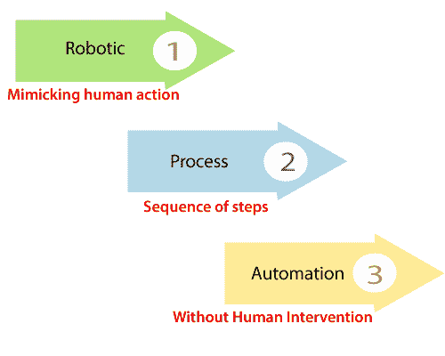
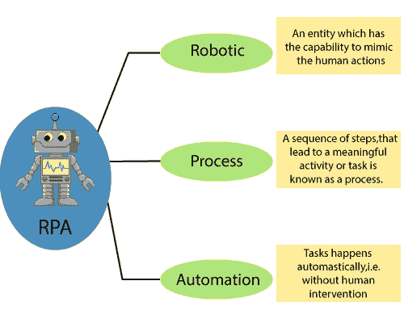
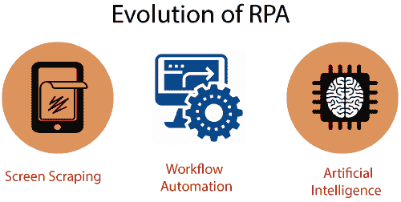
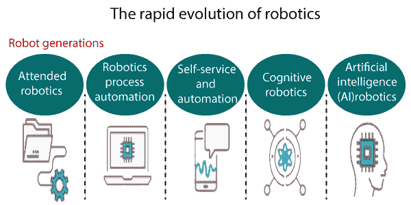
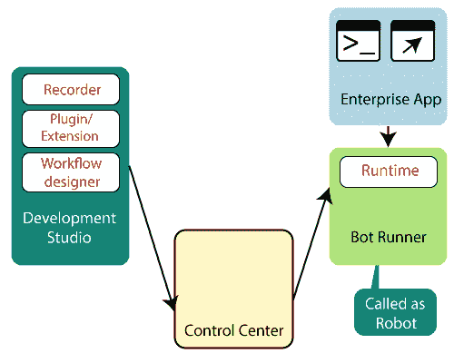
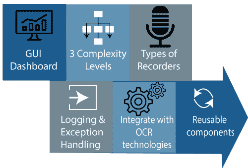
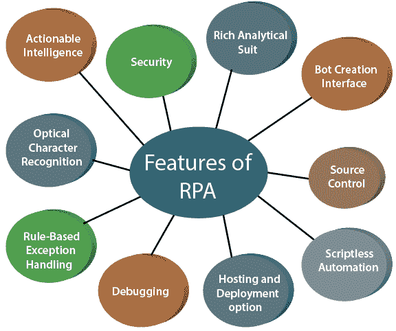
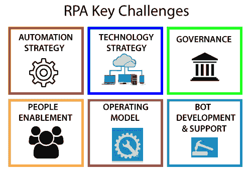
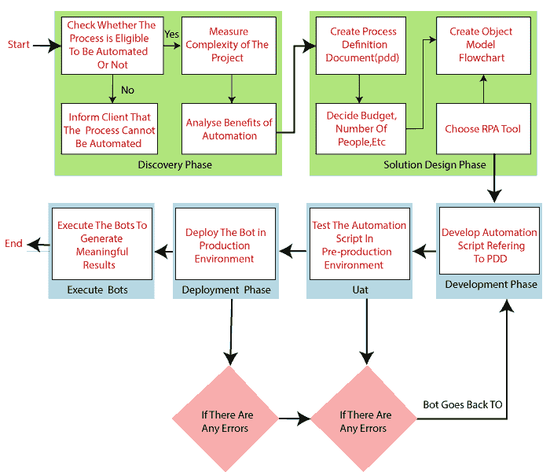
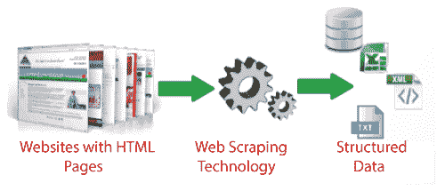

# RPA 教程

> 原文：<https://www.tutorialandexample.com/rpa-tutorial/>

### 什么是 RPA(机器人过程自动化)？

RPA 代表**“机器人流程自动化**”它支持一些手动和重复的任务像人类一样自动化。我们可以说**“RPA 是一个创建和训练软件机器人(自动化程序)以自动化业务流程的过程。”**

“RPA 是一种技术，它允许任何人配置计算机软件或机器人来模拟和集成人类的动作，以便在数字系统中进行交互，从而实施或执行业务流程。”

RPA 是数字化劳动力。它和计算机系统的交互方式和人类一样。它自动化重复和乏味的任务。

机器人过程自动化是由自动化程序在一些定义的商业规则下执行的命令序列。

RPA 的主要目的是用机器人或机器取代虚拟劳动力中重复和枯燥的文书工作。我们训练机器人(自动化程序)做什么，并让他们做工作。

RPA 是机器人过程自动化的缩写。这三个术语如下所示:

机器人:机器人的意思是“一个可以是模仿人类行为的程序的实体。”能够被计算机编程来完成复杂任务的单元或实体被称为机器人。

**流程:**流程是导致有意义的活动或任务的一系列步骤。

**自动化:**当任何任务在没有人为干预的情况下自动发生时，就称为自动化。

### RPA 历史记录

机器人流程自动化在 IT 和非 IT 行业都有应用。如今，每个组织都有重复、枯燥、乏味的任务，因此 RPA 有必要通过实现任务自动化来消除这些类型的任务。它创造了业务流程的快速增长。

机器学习是创造机器人流程自动化的第一步。在 **1959 年**，由**“亚瑟·萨缪尔**研发他在人工智能领域的 IBM 工作。

20 世纪 60 年代，[自然语言处理](https://www.tutorialandexample.com/natural-language-processing)被开发出来，它是人工智能与计算机和人类的交互相结合。

90 年代初，[人工智能](https://www.tutorialandexample.com/artificial-intelligence-tutorial)被很多行业接手，尤其是制造业公司。但由于其成本和实施问题，其在金融部门的实施突然减少。这是自然语言处理进入 IT 行业的时候。

NLP(自然语言处理)的主要目的是帮助计算机更准确地理解和处理人类语言。机器学习和自然语言处理都可以在机器人过程自动化中看到。

### RPA 组件

RPA 的组件共同构建了一个平台，可以自动执行任何重复性任务。机器人过程自动化有利于系统内的可重用性、简化变更等。

它专注于业务规则，而不需要创建链接。RPA 还有利于目标应用程序集成，可以在没有更改业务规则风险的情况下进行更改。

在机器人过程自动化领域，开发不需要理解业务规则。

图:爱国军的组成部分

RPA 的一些基本组件如下:

*   **记录器**

UiPath 的记录器用于记录 UI 鼠标移动和键盘活动，以生成自动化脚本。

这些记录的活动是按照顺序产生的，或者按照递增的顺序很好地维护。录像机也可以用来回放录制的动作。

*   **开发工作室**

Development Studio 或 UiPath studio 用于创建或开发自动化工作流，通过它我们可以轻松地自动化任务。

图:Development Studio 的特性。

UiPath studio 的一些特性如下所示:

1.  GUI 仪表板
2.  三个复杂层次
3.  记录器的类型
4.  日志记录和异常处理
5.  与 OCR 技术集成
6.  可重用组件

*   **插件/扩展**

可重复使用的 RPA 插件是可以添加到 RPA 工具中的程序，用于处理特定的任务，例如从发票中提取数据、处理不同数据库中的日期以及转录语音。这个插件/扩展非常有用，因为它减少了开发工作量、错误率和实现时间。

*   机器人(自动程序)运行程序

Bot Runner 是用户可以运行 Bot(自动化程序)的机器。用户可以并行运行多个机器人。用户只需要运行许可来运行机器人。

*   **控制中心**

控制中心是一个集中的仪表板，用户可以在其中轻松安排、管理、控制和扩展大量数字工作人员的活动。

### RPA 功能

人工智能和认知智能是 RPA 的两个共同特征。这两种功能都涉及机器学习、计算机视觉和认知自动化，以帮助机器人改善决策。

RPA 有一些独特的功能，如下所示:

1.  **丰富的分析套装**

丰富的分析套装用于发现机器人劳动力的表现。它从 RPA 的中央控制台管理和监控自动化功能。

*   **安全**

RPA 工具包括基于角色的安全性，可确保特定于操作的权限。一些机器人过程自动化工具支持加密能力的配置和定制，以保护特定数据类型免受网络通信中断的影响。

*   **Bot 创建接口**

机器人流程自动化工具支持快速、轻松地创建机器人。RPA 产品包括使用任务编辑器手动创建和编辑机器人的选项。

*   **源控制**

源代码控制方法允许开发人员检查特定流程版本之间的差异，以发现什么发生了变化。

**5。托管和部署选项**

RPA 支持跨虚拟机、终端服务和云的客户部署。与其他部署选项相比，云部署以其可扩展性和灵活性吸引了大多数客户。RPA 系统在自动部署数百个机器人时非常强大。

**6。基于规则的异常处理**

机器人流程自动化允许部署基于规则的异常处理。RPA 的这一功能会主动处理异常。

7 .**。调试**

少数 RPA 工具应该停止运行以进行更改并复制流程。其他 RPA 工具允许在调试时进行动态交互。调试是 RPA 的一个非常重要的功能。

**8。无脚本自动化**

RPA 工具是无代码的，可以自动化任何部门的应用。编程技能较低的员工或用户也可以创建机器人。

**9。无缝集成**

RPA 的这一功能主要用于优化用户的软件基础架构，以适应实现数据管理和企业决策的目的。

10。光学字符识别

RPA 中的光学字符识别是当今的一个新趋势。屏幕抓取是 RPA 工具最标准的功能，它处理从系统屏幕捕获位图数据，并根据交叉细节对其进行交叉检查。这个过程正在与微软和谷歌等 OCR 引擎集成。

**11。可操作情报**

RPA 的这种可操作的特性指的是获取和应用知识的能力。机器人获得结构化和非结构化数据，它们可以将这些数据转换为信息，而这些信息又会转化为最终用户或客户可操作的情报。

### RPA 的主要挑战

在实施机器人过程自动化方面存在一些重要的关键挑战，如下所示:

*   自动化策略
*   技术战略
*   管理
*   人员支持
*   运营模式
*   Bot 开发和支持

### RPA 生命周期

RPA 生命周期有六个阶段。此 RPA 生命周期没有定义的结构。RPA 生命周期的所有这些阶段都用于执行构建机器人(自动化程序)。RPA 生命周期所有阶段的简要说明如下:

1.  **发现阶段**

这个阶段的流程架构师分析客户的需求。根据客户的要求，决定该过程是否可以自动化。如果过程是自动化的，那么就要分析过程的复杂性。在这个发现阶段之后，下一个阶段是解决方案设计阶段。

*   **解决方案设计阶段**

自动化任务的解决方案或步骤是在这个阶段设计的。技术架构师使过程定义文档(PDD)与过程架构师协作。该文档包含每个流程或步骤的详细信息。

一旦分析了客户的需求，并且创建了过程定义文档，那么下一个过程就是决定项目的一些需求，例如预算、花费的时间、参与项目的人数等等。

然后，项目架构师需要创建流程图的对象模型图来理解流程的流动。

在流程图的帮助下，架构师将能够理解哪个步骤必须自动化，以及该步骤的需求是什么。

创建流程图后，项目架构师需要选择一个 RPA 工具来自动化任务，然后，他们准备开始开发 bot。

所以，下一个阶段是发展阶段，下面给出。

*   **开发阶段**

在开发阶段，自动化开发人员在所选 RPA 工具的帮助下创建自动化脚本。这些自动化脚本是通过引用先前创建的过程定义文档(PDD)来创建的。

市场上有各种 RPA 工具，但排名前三的 RPA 工具是 UiPath、Blue Prism 和 Automation Anywhere。

所需的自动化取决于任务；它们可能需要也可能不需要编码。RPA 中有几种情况，用户根本不需要编码。

*   **UAT(用户验收测试)**

用户接受阶段在 RPA 生命周期的开发阶段之后。在这个阶段，开发的 bot 由测试团队或开发团队自己进行测试。

bot(自动化程序)在预生产环境中进行测试。在这个环境中，测试团队测试用户如何使用这个机器人来自动完成特定的任务。

如果测试成功，我们将进入下一阶段。但是如果测试失败，那么 bot(自动化程序)会回到之前的开发阶段。

在前一个阶段中，错误是在测试阶段发现的，并被纠正，需要再次测试。

一旦 bot 测试成功，我们就进入 RPA 生命周期的下一阶段。

*   **部署和维护阶段**

在开发和测试 bot 之后，我们需要将 bot(自动化程序)部署到生产环境中。一旦部署了机器人，用户就可以很容易地使用它。

但是，如果机器人有问题，那么我们需要再次回到开发阶段，由测试团队解决问题。

*   **执行机器人**

在 RPA 生命周期的这个阶段，执行机器人，之后，我们需要检查生成的有意义的结果。

**图:构建 bot 的过程**

### RPA(机器人流程自动化)示例

大多数人要求自动化。机器人流程自动化允许组织使用机器人软件来完成所有重复、耗时的工作，以提高客户满意度。

RPA 开发后，员工现在可以研究许多其他事项，而不是做同样的旧的无聊的任务。我们可以在一些领域使用机器人流程自动化，如下所示:

1.  **网站报废**

网站抓取、网页采集、屏幕抓取或网页数据提取是用于从网站提取数据的数据抓取。

网络抓取软件可以通过使用超文本协议或网络浏览器直接访问万维网。它与从 web 下载的结构化数据相关。

以下给出了网报废的各种优点:

1.  更少的错误和成本
2.  更快的设置
3.  不需要维护报废团队。
4.  自动化批处理以下载任务。
5.  收集社交媒体数据。

**2。将数据从一个系统传输到另一个系统**

组织正在浪费时间来管理用于备份和恢复的数据，因此，将数据从一个系统转换到另一个系统就是 RPA 的例子。

**3。呼叫中心运营**

任何组织的呼叫中心都在一个屏幕上显示客户的所有信息，而不是查看不同的应用程序来获取不同种类的详细信息。

在呼叫中心领域实施 RPA 有一些优势，如下所示:

1.  平均通话时间更短。
2.  交流的改善。
3.  资源的优化使用。
4.  自动响应和触发。

### 机器人过程自动化(RPA)教程

*   [什么是 RPA](https://www.tutorialandexample.com/rpa-tutorial/)
*   [为什么选择 RPA](https://www.tutorialandexample.com/why-rpa/)
*   [RPA 使用情形](https://www.tutorialandexample.com/rpa-use-cases/)
*   [RPA 软件](https://www.tutorialandexample.com/rpa-software/)
*   [RPA 工作和未来](https://www.tutorialandexample.com/future-scope-of-rpa/)
*   [RPA 的优势和劣势](https://www.tutorialandexample.com/rpa-advantage-and-disadvantages/)

### **RPA 如何工作**

*   [RPA 如何工作](https://www.tutorialandexample.com/how-does-rpa-work/)
*   [RPA 服务](https://www.tutorialandexample.com/rpa-services/)

### RPA 工具

*   [RPA UiPath](https://www.tutorialandexample.com/rpa-uipath/)
*   [RPA 蓝色棱镜](https://www.tutorialandexample.com/rpa-blue-prism/)
*   [RPA 随处自动化](https://www.tutorialandexample.com/rpa-automation-anywhere/)
*   [RPA 工作融合](https://www.tutorialandexample.com/rpa-work-fusion/)
*   [RPA 好看](https://www.tutorialandexample.com/rpa-nice/)
*   [Pega RPA](https://www.tutorialandexample.com/pega-rpa/)

### **RPA 面试问题**

*   [RPA 面试问题](https://www.tutorialandexample.com/rpa-interview-questions/)