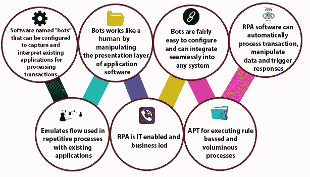
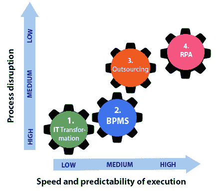
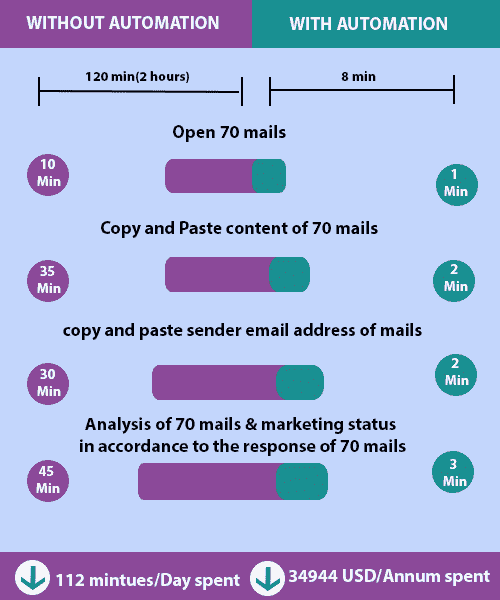
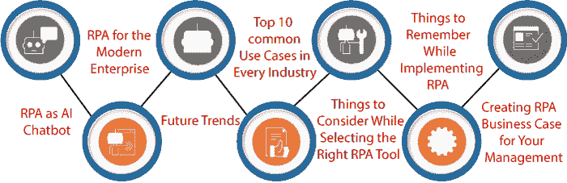
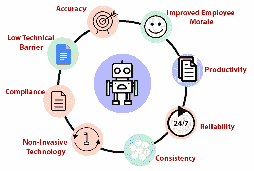
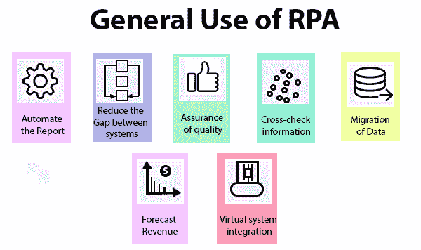
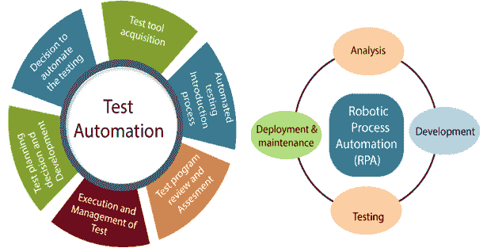

# 为什么选择 RPA(机器人流程自动化)

> 原文：<https://www.tutorialandexample.com/why-rpa/>

与任何其他自动化解决方案相比，机器人过程自动化在经济上是可行的。这是 It 行业的新流行语。它将传统的手动完成业务任务的方式转变为组织内部的自动任务。

大多数人认为术语 RPA(机器人过程自动化)是一幅物理机器人根据人类指令做一些工作的画面，例如从车辆上传大件货物，或打扫房间等。但是机器人的实际画面在现实中是不一样的。

与机器人过程自动化相关的“机器人”一词不是物理机器人。这些机器人是虚拟系统，可以有效地自动化重复和手动任务。

根据 2017 年 3 月的报告，研究人员和市场透露，“到 2022 年，机器人过程自动化市场将达到 24.67 亿美元。

### RPA(机器人流程自动化)与传统自动化

自动化在 IT 市场上并不是什么新技术，但机器人流程自动化是一种趋势，也是实现业务流程自动化的独特方法。在传统的自动化技术中，程序员使用 API 在一个平台上集成不同的系统，而在 RPA 中，他们实现了 UI(用户界面)级的动作使用。

“软件‘机器人’是一种复制人类动作并与计算机系统的用户界面进行交互的软件。它在用户界面(UI)上的操作方式与人类相同。”

RPA 与传统自动化的不同之处如下:

| 机器人过程自动化 | 传统自动化 |
| 1.RPA 在(UI)用户界面级别复制用户的操作。 | 1.传统的自动化基于编程，依赖于 API。在传统的自动化中，存在许多不同的用于集成各种系统的集成方法。 |
| 2.机器人在 RPA 中充当人类动作。它完全遵循用户提供的相同步骤。因此，用户不需要担心主应用程序的复杂性。 | 2.在传统的自动化中，开发人员需要对目标系统有很好的理解。 |
| 3.用户在 RPA(机器人过程自动化)中有无限的选项来定制应用或软件。 | 3.在传统的自动化中没有任何带软件的源代码。用户定制应用程序的选项有限。 |
| 4.我们可以很容易地设计继承的产品，也可以在机器人流程自动化的帮助下建立集成。 | 4.继承的产品不是为根据传统自动化的集成而设计和构建的。 |
| 5.机器人流程自动化可以轻松使用健壮的 API。 | 5.传统的自动化没有健壮的 API。 |

### RPA 的需求

1.由于机器人流程自动化节省了大量手动文档工作，因此可用于工资单流程以及新员工入职手续。

2.它主要用于保险部门获取保费信息、处理索赔和清关。

3.旅游领域也使用 RPA 来订票、存储乘客的详细信息以及记账。

4.RPA 还用于金融领域，提供应付账款服务。

图:对 RPA 的需求。

5.机器人过程自动化用于物流。一些公司使用 RPA 在业务模式的帮助下为分析和人工智能做出贡献。

6.RPA 用于数据管理领域。借助 RPA，我们可以收集、整合、分析和处理数据。

7.用户需要 RPA 来改进客户服务运营，以获得更好的客户服务。

8.商业领域需要自动化销售操作的机器人流程自动化。它不仅执行更快的事务，而且提供更高的准确性。

### RPA 优势

爱国军改变了游戏规则。它用于节省重复性手工任务的金钱和时间。它允许软件机器人模仿人类的行为。

它在应用程序用户界面的帮助下导航软件企业，如 ERP 系统、FSM 软件或服务管理工具。

机器人流程自动化(RPA)提高了生产效率，从而准确地提供智能数据。它通过报告和分析功能提供对财务数据的实时访问。

RPA 使用基于规则的常规任务，需要手动输入。它提高了业务效率，使员工更有生产力。

在行业层面实施机器人流程自动化有多种好处，如下所示:

**1。精确度**

RPA 提供了改进的服务，这些服务出现人为错误的可能性更高。机器人是可靠的，始终如一的，当他们被期望不知疲倦地工作时，他们不会抱怨。RPA 在重复任务中提供完美的准确性。

机器人减少了批改作业，提高了输出质量。机器人最重要的一点是它们遵守所有的规则，在处理结果中产生 100%的准确性。

自动化过程允许用户消除在手动操作时由于注意力不集中而不可避免的错误。更好的质量意味着更高的客户满意率，这有利于公司的盈利能力。

机器人过程自动化执行无错误的工作。它在软件的帮助下提供人工任务的自动化，由一些特定的规则编程。

**2。低技术壁垒**

在 RPA(机器人过程自动化)中配置 bot(自动化程序)或软件机器人不需要任何编程技能。自动化程序非常精确。

由于 RPA 是一种无代码技术，任何非技术人员都可以使用拖放流程设计器来设置 bot，甚至可以通过流程记录器功能记录他们的流程自动化步骤。

**3。合规性**

RPA 作为合规推动者需要大量的财力和人力资源。海量数据的处理非常复杂。

由于“反洗钱”和“了解客户”操作，机器人流程自动化可能会带来巨大的好处。

由于这一有益功能，RPA 支持高水平的准确性和成本节约。

**4。无创技术**

非侵入式技术对于机器人流程自动化非常有用，因为它允许组织以不中断的方式实施 RPA，这使得 RPA 在所有类型的自动化中独一无二。

这项技术还减少了对持续 IT 参与的需求。非侵入式技术为其员工提供了编码能力。

**5。提高员工士气**

工人们大部分时间都致力于从事有趣的工作。RPA 处理我们日常生活中各个领域的日常业务任务，例如会计、应收账款和工资单。这可能会提高企业人力资源和行政领域的士气。

**6。生产力**

机器人可以 24 X 7 X 365 连续工作，不需要休息。机器人被安排更有效地工作。他们不需要休息、休假等。机器人从来不会因为不在工作前线而耽误工作。

生产率还通过减少任何事件或程序的当前解决时间来提高整体运营效率。RPA 允许通过提高服务模型的产量和准确性来交付服务模型。

**7。可靠性**

RPA 大大降低了错误处理率。它允许更快和更容易的定制，以创建新的机器人(自动化程序)，这些程序是为一些特定的前端和后端任务设计的。

由于 RPA 的灵活性，我们可以进行基于规则的分析，并对文件或程序进行更改。RPA 机器人也能够做所有这些事情。

**8。一致性**

机器人过程自动化提供了过程一致性的好处。收入保护索赔的可续保流程需要几个步骤，每个客户都应该相同(客户身份识别、残疾确认、产品规则验证等)。).

这些自动化步骤确保客户需要主动提出可续保请求，而不是去找保险代理。

**9。灵活性和可扩展性**

在 RPA 技术中，如果用户想要在任意时间点增加多个机器人的处理能力，那么成本并不高。简单地说，用户必须立即定位更多的机器人。

机器人的增加或减少将取决于客户的需求。此操作可作为工作流程的一部分进行编程，即根据要求自动调整大小。

10。成本节约

近 30%的成本节约是通过自动化任务实现的。一个软件机器人的成本还不到一个全职员工的工资。

**11。更快更轻松的实施**

该保险公司希望更快、更轻松地实施 RPA 的现有优势，即提高索赔处理效率、增强手动数据输入的准确性，以及基于客户需求的快速可扩展性。

### RPA 使用情况

RPA(机器人流程自动化)用于自动化劳动密集型的工作流、基础架构和后台流程。

软件机器人(自动化程序)可以与内部应用程序、网站、用户门户等进行交互。RPA 是在终端用户 PC、笔记本电脑或移动设备上运行的软件程序。

RPA 自动执行人力资源任务，包括入职和离职、更新员工信息以及提交时间表。

机器人流程自动化可用于获取、自动化订单流程和支付、监控库存水平以及跟踪装运。

以下是 RPA 的一般用法:

1.  自动化报告
2.  缩小系统之间的差距
3.  质量保证
4.  交叉核对信息
5.  数据迁移
6.  预测收入
7.  虚拟系统集成

### 行业用途 RPA 的使用

RPA 在不同类型的行业中有多种用途。RPA 在电信行业中用于监控 CRM 订户的订阅源、欺诈管理数据和客户数据更新。

它是一种数字机器劳动的形式，复制人类的认知功能，并在各种行业中准确高效地执行任务。

RPA(机器人过程自动化)使用具有人工智能和机器学习技能的软件来处理以前需要人类交互的任务。许多行业都在使用 RPA 来提高业务成效。以下是一些使用 RPA 的行业领域，如下所示:

1.  卫生保健
2.  HR(人力资源)
3.  电信
4.  保险
5.  零售业
6.  旅行和物流

**图:行业目的 RPA 使用情况。**

制造业也使用 RPA。这些类型的行业使用物理机器人来积累测试。

制造企业正在优化复杂的后台运营，如供应商沟通、库存管理、采购、支付处理和报告生成。

### 测试自动化与 RPA

在测试自动化工具和 RPA 工具之间存在着多重重叠。RPA 不是一个测试工具，但将来可以用作测试工具。在 RPA(机器人流程自动化)软件的帮助下，功能和不同种类的业务流程实现了自动化。

图:RPA 和测试自动化之间的区别。

用户可以自动化 web 应用、桌面应用、移动应用以及基于大型机的应用。测试自动化和 RPA 之间有一些重要的区别，如下所示:

| 测试自动化 | 机器人过程自动化 |
| 1.测试自动化通过自动化减少了测试执行时间。 | 1.RPA 在自动化的帮助下减少了人员。 |
| 2.它自动化了重复的测试用例。 | 2.RPA 可以自动化重复的业务流程。 |
| 3.在测试自动化过程中创建测试脚本需要编码知识。 | 3.开发中的机器人过程自动化不需要编码知识。 |
| 4.测试自动化可以按照代码提供的指令来执行。 | 4.很多 RPA 工具自带人工智能引擎，像人类一样处理信息。 |
| 5.产品可以在测试自动化的帮助下实现自动化。 | 5.通过使用 RPA，产品和服务都实现了自动化。 |