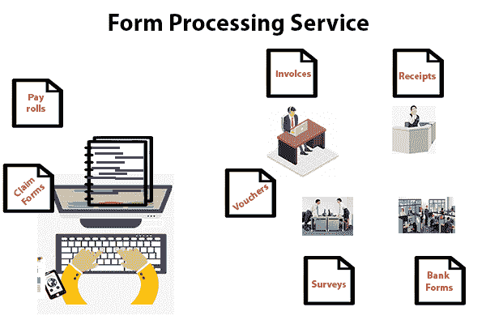
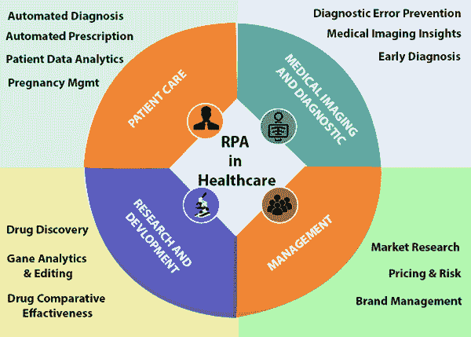

# RPA 使用情形

> 原文：<https://www.tutorialandexample.com/rpa-use-cases/>

**RPA(机器人流程自动化)用例**

RPA 是一个提供自动化业务流程和任务的系统。

用例图用于定义核心元素和流程，这在机器人流程自动化中创建了一个系统。其主要目的是收集系统的所有需求，包括内部和外部影响。

****图:业务流程自动化用例的潜力。****

 **由于行业对投资自动化基本流程不感兴趣，因此，从成本角度来看，RPA 更有利。

RPA 系统可以跨多个应用程序、平台和部门工作。它可以与现有的 It 基础设施集成，并且不需要安装任何额外的软件。

**自动化 RPA 使用情形**

bot 控制器是 RPA 的核心，它负责控制企业中的 Bot(自动化程序)。它拥有不同类型的机器人及其版本控制的存储库。

机器人(自动化程序)或软件机器人被称为客户端或代理。这些机器人直接与应用程序交互，以执行预定义的任务。

图:自动化 RPA 用例的方法。

下面给出了 RPA 自动化使用情形的几种方式:

*   **报告生成**

对于各种行业中的大多数员工来说，生成报告是主要的关键任务之一。我们可以将此报告与不同种类的数据源合并，以生成报告。这些类型的报告是在 RPA 的帮助下生成的。

*   **数据输入**

数据输入和数据废弃是 RPA 最重要和最常见的使用情形。有 N 家公司手动执行这些类型的任务。

RPA(机器人流程自动化)有助于数据输入操作员在一些特殊领域(如重新键入)实现高度的准确性。

*   **Excel 数据操作**

我们有大量的 excel 数据来处理各种任务，如报告生成、分析和商业智能等。因此，这种 Excel 数据操作或任何其他数据源都可以在 RPA(机器人流程自动化)的帮助下实现自动化。

*   **数据报废**

在数据抓取中，一些任务，如向网页或应用程序输入数据，以及从应用程序或网页中抓取数据，可以在 RPA 的帮助下，通过单击很容易地实现自动化。使用 RPA 进行网络抓取是 RPA 越来越多的使用案例之一。

整个网页抓取团队被一个 RPA 专家取代，该专家训练抓取系统从不同类型的网页收集数据。

最好的事情是，我们可以通过结合 RPA 的报废概念来定制我们的系统。

*   **HR 入职、离职流程**

人力资源和财务部门选择 RPA，只需点击几下鼠标即可完成工作。RPA 可以在几秒钟内自动生成文档，如入境、出境流程、新生录取通知书、体验信、徒步旅行信以及一些文本类型的计算。

Figure: Use of Robotic Process Automation in HR.

*   **文件生成**

RPA 提供文档生成和文档转换，例如根据用户需要将 PDF 转换为另一种格式，或者将 html 网页转换为 excel 表格。

*   **财务报告，收据自动化**

人力资源和财务部门使用 RPA 来减轻工作压力并实现自动化。借助 RPA 工作流解决方案，复杂的数字化转型场景(例如自动化端到端流程、订单到现金以及记录到报告周期)实现了自动化。

*   **PDF，图像提取**

考虑这样一种情况，一家公司有数千个客户的 PDF，员工必须将这些 PDF 转换成一个 excel 页面，然后将其发送到数据库。然后，在这种情况下，建议使用 RPA 工具(UiPath)逐个读取，并将所有 PDF 一起转换为一个 excel 页面，以将其保存在数据库中。

手动执行可能需要数千个单词，但是使用 RPA 工具，只需要数百个单词，这使得工作更加容易和简单。

它为企业的业务增长带来了巨大的好处。通过这种方式，客户节省了他们的时间，并专注于其他有价值的任务。

*   **重复性任务**

每个组织中可能存在 N 个每天、每周、每月重复任务，甚至每年重复的任务。关于 RPA 的一个关键问题是，如果有人准备 bot(自动化程序)并安排任务。即使客户端忘记了，机器人也不会忘记。我们可以根据时间表随时使用这个机器人。

**RPA 使用情形的领域**

RPA 在人类和机器人之间产生协调和通信能力。

人类的平均生产率是 60%，有一些错误，相比之下，机器人的生产率是 100%，没有错误。

RPA 使用情形领域的完整列表分为五个部分，如下所示:

1.常见的业务流程和活动

2.商业职能活动

*   销售
*   客户关系管理

3.支助职能方面的活动

*   技术支持
*   技术
*   金融
*   HR(人力资源)
*   操作
*   采购

4.特定行业的活动

*   银行业务
*   保险
*   电信
*   零售

5.个人使用的机器人过程自动化应用，例如数字助理。

**RPA 的应用领域**

我们可以根据劳动力需求使用 RPA 来自动化工作流、基础架构和后台流程。软件机器人与内部应用程序、网站、用户门户等进行交互。

RPA 是一套工具，被不同的公司用来减轻人类重复性的任务。

在我们的日常生活中，存在许多类型的 RPA(机器人过程自动化)应用。以下是一些例子:

**1。网上购物**

网上购物是我们日常生活中 RPA 应用的一个普通例子。我们可以通过在线购物网站购买从食品杂货到电子产品的任何东西。

但问题来了，你有没有想过所有这些过程是如何在后端完成的？这里的答案是 RPA(机器人过程自动化)，它在整个过程中起着至关重要的作用。

一旦订单被放在电子商务网站上，那么订单的信息必须位于实际的存储库中。

这些实际的存储库在下订单时跟踪库存，这有助于将商品发送到正确的地址。

RPA 可以轻松准确地完成这些类型的数据输入任务。

**2。系统间的数据传输**

许多组织通过在自动化流程的帮助下管理整个用户数据来节省时间。

任何组织的整个任务都是完全自动化的，具有源和目的地的详细信息。用户可以借助 RPA 工具检查和监控整个自动化流程。

从发票中提取数据是机器人流程自动化任务的真实例子。

一旦采购订单的详细信息输入 SAP 数据库系统，就可以从任何系统下载报告。

员工花费大量时间在数据输入和错误处理上。这是端到端流程的开始。因此，用户使用 RPA 来节省时间。

**3。表单处理**

几乎每个组织或公司都要在系统中处理用于保存初始记录的表格。调查过程也是一种使用纸质证据的过程。

这类流程需要机器人流程自动化工具。阅读这些类型的表单或对其执行各种操作需要 RPA 工具。

**4。信用卡功能**

RPA 软件机器人负责银行信用卡功能的全部职责。RPA 工具会在申请信用卡时自动处理所有初始任务

RPA 将决定一个人是否有权使用信用卡，然后银行根据他的详细信息向任何人提供信用卡。如果任何人有资格获得新卡，那么该卡也是由银行发行的。一旦信用卡成功交付，案件将被关闭。

世界各地的银行都在考虑 RPA，以最大限度地减少对大量数据的手动处理，从而避免错误。手动数据处理也是一项耗时的任务。

机器人(自动化程序)可以增加 30%到 70%的人工流程的处理成本。

银行中不同类型的流程可以实现自动化。它为男性创造了更多的自由时间来完成重要的任务。

**5。医院的患者登记流程**

有大量的病人定期来医院接受治疗。登记簿是用来记录病人的。手动给代币太难了，而且这种工作需要专门的人力。

如果其他患者患有类似的疾病，这种手动任务可能会增加混淆的机会。但它可以由自动化程序或机器人管理，并根据序列号准确工作。

医院可以在机器人流程自动化(RPA)软件的帮助下处理这些任务，从而节省时间和资源。患者的注册过程可以通过 RPA 工具完成。完整的登记是基于患者的相关信息，医生将指导他进行治疗。

在医疗保健行业，从患者登记到理赔，机器人流程自动化可以轻松快速地实施该解决方案。

### RPA(机器人过程自动化)与 AI(人工智能)

RPA 是一个模仿人类行为的软件机器人，而人工智能是机器对人类智能的模拟。机器人可以在机器人流程自动化的帮助下完成重复的任务，这节省了员工的时间，以便他可以从事公司更多的创收任务。

RPA 改进了结构化输入和业务逻辑规则。它的主要目标是自动化业务流程并与员工合作。

人工智能是一种取代人类劳动的技术形式。

RPA 和人工智能的结合可以创建一个完全自主的过程。RPA 使企业能够更快地工作并产生更好的结果。它被广泛用于自动化各种业务流程。

该组织使用机器人流程自动化来应对数字化工作场所和自动化挑战。RPA 是指被设置为自动执行某些流程的 bot(自动化程序)。

### 在 RPA 中使用机器学习和人工智能

机器学习模型可以插入到 RPA 工作流中，以执行图像识别等机器感知任务。机器学习主要用于决策和预测。

人工智能和 RPA 是两种横向技术，具有不同的目标和接口。

我们可以说，机器学习是机器通过使用历史数据来解决给定问题，从过去的经验中学习不同东西的能力。

机器学习使用不同的算法来实现一个或多个模型。这些模型充当根据输入数据参数生成所需结果集的基线。

RPA 与认知技术(如机器学习、语音识别和自然语言处理)的结合可以用人工智能自动化各种公司中的高阶任务。**