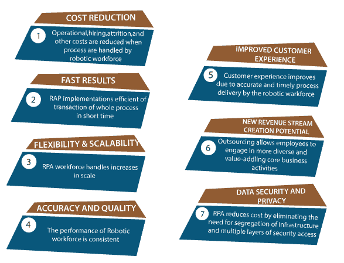
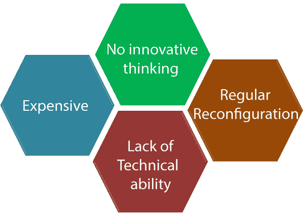
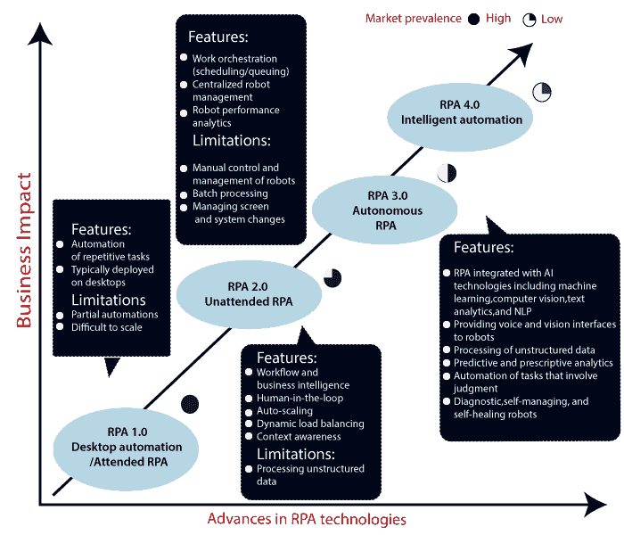

# RPA 的优势和劣势

> 原文：<https://www.tutorialandexample.com/rpa-advantage-and-disadvantages/>

**RPA 的优缺点**

RPA 是一种用于开发各种软件的自动化技术。它有助于在业务流程中创建自动化任务。它仍处于发明的早期阶段。

RPA 还用于提高组织的生产力。机器人被设计用来在不同类型的公司中创造重复的事件。通过执行重复性的任务，工作的专注程度会下降；这就是为什么我们使用 RPA(机器人流程自动化)来完成繁琐的任务。

Figure: Advantage of RPA

### RPA 的优势

RPA 有以下一些优势:

1.用户可以通过在机器人过程自动化的帮助下自动完成任务来降低成本。

2.它不需要用户通过使用虚拟劳动力来替换现有系统。

3.RPA 通过消除疲劳和缺乏知识等人为错误来降低出错率。它降低了运营风险。

4.RPA 的部署释放了高价值的资源，使其可以重新投入一线，以确保客户成功。

5.许多公司被迫定义明确的治理程序来使用人工智能和 RPA。

6.RPA 是一种能够“让机器人脱离人类”的技术 RPA 通过留出足够的时间来专注于增值任务，从而减少了工作量。这些增值任务对客户和业务产生了影响。

### RPA 的缺点

1.自动化任务增加了失业率。RPA 正在减少对人力的需求，因此它有可能消除重复性任务的工作。由于失业，劳动力在市场上增加了。

2.爱国军的实施工作日益复杂。根据最近的一项研究，30%到 50%的 RPA 项目最初会失败。

3.机器人过程自动化没有创新思维。

4.RPA 项目或系统需要定期重新配置。

5.与任何其他技术相比，这是一项昂贵技术。

6.RPA 项目缺乏技术能力。

图:RPA 的缺点。

### 人工智能和机器学习在 RPA 中的作用

人工智能在 RPA 软件中的应用。用户可以自动化任何组织的工作流程。

自动化供应商在自动化工具中包括机器学习功能，以处理大量的非结构化数据。它使用先进的图像识别技术来提高图形用户界面(GUI)自动化的质量。

机器学习模型可以插入到项目的工作流程中。工作流执行机器感知任务，如图像识别。RPA 可以记录 GUI 形式的一系列任务。RPA 记录光标移动和按钮点击，并将一系列动作翻译成代码。由于该代码，任务可以自动执行，将来无需人工干预。

RPA 通过应用机器学习和深度学习算法来优化一些 GUI 操作，以解决感知问题，如识别按钮或编辑字段。

我们可以说，RPA 软件机器人是手臂和腿，机器学习的组件是“大脑”。机器学习模型可以插入到 RPA 工作流中，以执行机器学习的感知任务，例如图像识别。