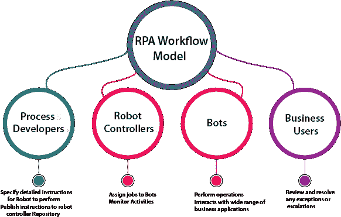

# RPA 是如何工作的？

> 原文：<https://www.tutorialandexample.com/how-does-rpa-work/>

**RPA 是如何工作的？**

无论规模大小，每个组织都训练机器人来自动化其业务流程。他们以一种补充手动策略的方式自动化了他们的业务流程，并且流程保持不间断。

RPA 或机器人流程自动化是技术大理石的一个新边缘，不同的企业利用它来自动化日常手动任务和流程。

Figure: working environment of RPA.

手动任务包括数据提取、发票处理、处理门户查询、定价、维护客户数据和验证文件等。

假设有人想在每天特定的时间在任何社交群上发表他的文章。你会手动这样做吗？

嗯，如果手动完成的话，这对任何人来说都会花费很多。对任何人来说，这也是一项令人厌倦的工作。我们应该让机器人自动完成这项工作，而不是人工完成这项工作。

我们应该配置计算机软件或机器人，因为它解释人类的行为并模仿它们。有了机器人配置，任何人都可以在每天特定的时间发表他的文章。

这不仅花费更少，而且还会节省时间，而且这个人不会感到疲劳或厌烦。所以，我们可以说 RPA 主要是减少了人的参与。

### RPA 体系结构

RPA 的体系结构是各种工具、平台和不同基础架构元素的组合。RPA 架构需要分析项目的需求。

它还有助于 RPA 开发人员理解最近项目中的含义。RPA 体系结构中包含各种术语，如下所示:

**1。可用性**

RPA 体系结构在从手动到自动化流程的转换中提供了可用性。它在决策过程中起着至关重要的作用。RPA 项目的可用性更加完美。借助 RPA 架构的可用性功能，使用有限数量的步骤来配置软件或机器人。最易访问的 RPA 软件可确保快速的可扩展性、轻松的开发和更高水平的客户采用。由于架构的可用性，所有这些特性在任何软件中都存在。

**2。整合**

任何 RPA 工具都可以与其他几种系统和技术集成。RPA 工具部署在组织中，以自动化不同的业务运营。借助更强的集成能力，可以实现更好、更强大的自动化。

**3。异常处理**

异常处理是 RPA 体系结构的基本特征。工作场所自动化的编排是通过稳定的异常处理平稳可靠地运行。

**4。安全性**

在任何组织中部署 RPA 解决方案时，它都会处理敏感数据。我们永远不要低估安全功能。RPA 体系结构的这一功能衡量安全控制的实施情况。

**5。配置特性**

RPA 应用程序旨在以特定方式支持功能，以提高速度。它还可以随时提供简单的配置编辑。它确保自动化的有效部署。

根据所需的内部功能，配置特性还为项目增加了许多支持。

**6。部署特性**

当配置和测试指南都交叉时，那么用户需要一个部署特性。一些企业或组织需要特定的部署场景，其中需要强大的部署工具集。

**7。供应商支持和文件**

不是任何特定的工具都完全适合组织中的每个过程。供应商支持和文档是 RPA 体系结构的重要组成部分。

供应商为任何特定的 RPA 工具提供强有力的支持，以获得更好的资源。

 **RPA 体系结构有五个方面，如下所示:

1.机器人流程执行下的应用

2.RPA 平台

3.RPA 执行基础架构

4.RPA(机器人过程自动化)工具

5.结构管理

机器人流程管理侧重于 RPA 体系结构。RPA 体系结构是需要分析的一个关键因素。

**RPA 工作流**

工作流模型解释了如何在业务中使用 RPA 来执行任务。RPA 开发人员向机器人提供执行任务的详细说明，并在机器人控制器中发布信息。

机器人控制器给机器人分配任务，并监控机器人(自动化程序)的活动。机器人执行机器人控制器给出的任务。Bot 与广泛的业务应用程序进行交互。RPA 工作流模型中有四个步骤，如下所示:

**1。流程开发人员**

流程开发人员或 RPA 开发人员为机器人执行任务提供指令。他们还将指令发布到机器人控制器存储库中。

**2。机器人控制器**

机器人控制器将任务分配给机器人(自动化程序)并监控活动。它充当已定义角色的主存储库，并促进版本控制。

**3。机器人**

机器人是可配置的软件，用来执行和控制开发者分配的任务。RPA 机器人可以在有人值守和无人值守模式下工作。

**4。商业用户**

业务用户可以检查和解决任何错误或异常。RPA 是实现业务流程自动化的技术。RPA 中的产品通常会创建可直接访问应用程序的脚本。**