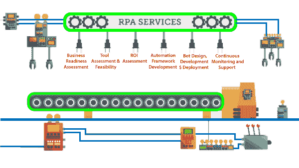
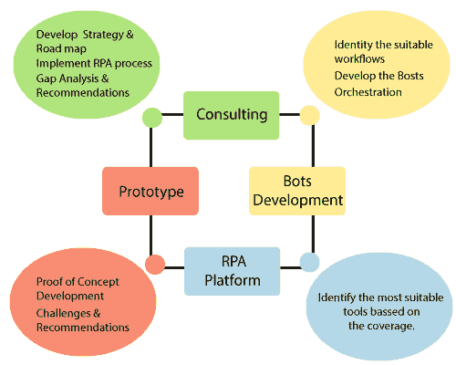
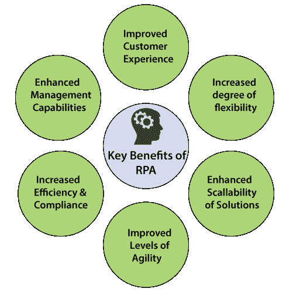

# RPA 服务

> 原文：<https://www.tutorialandexample.com/rpa-services/>

**机器人过程自动化服务**

RPA 服务使组织能够优化运营支出、提高工作效率并支持数字化转型。RPA 可以提高任何企业的生产效率。

人工智能和机器学习处理和自动化需要人工努力的重复任务。

这些重复性任务涉及处理查询、计算、记录维护和交易条目。

RPA 允许用户在软件机器人的帮助下自动执行任务。用户在业务流程中是自动化的，如管理任务、计费和会计。

这些组织将机器学习和人工智能等各种技术与 RPA(机器人流程自动化)相结合，以转变整个业务。

在 RPA 端到端咨询服务的帮助下，RPA 开发人员对新客户进行智能自动化培训，并帮助他们提高生产率、降低运营成本和提高可扩展性。

RPA 服务分为以下几个部分:

**1。业务准备情况评估**

业务准备评估服务帮助客户识别业务流程。

RPA 业务就绪性分析服务提供机器人的流程评估、范围和兼容性。

**2。工具评估和可行性**

RPA 中的可行性参数取决于给定的条件:

**1。平台基础设施**

客户机-服务器网络旨在借助增强的安全性、可靠性和可访问性来最大限度地提高生产率。RPA 解决方案是完整的客户端-服务器网络体系结构的设置。

**2。快速开发**

自动化场景集中保存在服务器上，由机器人下载。机器人自动化与 IT 架构相互作用，无需任何复杂系统的集成。

**3。投资回报评估**

许多客户都在寻求机器人过程自动化项目的投资回报。机器人许可证的年费用取决于开发中的位置和工作概况。

**4。自动化框架开发**

selenium 是一个开源框架，用于跨各种浏览器(如 Chrome、Firefox 和 safari)自动测试 web 应用程序。因此，selenium 在 RPA 中提供框架服务。

**5。机器人设计、开发和部署**

RPA 提供 Bot 设计、开发和部署服务。它提供了一个解决方案或步骤来自动完成机器人的设计阶段的任务。

自动化开发人员在开发阶段借助 RPA 工具创建自动化脚本。在 Bot 的开发和测试之后，它被部署到生产环境中。

**6。持续监控和支持**

RPA bot 需要持续监控，以保持全天候运行。支持和维护服务包括一个变更管理系统，该系统允许组织改进组织中现有的 RPA 流程。

**Figure: RPA services with Platform.**

### RPA 服务的优势

RPA 服务的优势如下:

1.成本效益。

2.提高质量保证。

3.生产率提高**。**

4.减少工作失误。

5.年营业额低。

### 为什么 RPA 服务与众不同

整合后，RPA 服务提高了组织的生产效率。它使组织能够优化运营支出、提高工作效率并支持数字化转型。

RPA 是顶级 IT 服务提供商之一。RPA 服务包括评估、战略、设计和实施。

### RPA 服务的缺点

RPA 服务有一些缺点，如下所示:

1.失业的可能性。

2.初始投资成本。

3.雇佣熟练员工。

4.实现的复杂性。

5.失业的威胁。

6.冗余。

7.缺乏技术能力